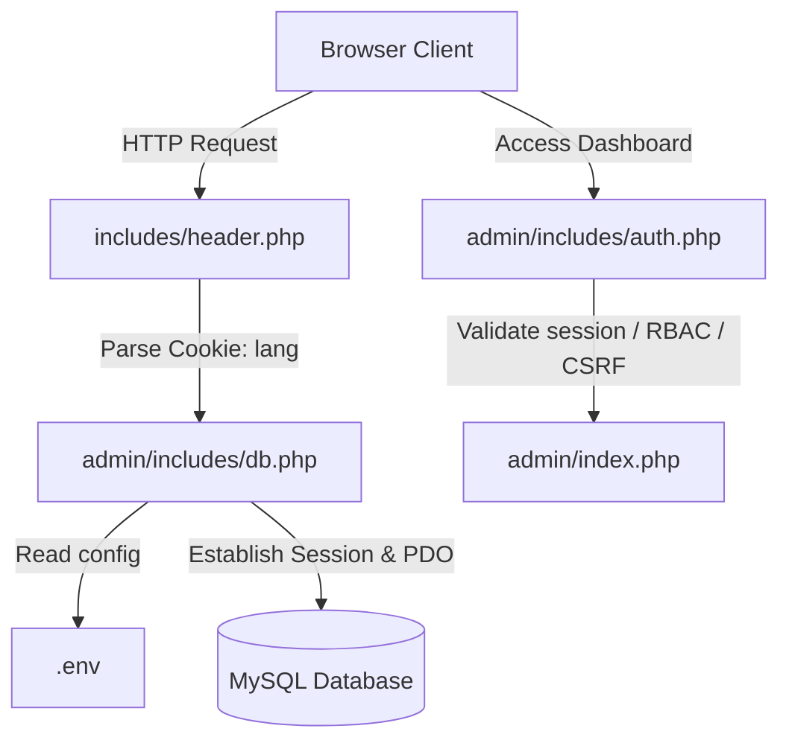

# Ministry of Labour Project Handover & Technical Specification

This document serves as the source of truth for the Ministry of Labour (Sri Lanka) web portal. It outlines the codebase architecture, environment configurations, styling rules, backend dynamics, security implementation, CMS dashboard, and build tools.

---

## 🏗️ Architectural Overview & Request Flow
The application is built on a procedural PHP backend, styled with Tailwind CSS, and uses a MySQL database via PDO.

1. **Global Configuration (`.env`):** Defines DB credentials, SMTP Mail parameters, Google reCAPTCHA v2 keys, and environment toggles (`APP_ENV`).
2. **Database Connection (`db.php`):** Parses `.env`, configures strict PDO parameters, checks active language cookies, and defines utility path functions.
3. **Session & Security (`auth.php`):** Implements secure session parameters, inactivity check timeouts, CSRF tokens, and Role-Based Access Control (RBAC).

---

## 🎨 Styling & Design Systems (Tailwind & Vanilla CSS)
The application leverages a curated color scheme and responsive system compiled via Tailwind CLI v3:

### 1. Color Palette & Typography (`tailwind.config.js`)
* **Primary Color (`#13273F`):** A premium dark slate blue used for navbars, primary action buttons, and dominant layout blocks.
* **Secondary Color (`#4E0000`):** A deep burgundy/maroon used as a secondary brand identity, statistics block backgrounds, and hover indicators.
* **Fonts:**
  * **Headings:** Montserrat (`font-montserrat`) to deliver premium, uppercase, and tracked headers.
  * **Body:** Inter (`font-inter`) for legible reading.

### 2. Base Settings & Custom Layouts (`input.css`)
* **Responsive Base Sizes:** Scaled font sizes relative to HTML viewport sizes (14.5px on mobile, 15px on small tablet, 16px on desktop) to keep layouts proportioned.
* **Smooth Scrolling:** Enabled globally (`scroll-behavior: smooth`) on `html` tags.
* **Custom Scrollbars:** Tailored scrollbar widths (`8px` for global viewports, `5px` for compact lists) styled in brand colors.
* **Utility Animations:**
  * `.animate-marquee`: Slides text horizontally in an infinite loop for news tickers.
  * `.animate-fade-in`: Custom Bezier fade-up/in transition for async component rendering.
  * `.animate-float`: Subtle up/down hover displacement.

### 3. Advanced UI/UX Components
* **Scroll Animations (AOS):** `aos.js` is globally initialized in `footer.php` with `data-aos="fade-up"`.
* **Glassmorphism:** The main header uses `backdrop-blur-md` for a premium frosted glass effect on scroll.
* **Micro-Interactions:** Custom Tailwind classes (`.news-card`, `.service-card`, `.focus-card`) implement smooth scaling, icon rotations, and cubic-bezier shadows on hover.
* **Toast Notifications (Admin):** The backend relies on a custom `window.showToast(message, type)` function (via `admin.js`) for success/error alerts instead of blocking `alert()` dialogues.

---

## ⚙️ Backend Logic & Database Handling

### 1. Connection Isolation & Environment Safeguards (`db.php`)
* **Manual `.env` Parsing:** Implements a fallback manual parser to read `.env` configurations even if PHP's native `parse_ini_file` is disabled by the hosting provider's security policies.
* **Dynamic Error Reporting:**
  * `development` environment: Automatically enables full debugging warnings via `ini_set('display_errors', 1)` and `error_reporting(E_ALL)`.
  * `production` environment: Suppresses error display (`display_errors = 0`) to prevent leaking code details, logging errors to system logs instead.
* **Database Charset:** Enforces `utf8mb4` encoding to support Unicode, ensuring Sinhalese (`si`) and Tamil (`ta`) strings load correctly.

### 2. High-Performance Caching System (`Cache.php`)
* **JSON File Caching:** Heavy homepage queries (News, Announcements, Statistics) are wrapped in `Cache::get()` and `Cache::set()`.
* **Time-To-Live (TTL):** The cache duration defaults to 5 minutes (300 seconds), reading from the `cache/` directory. This mitigates MySQL connection overloads during traffic spikes.

### 3. Multi-Language (Localization) Engine
* **Locale Detection:** Set in `$_COOKIE['lang']` (fallback to `'en'`).
* **Font Overrides:** Done dynamically in [header.php](file:///c:/xampp/htdocs/Ministry-of-Labour/includes/header.php):
  * Sinhalese -> Overrides all text to `Noto Sans Sinhala`.
  * Tamil -> Overrides all text to `Noto Sans Tamil`.
* **Database Suffix Fallback:** Database queries fetch base columns (e.g. `title`) and check language suffixes (`title_si`, `title_ta`). PHP scripts select localized strings if they are populated, falling back to English.

### 4. Search Suggestion API (`search-suggest.php`)
* **AJAX Autocomplete:** An endpoint that returns JSON suggestions for News, Vacancies, Procurements, and static pages based on a GET query (`?q=`).
* **Language Aware:** It respects the `$_COOKIE['lang']` to search against `title_si` or `title_ta` and resolves static pages against translated keyword mappings.

### 5. Server-Level Optimizations (`.htaccess`)
* **Pretty URLs:** Removes `.php` extensions and enables SEO-friendly routes (e.g. `news/123` resolves to `news-single.php?id=123`).
* **Compression & Caching:** Uses `mod_deflate` to gzip HTML/CSS/JS and `mod_expires` for aggressive browser caching of static assets.
* **Security Constraints:** Hard blocks access to sensitive files (`.env`, `.sql`, `.git`) and enforces a custom 404 router.

---

## 🔒 Security Architecture
The application maintains strict protection layers against common web vulnerabilities:

### 1. Database prepared statements
* **Native Prep Enforcements:** Handled using `$pdo->setAttribute(PDO::ATTR_EMULATE_PREPARES, false)`. This sends SQL queries and parameter bindings separately to the MySQL engine, preventing SQL Injection exploits.

### 2. Session Hygiene & CSRF Defenses (`auth.php`)
* **Session Cookie Properties:** Cookies are generated using:
  * `httponly => true`: Prevents client-side scripts (JS) from accessing the session ID cookie (guards against Session Hijacking via XSS).
  * `samesite => 'Lax'`: Mitigates Cross-Site Request Forgery (CSRF) on navigation paths.
  * `secure => true`: Enforces HTTPS transmission (if SSL is active).
* **Session Fixation Defense:** Triggers `session_regenerate_id(true)` upon successful credentials verification to discard old session identifiers.
* **Inactivity Timeout:** Monitors active admin activity. If idle for `300 seconds` (5 minutes), the session is destroyed and the user is redirected to the login.
* **Brute-Force Rate Limiting:** Tracked via `Cache.php` in `admin/login.php`. If an IP fails to log in 5 times, they are locked out for 15 minutes (900 seconds) before they can attempt again.
* **CSRF Token Verification:** 
  * Generates random tokens via `bin2hex(random_bytes(32))`.
  * Verifies POST/GET variables with a cryptographically-secure, constant-time compare function: `hash_equals($_SESSION['csrf_token'], $token)`.

### 3. Output Sanitization & Spam Prevention
* **XSS Defense:** Forms and dynamic outputs employ `htmlspecialchars(stripslashes(trim($data)))` within `sanitizeInput()` to eliminate malicious script injections.
* **Google reCAPTCHA v2:** Implemented on public-facing endpoints (e.g. `process-contact.php`) requiring server-side API verification (`https://www.google.com/recaptcha/api/siteverify`) before processing emails or database inserts.

### 4. Email & SMTP Handling (`Mailer.php`)
* **Centralized Utility (`App\Utilities\Mailer`):** A custom wrapper that dynamically loads `.env` variables on demand and uses `PHPMailer`.
* **Dynamic Security Modes:** Automatically switches between `ENCRYPTION_SMTPS` (for port 465) and `ENCRYPTION_STARTTLS` (for port 587 or 25).
* **SSL Bypass Support:** Supports `SMTP_BYPASS_SSL` via `.env` to allow self-signed certificates or unverified peers for internal network relays.

---

## 🖥️ CMS Admin Panel Operations

### 1. Role-Based Access Control (RBAC)
User accounts are classified into specific capability matrices:
* **`executive_officer` (Administrator):** Master role with access to user management, booking approvals, news, IAU records, statistics adjustments, vacancies, procurements, and global configurations.
* **`content_editor`:** Restricted to managing public articles and news logs.

### 2. Secure File Upload Handler (`functions.php`)
All uploads (notices, vacancy PDFs, official images) run through a centralized validator `handleFileUpload()`:
1. **Size check:** Rejects files exceeding the configured limit (defaults to `5MB`).
2. **Real MIME-Type lookup:** Performs verification using `FILEINFO_MIME_TYPE` (`finfo_open`) or `mime_content_type` rather than trusting the user's HTTP headers.
3. **Extension Whitelisting:** Strictly limits uploads to `['jpg', 'jpeg', 'png', 'webp', 'pdf']` to prevent remote execution exploits (RCE).
4. **Filename Sanitization:** Replaces special characters with hyphens to form a clean URL-slug.
5. **Collision Protection:** Appends a random hash `uniqid()` to prevent rewriting existing files.
6. **Date-Based Organization:** Stores files in folder hierarchies organized by year/month (e.g. `uploads/2026/07/`).

### 3. Content Creation & Workflow (e.g., `news-add.php`)
* **Rich Text Editing (Quill.js):** Uses Quill.js for WYSIWYG editing, syncing HTML content to hidden inputs upon form submission.
* **Auto-Translate API:** Integrates the Google Translate API (`translate.googleapis.com`) to instantly translate English titles and body content into Sinhala and Tamil via AJAX buttons.
* **Publishing Workflow:** Implements a strict state machine (`Draft` -> `Pending Approval` -> `Published`). Only `executive_officer` roles (or those with `approve_news` permissions) can finalize publications.
* **Live Media Preview:** Uses native JS `FileReader` to generate immediate thumbnail previews for single (cover) and multiple (gallery) image uploads before form submission, with client-side 5MB size validation.

---

## 🛠️ Build Pipeline
The asset compilation workflow uses Tailwind CLI. Scripts are configured in `package.json`:
* **Development Build (Watch Mode):** `npm run dev`
* **Production Build (Minified):** `npm run build:prod`

## 🗂️ Workflow & Templates
* **Templates (`templates/`):** When generating new UI or CMS pages, always look for boilerplate files here to duplicate. This saves tokens and guarantees architecture consistency.
* **Task Management (`TODO.md`):** Sequential project goals should be listed in `TODO.md` at the project root. The AI should follow these incrementally.

---

### 2026-07-19 (Trilingual PDF Uploads for Frontend Public Pages)
* **Files:** [special-notices.php](file:///c:/xampp/htdocs/Ministry-of-Labour/special-notices.php), [vacancies.php](file:///c:/xampp/htdocs/Ministry-of-Labour/vacancies.php), [procurements.php](file:///c:/xampp/htdocs/Ministry-of-Labour/procurements.php), [learning-platforms-local.php](file:///c:/xampp/htdocs/Ministry-of-Labour/learning-platforms-local.php), [learning-platforms-foreign.php](file:///c:/xampp/htdocs/Ministry-of-Labour/learning-platforms-foreign.php), [downloads.php](file:///c:/xampp/htdocs/Ministry-of-Labour/downloads.php), [includes/footer.php](file:///c:/xampp/htdocs/Ministry-of-Labour/includes/footer.php), [.agents/handover.md](file:///c:/xampp/htdocs/Ministry-of-Labour/.agents/handover.md)
* **Author:** Antigravity AI
* **Change Description:** Rolled out the frontend implementation of trilingual PDF downloads across all relevant public-facing list pages. Added a "Language Filter" dropdown next to the search bars to allow users to toggle list view content between English, Sinhala, and Tamil PDF availability. Modified backend PHP queries to select `pdf_path`, `pdf_path_si`, and `pdf_path_ta`, and populated these values into HTML data-attributes (`data-pdf-en`, `data-pdf-si`, `data-pdf-ta`). Updated the `filterTable()` JavaScript function on each page to filter the lists based on the selected language and to dynamically update the download links and fallback buttons (e.g., "No Document"). Refactored the global `openDetailModal()` function in `includes/footer.php` to receive all three language paths and render conditional language-specific download buttons ("EN PDF", "SI PDF", "TA PDF") within the detail preview modal.

### 2026-07-19 (Trilingual PDF Uploads for Admin Modules)
* **Files:** [admin/manage-action-plans.php](file:///c:/xampp/htdocs/Ministry-of-Labour/admin/manage-action-plans.php), [admin/manage-vacancies.php](file:///c:/xampp/htdocs/Ministry-of-Labour/admin/manage-vacancies.php), [admin/manage-special-notices.php](file:///c:/xampp/htdocs/Ministry-of-Labour/admin/manage-special-notices.php), [admin/manage-rti-reports.php](file:///c:/xampp/htdocs/Ministry-of-Labour/admin/manage-rti-reports.php), [admin/manage-procurements.php](file:///c:/xampp/htdocs/Ministry-of-Labour/admin/manage-procurements.php), [admin/manage-acts.php](file:///c:/xampp/htdocs/Ministry-of-Labour/admin/manage-acts.php), [admin/manage-learning-platforms-foreign.php](file:///c:/xampp/htdocs/Ministry-of-Labour/admin/manage-learning-platforms-foreign.php), [admin/manage-learning-platforms-local.php](file:///c:/xampp/htdocs/Ministry-of-Labour/admin/manage-learning-platforms-local.php), [.agents/handover.md](file:///c:/xampp/htdocs/Ministry-of-Labour/.agents/handover.md)
* **Author:** Antigravity AI
* **Change Description:** Implemented trilingual (English, Sinhala, Tamil) PDF upload functionality for all 8 admin panel modules. Replaced the single PDF upload input with a 3-column grid layout for separate language file uploads. Updated the PHP backend to process and store all three file paths (`pdf_path`, `pdf_path_si`, `pdf_path_ta`) and handle file deletions on edit or record deletion. Updated the table views and preview modals to display conditional download buttons ("EN PDF", "SI PDF", "TA PDF") based on the availability of the translated files.

### 2026-07-17 (Created Dedicated Complaints Page & Routing Integrations)
* **Files:** [complaints.php](file:///c:/xampp/htdocs/Ministry-of-Labour/complaints.php), [index.php](file:///c:/xampp/htdocs/Ministry-of-Labour/index.php), [contact-us.php](file:///c:/xampp/htdocs/Ministry-of-Labour/contact-us.php), [includes/footer.php](file:///c:/xampp/htdocs/Ministry-of-Labour/includes/footer.php), [search-suggest.php](file:///c:/xampp/htdocs/Ministry-of-Labour/search-suggest.php), [about-us.php](file:///c:/xampp/htdocs/Ministry-of-Labour/about-us.php), [admin/officials.php](file:///c:/xampp/htdocs/Ministry-of-Labour/admin/officials.php), [database.sql](file:///c:/xampp/htdocs/Ministry-of-Labour/database.sql), [.agents/handover.md](file:///c:/xampp/htdocs/Ministry-of-Labour/.agents/handover.md)
* **Author:** Antigravity AI
* **Change Description:** Created a dedicated complaints page (`complaints.php`) supporting English, Sinhala, and Tamil localization. Renders a premium dual-card structure: Step 1 points to the official Department of Labour CMS portal (https://cms.labourdept.gov.lk/), and Step 2 provides the escalation pathway to the Ministry's WhatsApp hotline (070 722 7877). Improved the complaints page UI by adding structured list indicators, hover scaling effects, gold badges, custom SVG icons, step markers ("01" & "02"), and integrated the official FontAwesome WhatsApp brand vector logo. Updated the homepage Quick Links card, the Contact Us page callout button, and the footer Quick Links to point to this new page instead of linking directly to WhatsApp. Also updated the card description on the homepage and the callout text details on the Contact Us page to explain that complaints go to the CMS first, with WhatsApp as the escalation path, while removing all direct mentions of WhatsApp from navigation titles, page headers, search suggester nodes, and action buttons to keep them clean. Registered the Complaints page in `search-suggest.php` to enable search autocomplete. Renamed "Development Division" to "Policy Formulation & Foreign Relations Division" in `about-us.php` inside the split-pane tabs sidebar, panel headers, and description text blocks. Also renamed it inside `database.sql` and ran a database migration query to update the active live database (which automatically updates the admin panel's navigation tabs and official assignment dropdown menus). Implemented scroll-snapping horizontal tab bars (`snap-x snap-mandatory scroll-smooth scrollbar-none` layout with `snap-center` buttons and JavaScript centering on-click) for both the admin panel (`admin/officials.php`) and front-end (`about-us.php`) officials and department tab controllers. Removed icons from `admin/officials.php` tab buttons and added left/right fading gradient overlays to indicate additional scrolling content. Removed icons from the affiliated Institutions tab selectors on the homepage (`index.php`) and the Divisions & Functions tab selectors on the About Us page (`about-us.php`) to keep a clean, text-only aesthetic. Added a "Get Directions" button to the Narahenpita head office address section inside the global footer template (`includes/footer.php`) linking directly to a Google Maps direction search. Fixed the footer column layout by replacing the `hidden md:block` responsive classes with a fully responsive grid system (`md:col-span-1`/`md:col-span-2` and `lg:col-span-...`) so they stack correctly on mobile viewports. Increased the grid gap (`gap-12 lg:gap-10`) and replaced flex centering and end alignments with natural left-align block structures and custom padding-left classes (`lg:pl-12`, `lg:pl-8`) on footer columns to fix crowding between Circuit Bungalows and Contact columns. Fixed conflicting layout classes (`hidden` and `flex` defined together) in `admin/officials.php` image preview wrapper by removing `flex` from static HTML classes and toggling it dynamically inside the JavaScript modal controls. Recompiled Tailwind CSS assets.

### 2026-07-16 (Homepage and Navigation Gold Accent Hover Effects and Premium UX Interactions)
* **Files:** [index.php](file:///c:/xampp/htdocs/Ministry-of-Labour/index.php), [includes/header.php](file:///c:/xampp/htdocs/Ministry-of-Labour/includes/header.php), [input.css](file:///c:/xampp/htdocs/Ministry-of-Labour/input.css), [.agents/handover.md](file:///c:/xampp/htdocs/Ministry-of-Labour/.agents/handover.md)
* **Author:** Antigravity AI
* **Change Description:** Enhanced the website's interaction patterns to use the gold accent color (`text-yellow-600` / `bg-yellow-500` / `text-yellow-400`) on hover for key text links and navigation components. Updated `.focus-card-title` in `input.css` to transition smoothly to gold when hovering over the card. Changed the hover text state for `.inst-split-tab` and `.div-split-tab` from `text-primary` (slate blue) to gold (`text-yellow-600`), and updated tab icon bubbles to transition to a gold accent instead of blue. Changed desktop and mobile navigation links in `header.php` to transition to gold (`hover:text-yellow-600`) instead of blue (`hover:text-primary`), and submenu items now hover with a soft gold background blend and gold text. Wrapped news cover images and titles in active links, keeping their hover color actions matching the classic theme (red titles and primary slate blue for read more). Retained the original high-fidelity hover scheme on the Downloads section items (where text highlights in red and the arrow icon background highlights in primary slate blue). Wrapped announcements titles in links pointing to the target URL/PDF, enabling gold hover color styling (`hover:text-yellow-600`). Added interactive gold text highlights (`group-hover:text-yellow-400`) to the clickable stats bar links ("5 Affiliated Institutions" and "44 ILO Ratified Conventions") on the homepage. Removed the global paragraph justification rule (`p { @apply text-justify; }`) from `input.css` to prevent forcing full justification on all pages. Added official external URL website links to all 5 Affiliated Institution detail panels, styled as a premium footer bar featuring a clean layout, a border separator, a right arrow, and micro-hover transitions. Reduced top and bottom paddings of homepage sections (`py-20 md:py-28`/`32` -> `py-12 md:py-16`/`18`) and applied these section padding constraints globally inside `input.css` so that all pages benefit from compressed vertical spacing. Recompiled production assets.

### 2026-07-16 (Hero Section Animation Gap Fix, Tailwind Linter, Mobile Layout Optimization, Global Paragraphs Justification, and Officials Staggered Animations)
* **Files:** [index.php](file:///c:/xampp/htdocs/Ministry-of-Labour/index.php), [about-us.php](file:///c:/xampp/htdocs/Ministry-of-Labour/about-us.php), [input.css](file:///c:/xampp/htdocs/Ministry-of-Labour/input.css), [.agents/handover.md](file:///c:/xampp/htdocs/Ministry-of-Labour/.agents/handover.md)
* **Author:** Antigravity AI
* **Change Description:** Resolved a visual issue where the background color (`bg-primary`) of the main hero section container was visible as a light blue gap during the load animation. Fixed this by updating the section container background to `#08121e` (dark theme background) and moving the AOS `fade-right` animation from the left column layout container itself to the inner text content wrapper. This leaves the background layout static and allows only the content to slide, while changing the right image slider container to fade-in smoothly in-place with `data-aos="fade"`. In addition, fixed a static linter warning complaining about duplicate/conflicting `via-` stops on the left gradient shadow overlay by replacing the Tailwind `via-` helper combination with a custom CSS `linear-gradient` inline style to ensure smooth multi-stop blending. Optimized the hero layout for mobile and tablet screens: changed the text column background gradient to flow vertically (`bg-gradient-to-b`) on mobile/tablet viewports and horizontally (`lg:bg-gradient-to-r`) on desktops, increased the Swiper container height from 280px to 300px on mobile (and 380px to 400px on tablet) to showcase slides better, hid custom left/right navigation arrow buttons on mobile screens (`hidden sm:flex`) to clear clutter in favor of native touch-swiping, and introduced a vertical top gradient blend overlay for mobile stack viewports to blend the text panel bottom border seamlessly with the Swiper slider images. Further optimized the scrolling news bar on mobile viewports by positioning it using `relative` flow (with added top and bottom borders), causing it to display inline directly between the Welcome text panel and the Swiper images instead of being absolute-positioned at the bottom of the page, ensuring users can read news updates instantly without scrolling. Implemented a global text-justification style by adding a base selector rule `p { @apply text-justify; }` in `input.css`, which justifies all paragraph (`
`) tags across every page of the website. Added a footer override rule `footer p { @apply text-left; }` to keep footer paragraph text left-aligned. Also justified page containers on the home page (`index.php`) and added `text-justify` to `.focus-card-desc` in `input.css` using Tailwind's `@apply` directive. Upgraded the animations in the Officials section on the About Us page (`about-us.php`): replaced the collective container zoom-in animation with individual staggered `fade-up` entrance animations on the three main official cards (Minister, Deputy Minister, Secretary), and implemented a cascading CSS fade-up transition on sub-department staff cards triggered dynamically via JS reflow on tab switching. Rebuilt production assets.

### 2026-07-15 (Optional PDF support, size limit removal, downloads dropdown, CSS warning fixes, Procurements category filter, and CSRF / Inactivity timeout fixes)
* **Files:** [database.sql](file:///c:/xampp/htdocs/Ministry-of-Labour/database.sql), [admin/manage-special-notices.php](file:///c:/xampp/htdocs/Ministry-of-Labour/admin/manage-special-notices.php), [special-notices.php](file:///c:/xampp/htdocs/Ministry-of-Labour/special-notices.php), [admin/includes/functions.php](file:///c:/xampp/htdocs/Ministry-of-Labour/admin/includes/functions.php), [admin/manage-procurements.php](file:///c:/xampp/htdocs/Ministry-of-Labour/admin/manage-procurements.php), [admin/manage-acts.php](file:///c:/xampp/htdocs/Ministry-of-Labour/admin/manage-acts.php), [admin/manage-learning-platforms-local.php](file:///c:/xampp/htdocs/Ministry-of-Labour/admin/manage-learning-platforms-local.php), [admin/manage-learning-platforms-foreign.php](file:///c:/xampp/htdocs/Ministry-of-Labour/admin/manage-learning-platforms-foreign.php), [downloads.php](file:///c:/xampp/htdocs/Ministry-of-Labour/downloads.php), [procurements.php](file:///c:/xampp/htdocs/Ministry-of-Labour/procurements.php), [admin/includes/auth.php](file:///c:/xampp/htdocs/Ministry-of-Labour/admin/includes/auth.php), [admin/officials-api.php](file:///c:/xampp/htdocs/Ministry-of-Labour/admin/officials-api.php), [.agents/handover.md](file:///c:/xampp/htdocs/Ministry-of-Labour/.agents/handover.md)
* **Author:** Antigravity AI
* **Change Description:** Implemented optional PDF support for Special Notices, removed PDF file size limits, integrated PDF-enabled notices into the downloads page, resolved conflicting CSS property warnings, and added a category dropdown filter to the public Procurements portal. Converted `database.sql` to UTF-8 and added the `pdf_path` column to the `special_notices` table. Updated the admin CMS portal (`admin/manage-special-notices.php`) to accept file uploads, handle storage and updates via `handleFileUpload()`, manage physical file deletions, and display PDF previews. Integrated a premium dashed drag-and-drop file input UI matching other dashboard modules. Modified `handleFileUpload()` in `admin/includes/functions.php` to bypass the 5MB size limit for PDF uploads globally while keeping it strictly enforced on images. Removed the size limit hints in all PDF upload forms across the site. Integrated special notices with PDFs into the public `downloads.php` template list and category dropdown filters. Split the generalized "Procurements" category inside `downloads.php` into three distinct subcategories: "Procurement Plan", "Procurement Notice", and "Contract Award Details", each with specific color badges and filter options. Added a compound "All Procurements" filter option inside `downloads.php`. Resolved HTML/CSS static linter warnings that flagged conflicting text classes on status badges in all 5 management modules by moving inline PHP ternaries to a pre-defined PHP status styling variable. Corrected a legacy `bg-gray-55` class name typo inside `manage-procurements.php`. Implemented a categories dropdown filter inside the public `procurements.php` page controls bar, using the exact singular names: "Procurement Plan", "Procurement Notice", and "Contract Award Details". Defined the categories list manually in PHP so that all categories display in the dropdown even if no matching items currently exist in the database. Updated `filterTable()` JS logic to check matches across categories, and added URL-query pre-selection support. Resolved layout warnings on `procurements.php` where layout display classes conflicted (e.g. `grid` / `flex` along with `hidden` inside Tailwind class lists) by replacing the `hidden` class on the container elements with inline `style="display: none;"` properties. Fixed the CSRF token mismatch error occurring when editing officials/RTI officers by increasing the short session inactivity check timeout in `admin/includes/auth.php` from 5 minutes to 30 minutes, adding a `isLoggedIn()` check before token verification in `admin/officials-api.php` (returning a clean JSON error response on timeout rather than crashing on CSRF), and updating the CSRF check to use the standard `verifyCsrfToken()` helper. Recompiled Tailwind styles.

### 2026-07-15 (Home About Us Image Aspect Ratio Fix)
* **Files:** [index.php](file:///c:/xampp/htdocs/Ministry-of-Labour/index.php), [.agents/handover.md](file:///c:/xampp/htdocs/Ministry-of-Labour/.agents/handover.md)
* **Author:** Antigravity AI
* **Change Description:** Modified the Home page About Us section image container to be aspect-square matching the 1:1 ratio of the `home-about.webp` image. Applied a max-width constraint (`max-w-[450px] lg:max-w-none`) on mobile/tablet viewports to prevent size explosion, ensuring the image is shown fully and clean structural scaling. Added a dynamic cache-busting version parameter (`?v=<?= $about_img_version ?>`) to the image tag to force browser cache reset when the file changes. Rebuilt production assets.

### 2026-07-14 (Home Page Statistics Order, Linking, and Admin Controls)
* **Files:** [index.php](file:///c:/xampp/htdocs/Ministry-of-Labour/index.php), [admin/manage-statistics.php](file:///c:/xampp/htdocs/Ministry-of-Labour/admin/manage-statistics.php), [admin/includes/auth.php](file:///c:/xampp/htdocs/Ministry-of-Labour/admin/includes/auth.php), [includes/header.php](file:///c:/xampp/htdocs/Ministry-of-Labour/includes/header.php), [downloads.php](file:///c:/xampp/htdocs/Ministry-of-Labour/downloads.php), [input.css](file:///c:/xampp/htdocs/Ministry-of-Labour/input.css), [.agents/handover.md](file:///c:/xampp/htdocs/Ministry-of-Labour/.agents/handover.md) (and 32 other modified PHP files)
* **Author:** Antigravity AI
* **Change Description:** Reordered homepage statistics: Affiliated Institutions (linked to section), Labour Acts Enforced (plain text), ILO Ratified Conventions (linked to Normlex country profile URL), and Total Visitors (automated count). Updated the admin panel to disable editing for `total_visitors` both on the frontend interface and in the backend POST handler. Configured cache purging on stats update. Added explicit type hinting to functions in `auth.php` and `manage-statistics.php` (including `mixed $val` on visitor count formatting) to clear IDE parameter type notices. Moved the homepage **Institutions** section to display directly before the **Quick Links** section. Updated the Ministry's contact telephone to `011 2581991` and email to `info@labourmin.gov.lk` in the header top bar. Renamed **Circuit Bungalow** to **Ampara Circuit Bungalow** inside the homepage Quick Links. Modified the homepage **Acts & Amendments** link in the Downloads section to pass `?category=acts-amendments`. Added support for the compound `acts-amendments` category in the frontend filter dropdown and JavaScript search handler of [downloads.php](file:///c:/xampp/htdocs/Ministry-of-Labour/downloads.php), so it correctly shows only Acts and Amendments on page load. Removed the redundant backup file `V7.zip` from the workspace root. Resolved Tailwind CSS display class conflicts in `downloads.php` (using inline styles instead of class combinations on `gridViewContainer` and `paginationControls`) and conflicting text color classes in `includes/header.php` dropdown links (by conditionally rendering base text colors only when inactive). Replaced hardcoded `#13273F` and `#4E0000` color codes in HTML/PHP files and `input.css` with Tailwind's standard `primary` and `secondary` color classes/functions, ensuring changes in `tailwind.config.js` propagate globally. Rebuilt production assets.

### 2026-07-14 (Created NLAC Page and linked to Quick Links)
* **Files:** [nlac.php](file:///c:/xampp/htdocs/Ministry-of-Labour/nlac.php), [includes/footer.php](file:///c:/xampp/htdocs/Ministry-of-Labour/includes/footer.php), [index.php](file:///c:/xampp/htdocs/Ministry-of-Labour/index.php)
* **Author:** Antigravity AI
* **Change Description:** Created a new static page `nlac.php` for the National Labour Advisory Council matching the existing frontend template design with Tailwind CSS and grid layouts. Appended the link to the "Quick Links" section in the footer, and updated the NLAC focus card in the homepage "Quick Links" section to point directly to the new page instead of the old section anchor.

### 2026-07-13 (Admin Session Inactivity Timeout Adjustment)
* **Files:** [admin/includes/auth.php](file:///c:/xampp/htdocs/Ministry-of-Labour/admin/includes/auth.php), [.agents/handover.md](file:///c:/xampp/htdocs/Ministry-of-Labour/.agents/handover.md)
* **Author:** Antigravity AI
* **Change Description:** Adjusted the inactivity session timeout value from 10 minutes (600 seconds) to 5 minutes (300 seconds) to strictly conform to meeting progress requirements.

### 2026-07-13 (Housekeeping & Temporary File Deletion)
* **Files:** None (Deleted: `test_db.php`, `test_db_iau.php`, `test_post.php`), [.agents/handover.md](file:///c:/xampp/htdocs/Ministry-of-Labour/.agents/handover.md)
* **Author:** Antigravity AI
* **Change Description:** Cleaned up the repository by deleting three redundant, unreferenced test files (`test_db.php`, `test_db_iau.php`, and `test_post.php`) from the root directory to maintain a clean codebase.

### 2026-07-13 (Affiliated Institutions & About Us UI/UX Responsive Split-Pane & Visual Polish)
* **Files:** [index.php](file:///c:/xampp/htdocs/Ministry-of-Labour/index.php), [about-us.php](file:///c:/xampp/htdocs/Ministry-of-Labour/about-us.php), [input.css](file:///c:/xampp/htdocs/Ministry-of-Labour/input.css), [assets/js/main.js](file:///c:/xampp/htdocs/Ministry-of-Labour/assets/js/main.js), [.agents/handover.md](file:///c:/xampp/htdocs/Ministry-of-Labour/.agents/handover.md)
* **Author:** Antigravity AI
* **Change Description:** Replaced the Affiliated Institutions (home) and Divisions & Functions (about us) selector switcher layouts with unified split-pane tab card containers. Designed vertical tab buttons inside a left sidebar on desktop (`md:flex-row`), merging the active tab directly into the white right-side content pane using border overlays (`-mr-[1px]` and `border-r-white`). Integrated premium icon bubbles (`.icon-bubble`) inside the tab buttons that scale and colorize on hover/active states, matching the website's visual style. Programmed responsive media queries that collapse the sidebar into a horizontal scrollable tab bar on mobile (`max-width: 767px`) with `snap-x` CSS snapping and resolved overlap issues by styling them as clean, non-shrinking pill chips (`shrink-0 w-auto`). Updated active tab scroll triggers to dynamically run `.scrollIntoView` for active tabs on mobile to smoothly center them upon user click. Polished the About Us page with grayscale-to-color partner filters, image collage scale overlays, a gradient background for the vision/mission card, and glass hover lifting for organizational chart diagrams and officials cards.

### 2026-07-13 (PHPUnit Automated Test Suite Removal)
* **Files:** [.agents/AGENTS.md](file:///c:/xampp/htdocs/Ministry-of-Labour/.agents/AGENTS.md), [package.json](file:///c:/xampp/htdocs/Ministry-of-Labour/package.json), [composer.json](file:///c:/xampp/htdocs/Ministry-of-Labour/composer.json), [composer.lock](file:///c:/xampp/htdocs/Ministry-of-Labour/composer.lock), [phpunit.xml](file:///c:/xampp/htdocs/Ministry-of-Labour/phpunit.xml), [tests/](file:///c:/xampp/htdocs/Ministry-of-Labour/tests), [.phpunit.cache/](file:///c:/xampp/htdocs/Ministry-of-Labour/.phpunit.cache), [.agents/handover.md](file:///c:/xampp/htdocs/Ministry-of-Labour/.agents/handover.md)
* **Author:** Antigravity AI
* **Change Description:** Removed the PHPUnit automated test suite from the repository completely to streamline local development. Deleted the `tests/` directory, the PHPUnit cache directory `.phpunit.cache/`, and the `phpunit.xml` configuration file. Pruned the `phpunit` composer dependencies using `composer update --no-dev` and removed the `"test"` command from `package.json` scripts. Cleaned up workspace rules in `AGENTS.md` to remove the requirement of running tests during updates.

### 2026-07-13 (Documentation Update: UI/UX Audit)
* **Files:** [.agents/handover.md](file:///c:/xampp/htdocs/Ministry-of-Labour/.agents/handover.md), [.agents/AGENTS.md](file:///c:/xampp/htdocs/Ministry-of-Labour/.agents/AGENTS.md)
* **Author:** Antigravity AI
* **Change Description:** Performed a comprehensive codebase audit to document existing advanced UI/UX features (AOS scroll animations, Glassmorphism headers, Custom scrollbars, and Toast notifications). Updated `AGENTS.md` to strictly enforce the use of `showToast` in the admin panel over native `alert()`.

### 2026-07-12 (SEO & Social Sharing Preview Fix)
* **Files:** [includes/header.php](file:///c:/xampp/htdocs/Ministry-of-Labour/includes/header.php)
* **Author:** Antigravity AI
* **Change Description:** Reorganized `header.php` to define and compute `$base_url` prior to processing page metadata. Implemented dynamic prefixing logic that converts all relative OG and Twitter image assets into fully qualified absolute URLs. Added comprehensive Twitter Card meta tags (`summary_large_image`) for rich link previews across all major social networks (WhatsApp, Twitter/X, Facebook).

### 2026-07-12 (Global UI Micro-Animations)
* **Files:** [input.css](file:///c:/xampp/htdocs/Ministry-of-Labour/input.css)
* **Author:** Antigravity AI
* **Change Description:** Upgraded components in `input.css` to add smooth transitions, responsive card highlights, and micro-interactions. Buttons gain an extra 4px lift and custom ambient glowing shadows (`hover:shadow-[#4E0000]/25`) with a cubic-bezier transition. Cards (service, focus, news, statistics) now scale/translate smoothly with rotating icons on hover. Compiled assets using `npm run build:prod`.

### 2026-07-12 (Custom 404 Error Page)
* **Files:** [404.php](file:///c:/xampp/htdocs/Ministry-of-Labour/404.php)
* **Author:** Antigravity AI
* **Change Description:** Re-implemented the custom `404.php` error page with a highly polished design. Added a tri-lingual translation array supporting English, Sinhala, and Tamil based on user cookies (`lang`). Added subtle animations, glowing icons, and card hover translations to match design systems.

### 2026-07-12 (Automated Testing Framework)
* **Files:** [phpunit.xml](file:///c:/xampp/htdocs/Ministry-of-Labour/phpunit.xml), [tests/CacheTest.php](file:///c:/xampp/htdocs/Ministry-of-Labour/tests/CacheTest.php), [package.json](file:///c:/xampp/htdocs/Ministry-of-Labour/package.json)
* **Author:** Antigravity AI
* **Change Description:** Installed PHPUnit via Composer. Created the `tests/` directory and wrote an automated suite (`CacheTest.php`) to test the TTL expiration, saving, and deletion mechanics of the JSON Cache system. Added `npm run test` script.

### 2026-07-12 (Rate Limiting Security)
* **Files:** [admin/login.php](file:///c:/xampp/htdocs/Ministry-of-Labour/admin/login.php)
* **Author:** Antigravity AI
* **Change Description:** Implemented a brute-force rate limiter using `Cache.php`. IP addresses that fail to login 5 times are locked out for 15 minutes. Successful logins immediately clear the lockout cache.

### 2026-07-12 (Caching Implementation)
* **Files:** [includes/Cache.php](file:///c:/xampp/htdocs/Ministry-of-Labour/includes/Cache.php), [index.php](file:///c:/xampp/htdocs/Ministry-of-Labour/index.php)
* **Author:** Antigravity AI
* **Change Description:** Implemented a high-performance JSON file-based caching layer for the homepage to prevent database bottlenecks. Created `Cache.php` utility. Wrapped `$recentNewsRaw`, `$announcementsRaw`, and `$statisticsList` inside `Cache::get()` with a 5-minute TTL.

### 2026-07-12 (CSS Layout)
* **File:** [index.php](file:///c:/xampp/htdocs/Ministry-of-Labour/index.php)
* **Author:** Antigravity AI
* **Change Description:** Resolved a conflicting layout CSS warning on the News scrolling ticker bar (`line 174`). Removed the base `flex` class because `hidden` was also declared. This leaves `hidden` active on mobile viewports and transitions to `md:flex` on medium/large devices without layout bugs.

### 2026-07-15 (Ampara Circuit Bungalow Booking Digital Form UI)
* **Files:** [ampara-circuit-bungalow.php](file:///c:/xampp/htdocs/Ministry-of-Labour/ampara-circuit-bungalow.php), [ampara-circuit-bungalow-booking.php](file:///c:/xampp/htdocs/Ministry-of-Labour/ampara-circuit-bungalow-booking.php), [check-room-availability.php](file:///c:/xampp/htdocs/Ministry-of-Labour/check-room-availability.php)
* **Author:** Antigravity AI
* **Change Description:** Created a dedicated booking page (mpara-circuit-bungalow-booking.php) featuring a comprehensive multi-step digital form (wizard) that captures all required details (Dates, Applicant Info, Guest dynamic lists up to 16, Official Recommendation Upload) based on the latest physical PDF requirements. Updated mpara-circuit-bungalow.php by removing the inline modal booking logic, updating the room capacities, labels, and pricing to reflect three tiers (Ministry Staff, Govt/Private, Foreign), and redirecting booking action buttons to the new page. Also updated check-room-availability.php with the updated room labels and max capacities.

### 2026-07-15 (Ampara Circuit Bungalow Backend Form Processing & Admin UI)
* **Files:** [process-ampara-booking.php](file:///c:/xampp/htdocs/Ministry-of-Labour/process-ampara-booking.php), [ampara-circuit-bungalow-booking.php](file:///c:/xampp/htdocs/Ministry-of-Labour/ampara-circuit-bungalow-booking.php), [admin/bungalow-bookings.php](file:///c:/xampp/htdocs/Ministry-of-Labour/admin/bungalow-bookings.php)
* **Author:** Antigravity AI
* **Change Description:** Fully implemented the backend form processing for the new multi-step Ampara Bungalow Booking form. Created \process-ampara-booking.php\ to securely handle multipart form POST data, upload the Official Recommendation file via the strict \handleFileUpload()\ utility, and store comprehensive applicant profiles (Category, Designation, NIC, Address) in the \ookings\ table using PDO prepared statements. Created a new relational table \ooking_guests\ to persist dynamic guest arrays. Redesigned the admin modal in \dmin/bungalow-bookings.php\ to fetch these expanded details dynamically via an integrated AJAX JSON endpoint (\?action=get_details\), displaying full contact info, scrollable guest lists, and providing a secure download link for uploaded documents.

### 2026-07-15 (Cleaned up Room Types & Pricing details)
* **Files:** [ampara-circuit-bungalow.php](file:///c:/xampp/htdocs/Ministry-of-Labour/ampara-circuit-bungalow.php)
* **Author:** Antigravity AI
* **Change Description:** Removed the old mock card-based Room Types & Pricing section from the details page. Replaced it with the unified Accommodation & Room Rates section, updating the mobile card views with the correct multi-tiered pricing (Ministry Staff, Other Government / Private, and Foreign) to match the official PDF rates.

### 2026-07-15 (Added NLAC Employee Trade Unions and Tab Switcher)
* **Files:** [nlac.php](file:///c:/xampp/htdocs/Ministry-of-Labour/nlac.php)
* **Author:** Antigravity AI
* **Change Description:** Added the complete list of Employee Trade Unions (18 members) to the National Labour Advisory Council (NLAC) page. Implemented an interactive tab switcher to toggle between the "Employer Trade Unions" and "Employee Trade Unions" views, maintaining visual consistency with the portal's primary design system and styling.

### 2026-07-15 (Ampara Booking: Dynamic Pricing, Passport Field, Offline Workflow, and Booking Page UI Enhancements)
* **Files:** [database.sql](file:///c:/xampp/htdocs/Ministry-of-Labour/database.sql), [ampara-circuit-bungalow.php](file:///c:/xampp/htdocs/Ministry-of-Labour/ampara-circuit-bungalow.php), [ampara-circuit-bungalow-booking.php](file:///c:/xampp/htdocs/Ministry-of-Labour/ampara-circuit-bungalow-booking.php), [process-ampara-booking.php](file:///c:/xampp/htdocs/Ministry-of-Labour/process-ampara-booking.php), [admin/bungalow-bookings.php](file:///c:/xampp/htdocs/Ministry-of-Labour/admin/bungalow-bookings.php), [.agents/handover.md](file:///c:/xampp/htdocs/Ministry-of-Labour/.agents/handover.md)
* **Author:** Antigravity AI
* **Change Description:** Refined the Ampara Circuit Bungalow digital booking workflow to align with the final manual payment requirement. Updated the database schema to include `passport_number`, `applicant_category`, `workplace_address`, and `residential_address` in the `bookings` table. Modified the `ampara-circuit-bungalow.php` public page to clearly state that payments are manual post-approval and added a "Download Application Form (PDF)" button. Updated `ampara-circuit-bungalow-booking.php` to include a dynamic UI toggle for Passport vs. NIC based on the applicant category, and injected dynamic pricing into the Check Availability room selection panel via JavaScript. Rewrote `process-ampara-booking.php` to capture the new passport and address fields correctly. Disabled automated approval/cancellation emails in `admin/bungalow-bookings.php` (since they are now handled manually by officers) and updated the admin modal UI to display the newly captured applicant details, including both workplace and residential addresses. Upgraded the booking form's applicant category buttons to interactive visual cards. Integrated the premium Flatpickr calendar control for check-in/check-out inputs, and added a dynamic Booking Details Summary card on Step 4 of the reservation wizard. Additionally, made designation, retired status, and workplace organization details conditional on the applicant being "Ministry of Labour Staff" (hiding them and removing required validation for other categories). Integrated Flatpickr time-picking overlays on Expected Arrival/Departure time fields, added smooth fade-in step transition effects, added a loading spinner for "Check Availability", and styled active room option selection states. Resolved a static warning in `ampara-circuit-bungalow-booking.php` by removing conflicting `text-gray-900` and `text-primary` classes on line 204. Completely removed the "Official Recommendation" file upload section from the booking page and disabled its backend processing in `process-ampara-booking.php` to streamline the user submission flow.

### 2026-07-15 (Ampara Booking: Submission Redirection Fix & Admin Big Grid Calendar Redesign & UI/UX Polish)
* **Files:** [ampara-circuit-bungalow-booking.php](file:///c:/xampp/htdocs/Ministry-of-Labour/ampara-circuit-bungalow-booking.php), [process-ampara-booking.php](file:///c:/xampp/htdocs/Ministry-of-Labour/process-ampara-booking.php), [admin/bungalow-bookings.php](file:///c:/xampp/htdocs/Ministry-of-Labour/admin/bungalow-bookings.php)
* **Author:** Antigravity AI
* **Change Description:** Resolved booking submission failure caused by global `.htaccess` 301 redirection rules stripping POST request data from `.php` extensions, by changing the form action to point to the extensionless endpoint `/process-ampara-booking`. Implemented frontend room validation in Step 1 to guarantee at least one room type or the entire bungalow is selected before advancing. Refined Step 3 guest validation to allow solo travelers to completely remove the default guest card and submit with zero other guests. Redesigned the admin panel calendar widget into a large, full-width monthly grid positioned vertically directly below the summary cards. Injected dynamic occupancy and remaining availability checks (computed dynamically out of 7 total rooms by a new `getDayOccupancy` helper function). Integrated interactive popout hover tooltips with smart left/right horizontal alignment to prevent edge clipping (tooltips open right for columns 1-3, and left for columns 4-7) displaying room types, applicant names, approval status, and free room counts, and resolved container overflow clipping. Stacked the bookings list cards and selected day details panel below the large calendar. Furthermore, polished the entire Admin dashboard UI/UX: wired stats cards to trigger filter tabs, implemented server-side tiered pricing estimated cost calculation, displayed the estimated price tags on cards and in the details modal header, enabled direct Reject/Approve/Delete action buttons inside the details modal, implemented scale/opacity transitions for card filtering, highlighted active clicked calendar dates, and made the calendar details panel list interactive to drill down into guest modals instantly.

### 2026-07-15 (Ampara Booking: Side-by-Side Calendar & Compact Sizing Redesign & Hover Overlap Fixes)
* **Files:** [admin/bungalow-bookings.php](file:///c:/xampp/htdocs/Ministry-of-Labour/admin/bungalow-bookings.php)
* **Author:** Antigravity AI
* **Change Description:** Rearranged the Admin Bungalow Booking interface to place the monthly calendar grid and Selected Day Details side-by-side (using a 3/4 and 1/4 grid layout) rather than stacked vertically. Reduced overall calendar dimensions, day cell heights (to `min-h-[65px]`), headers, pickers, and titles to make the calendar look compact and dashboard-friendly. Fixed calendar cell hover overlapping and tooltip clipping by setting `z-index: 50 !important` and softening scale transform to `1.03` on day cell hover. Redesigned day occupancy indicators inside cells into premium colored status pills (green "Free", slate "Occ", amber "Pend", and light grey "Empty"). Upgraded hover tooltips into modern glassmorphism panels (`bg-slate-900/95`) with smooth scale-up zoom transitions (`scale-95` to `scale-100`). Redesigned Selected Day Details default empty states with high-fidelity SVG calendar illustrations. Injected four interactive, iOS-style Statistics Cards (Total, Pending, Confirmed, Cancelled) at the top of the console page, linking their click events to automatically toggle the search filter tabs. Programmed interactive card creation in Javascript so clicking any guest listed in the side panel automatically launches their full booking details modal window.

### 2026-07-15 (Ampara Booking: CSRF Variable Injection, Automated Email Disabling, and Public Page UI/UX Polish)
* **Files:** [admin/bungalow-bookings.php](file:///c:/xampp/htdocs/Ministry-of-Labour/admin/bungalow-bookings.php), [ampara-circuit-bungalow.php](file:///c:/xampp/htdocs/Ministry-of-Labour/ampara-circuit-bungalow.php), [.agents/handover.md](file:///c:/xampp/htdocs/Ministry-of-Labour/.agents/handover.md)
* **Author:** Antigravity AI
* **Change Description:** Injected the generated CSRF token from PHP into a global JavaScript constant `csrfToken` within the script block of `admin/bungalow-bookings.php` to prevent JavaScript reference errors when handling actions from the view details modal. Commented out the automated email notification block on booking approval/cancellation to comply with the manual payment flow and admin policies. Redesigned the public details page `ampara-circuit-bungalow.php` to align with premium UI/UX design systems. Wrapped descriptions in white shadow cards; replaced plain list-style amenities with an interactive 4-column grid populated by clean, custom SVG icons; polished the pricing table headers and mobile card structures with slate backgrounds and bold typography; styled the driver accommodation box as an elegant alert panel; and redesigned the right-side booking sidebar and contact details card with floating glassmorphism layouts and rounded icon bubbles. Recompiled Tailwind CSS production assets to apply all new utility styles. Also fixed a structural HTML layout bug on `ampara-circuit-bungalow.php` where an extra closing `
` tag prematurely closed the main layout's flex container, preventing the right-side sticky booking sidebar from displaying side-by-side with the left column content. Reduced font size (to `text-xs`) and icon dimensions (to `w-3.5 h-3.5`) inside the Optional / Additional Charges section header for a more balanced and compact appearance. Prefixed the manual application PDF download form link with `$base_url` to guarantee it resolves correctly on rewritten routes and URLs with trailing slashes. Corrected misspelled filename for Thumbnail 5 (`ampara-bungalow-6.webp` corrected to `ampara-bunglalow-6.webp` in source) and prefixed all gallery image paths and links with the absolute `$base_url` to prevent broken assets under custom rewritten URLs. Styled the "Download PDF Form" manual application button as a premium secondary outline link (`border-2 border-secondary text-secondary hover:bg-secondary/5`) instead of a solid primary block.

### 2026-07-15 (Home Page Banner Enhancement: Split Layout & Dynamic Swiper Carousel)
* **Files:** [index.php](file:///c:/xampp/htdocs/Ministry-of-Labour/index.php)
* **Author:** Antigravity AI
* **Change Description:** Replaced the full-width static hero banner with a modern split-column design (`flex flex-col lg:flex-row`). Set the hero height to dynamically fit the viewport height minus the header and stats bar (`lg:h-[calc(100vh-200px)]` or `lg:h-[calc(100vh-225px)]` with a safe minimum height of `lg:min-h-[420px]`) so that all top components (Header + Hero Banner + Stats Bar) fit exactly within the initial desktop viewport (`100vh`) without any scrolling required. Reduced the height of the stats section by decreasing padding (from `py-10` to `py-5`), tightening card gap spacing (from `gap-8` to `gap-4`), and scaling down typography sizes (numbers from `text-4xl/5xl` to `text-2xl/3xl` and labels to `text-[10px]/[11px]`). Refined the welcome text title "Ministry of Labour" to display in a single line with a unified size (`text-[40px]` on desktop). Changed the left card welcome banner gradient direction from diagonal to horizontal (`bg-gradient-to-r from-primary via-[#0c1b2d] to-[#08121e]`) to maintain a uniform border edge color (#08121e) meeting the right slider. Extended the slider blending overlay to `w-80` with a lighter, smoother multi-stop transitions gradient (`from-[#08121e] via-[#08121e]/60 via-[#08121e]/15 to-transparent`) to make the visual transition from left to right completely seamless and smooth. Darkened the marquee news ticker background and set its opacity to `bg-slate-950/70` with a backdrop blur to preserve a premium, subtle glassmorphism effect. Relocated the Swiper navigation arrows from the vertical edges to the bottom-right corner (`bottom-16 right-6`), absolute-positioned cleanly above the marquee news line, and styled them with matching theme colors (`bg-[#0c1b2d]/70` with a crimson `hover:bg-secondary` fill state, scale transforms, and soft shadow elevations).

---

### 2026-07-18 (Added Action Plans and RTI Reports to Downloads)
* **Files:** [database.sql](file:///c:/xampp/htdocs/Ministry-of-Labour/database.sql), [downloads.php](file:///c:/xampp/htdocs/Ministry-of-Labour/downloads.php), [admin/manage-action-plans.php](file:///c:/xampp/htdocs/Ministry-of-Labour/admin/manage-action-plans.php), [admin/manage-rti-reports.php](file:///c:/xampp/htdocs/Ministry-of-Labour/admin/manage-rti-reports.php), [admin/includes/sidebar.php](file:///c:/xampp/htdocs/Ministry-of-Labour/admin/includes/sidebar.php)
* **Author:** Antigravity AI
* **Change Description:** Created new database tables `action_plans` and `rti_reports` to support dedicated document management for these two categories. Replicated the standard CMS module styling (similar to local learning platforms) to create new admin dashboard panels: `admin/manage-action-plans.php` and `admin/manage-rti-reports.php`. Injected new navigation links for these modules under the "Publications" section in the admin sidebar. Updated the public `downloads.php` page to execute PDO queries fetching published Action Plans and RTI Reports, seamlessly blending them into the global list view and grid layout without creating separate public pages. Assigned them distinct Tailwind badge colors (Pink for Action Plans, Teal for RTI Reports) and verified that the existing JavaScript filter system correctly identifies and isolates them using the dynamic dropdown categorizations.

### 2026-07-18 (Refactored RBAC to Dynamic Checklist)
* **Files:** [database.sql](file:///c:/xampp/htdocs/Ministry-of-Labour/database.sql), [admin/includes/auth.php](file:///c:/xampp/htdocs/Ministry-of-Labour/admin/includes/auth.php), [admin/login.php](file:///c:/xampp/htdocs/Ministry-of-Labour/admin/login.php), [admin/manage-admins.php](file:///c:/xampp/htdocs/Ministry-of-Labour/admin/manage-admins.php), [admin/includes/sidebar.php](file:///c:/xampp/htdocs/Ministry-of-Labour/admin/includes/sidebar.php)
* **Author:** Antigravity AI
* **Change Description:** Replaced the legacy hardcoded role system with a fully dynamic Permissions Checklist. Modified the `admins` table to convert the role column to a simple 'Super Admin / User' toggle and introduced a JSON `permissions` column. Overhauled `admin/manage-admins.php` UI to display an intuitive checkbox grid allowing administrators to mix-and-match specific module permissions (e.g., News, Local Publications, RTI Reports) for "Custom Users". Updated `auth.php` and `login.php` to decode and inject these permissions into the session. Finally, wrapped all navigation elements in `admin/includes/sidebar.php` with strict `hasPermission()` checks to ensure a restricted user's sidebar automatically hides modules they cannot access.

### 2026-07-19 (Navbar & Non-Footer Yellow Hover Replacements)
* **Files:** [includes/header.php](file:///c:/xampp/htdocs/Ministry-of-Labour/includes/header.php), [index.php](file:///c:/xampp/htdocs/Ministry-of-Labour/index.php), [input.css](file:///c:/xampp/htdocs/Ministry-of-Labour/input.css), [about-us.php](file:///c:/xampp/htdocs/Ministry-of-Labour/about-us.php), [admin/index.php](file:///c:/xampp/htdocs/Ministry-of-Labour/admin/index.php), [admin/login.php](file:///c:/xampp/htdocs/Ministry-of-Labour/admin/login.php)
* **Author:** Antigravity AI
* **Change Description:** Updated all hover states on **Quick Links** (`.focus-card-title`), **Divisions & Functions** (`.div-split-tab`), **Key Affiliated Institutions** (`.inst-split-tab`), desktop/mobile navigation header links, news ticker, and announcements lists to use rich brand Maroon (`secondary` / `#4E0000`) and Navy (`primary` / `#13273F`) palettes instead of yellow/gold. Applied a slight gold accent (`group-hover:text-amber-300`) exclusively on the interactive stats bar cards ("5 Affiliated Institutions" & "44 ILO Ratified Conventions") on hover. Retained yellow link hovers inside [includes/footer.php](file:///c:/xampp/htdocs/Ministry-of-Labour/includes/footer.php) as requested, and re-compiled production CSS assets.

### 2026-07-19 (Trilingual PDF Uploads & Frontend Display Logic Fixes)
* **Files:** [admin/manage-vacancies.php](file:///c:/xampp/htdocs/Ministry-of-Labour/admin/manage-vacancies.php), [admin/manage-downloads.php](file:///c:/xampp/htdocs/Ministry-of-Labour/admin/manage-downloads.php), [admin/manage-special-notices.php](file:///c:/xampp/htdocs/Ministry-of-Labour/admin/manage-special-notices.php), [admin/manage-learning-platforms.php](file:///c:/xampp/htdocs/Ministry-of-Labour/admin/manage-learning-platforms.php), [vacancies.php](file:///c:/xampp/htdocs/Ministry-of-Labour/vacancies.php), [special-notices.php](file:///c:/xampp/htdocs/Ministry-of-Labour/special-notices.php), [downloads.php](file:///c:/xampp/htdocs/Ministry-of-Labour/downloads.php), [procurements.php](file:///c:/xampp/htdocs/Ministry-of-Labour/procurements.php), [iau-updates.php](file:///c:/xampp/htdocs/Ministry-of-Labour/iau-updates.php)
* **Author:** Antigravity AI
* **Change Description:** 
    * **Backend:** Updated multiple tables (vacancies, downloads, special_notices, procurements, etc.) to include `pdf_path_si` and `pdf_path_ta` columns. Modified admin panel upload scripts (`handleFileUpload`) to support three separate file inputs (English, Sinhala, Tamil) and store them in the respective columns.
    * **Frontend:** Refactored the list-view templates across all publications pages. Removed logic that was explicitly hiding documents if they didn't have a PDF in the selected language. Instead, all documents matching search/category filters will always show. The language filter dropdown now acts purely to dynamically switch the `.download-btn` URL to the corresponding language PDF, preserving layout structure.
    * **Bug Fix:** Fixed CSS styling conflicts in `vacancies.php` and its sibling pages where Tailwind `hidden` classes on grid containers and "No Results" panels were clashing with CSS Grid/Flex definitions and JavaScript `classList` manipulation. Standardized all container toggles via inline `style.display = 'grid'`, `style.display = 'block'`, and `style.display = 'none'` to guarantee robust switching between Grid and List views.

### 2026-07-19 (High-Resolution 2K / 1440p / 4K Screen Layout Optimizations)
* **Files:** [input.css](file:///c:/xampp/htdocs/Ministry-of-Labour/input.css), [assets/css/style.css](file:///c:/xampp/htdocs/Ministry-of-Labour/assets/css/style.css)
* **Author:** Antigravity AI
* **Change Description:** Added responsive fluid typography scaling and container width extensions for 2K (1920px+), 1440p / QHD (2560px+), and 4K displays. Scaled `html` font-size dynamically up to `17.5px` (at 1920px) and `19px` (at 2560px) so all rem-based typography, paddings, cards, and UI elements scale smoothly. Expanded `.container`, `.max-w-6xl`, and `.max-w-5xl` constraints to prevent excessive empty side margins on wide monitors, and upgraded `#gridViewContainer` layouts to auto-expand to 4 columns on 2K displays and 5 columns on 4K displays. Compiled production CSS bundle (`npm run build:prod`).

### 2026-07-22 (News Single Article Header Redirects & Production CSS Build Verification)
* **Files:** [news-single.php](file:///c:/xampp/htdocs/Ministry-of-Labour/news-single.php), [.agents/handover.md](file:///c:/xampp/htdocs/Ministry-of-Labour/.agents/handover.md)
* **Author:** Antigravity AI
* **Change Description:** Moved dynamic `$site_url` base URL calculation to the very top of `news-single.php` before ID and article existence checks. Updated `header("Location: news")` to use absolute `$site_url` (`header("Location: " . $site_url . "news")`), preventing path duplication issues where relative redirects from rewritten sub-paths (`/news/123`) would resolve to `/news/news`. Cleaned up redundant `$site_url` calculations later in the file, verified zero PHP syntax errors across all 60 workspace PHP files, and recompiled production CSS styles (`npm run build:prod`).

### 2026-07-22 (Topbar Selected Language Synchronization Across Client & Server)
* **Files:** [includes/header.php](file:///c:/xampp/htdocs/Ministry-of-Labour/includes/header.php), [admin/includes/db.php](file:///c:/xampp/htdocs/Ministry-of-Labour/admin/includes/db.php), [search-suggest.php](file:///c:/xampp/htdocs/Ministry-of-Labour/search-suggest.php), [rti.php](file:///c:/xampp/htdocs/Ministry-of-Labour/rti.php), [complaints.php](file:///c:/xampp/htdocs/Ministry-of-Labour/complaints.php), [.agents/handover.md](file:///c:/xampp/htdocs/Ministry-of-Labour/.agents/handover.md)
* **Author:** Antigravity AI
* **Change Description:** Unified the language resolution logic across PHP scripts so that `$current_lang` checks both Google Translate's `googtrans` cookie (e.g., `/en/si`, `/en/ta`, `/en/en`) and the native `lang` cookie. Added client-side JavaScript helper functions (`getActiveLanguage()` and `syncTopbarLanguageUI()`) in `includes/header.php` to dynamically update topbar and mobile drawer button active highlights on DOM load and Google Translate initialization. Guaranteed that the highlighted topbar language button always accurately matches the active language of the website.

### 2026-07-22 (Enhanced Visual Section Separation via Background Color Contrast)
* **Files:** [index.php](file:///c:/xampp/htdocs/Ministry-of-Labour/index.php), [about-us.php](file:///c:/xampp/htdocs/Ministry-of-Labour/about-us.php), [iau.php](file:///c:/xampp/htdocs/Ministry-of-Labour/iau.php), [rti.php](file:///c:/xampp/htdocs/Ministry-of-Labour/rti.php), [complaints.php](file:///c:/xampp/htdocs/Ministry-of-Labour/complaints.php), [.agents/handover.md](file:///c:/xampp/htdocs/Ministry-of-Labour/.agents/handover.md)
* **Author:** Antigravity AI
* **Change Description:** Upgraded low-contrast background section classes (`bg-[#FAFAFA]` / `bg-[#F9FAFB]`, which were virtually indistinguishable from `bg-white`) to a crisp slate background (`bg-[#F1F5F9]`) paired with subtle top/bottom borders (`border-t border-b border-slate-200/80`) and inset micro-shadows. This creates distinct, high-contrast visual rhythm between alternating white and light-slate sections across the homepage and inner content pages without modifying layout dimensions or content structures. Recompiled production CSS styles (`npm run build:prod`).

### 2026-07-22 (Resolved Admin Topbar CSS Display Conflict Warnings)
* **Files:** [admin/includes/topbar.php](file:///c:/xampp/htdocs/Ministry-of-Labour/admin/includes/topbar.php), [.agents/handover.md](file:///c:/xampp/htdocs/Ministry-of-Labour/.agents/handover.md)
* **Author:** Antigravity AI
* **Change Description:** Removed the redundant `block` class on the user dropdown `Settings` and `Logout` links in [admin/includes/topbar.php](file:///c:/xampp/htdocs/Ministry-of-Labour/admin/includes/topbar.php#L35-L44). Since these links already use `flex items-center w-full` for alignment, having both `block` and `flex` caused conflicting CSS `display` property warnings. Recompiled production CSS styles (`npm run build:prod`).

### 2026-07-22 (Merged Policy Formulation & Foreign Relations Divisions)
* **Files:** [database.sql](file:///c:/xampp/htdocs/Ministry-of-Labour/database.sql), [iau.php](file:///c:/xampp/htdocs/Ministry-of-Labour/iau.php), [.agents/handover.md](file:///c:/xampp/htdocs/Ministry-of-Labour/.agents/handover.md)
* **Author:** Antigravity AI
* **Change Description:** Combined the "Policy Formulation & Foreign Relations" division and "Foreign Relations" division into a single consolidated division: "Policy Formulation & Foreign Relations". Performed database migrations to move all officials from division ID 6 (Foreign Relations) into division ID 2 (Policy Formulation & Foreign Relations) and deleted division ID 6. Adjusted RTI Officers division sort order to fill the index gap. Synced the division definitions and officials' assignments inside [database.sql](file:///c:/xampp/htdocs/Ministry-of-Labour/database.sql) (preserving its UTF-16LE encoding), and updated the IAU staff list in [iau.php](file:///c:/xampp/htdocs/Ministry-of-Labour/iau.php) to use the unified department category name.

### 2026-07-22 (Removed Contact Cards from about-us.php Divisions Profile)
* **Files:** [about-us.php](file:///c:/xampp/htdocs/Ministry-of-Labour/about-us.php), [.agents/handover.md](file:///c:/xampp/htdocs/Ministry-of-Labour/.agents/handover.md)
* **Author:** Antigravity AI
* **Change Description:** Removed the redundant hardcoded Contact Information cards from all five division detail panels in [about-us.php](file:///c:/xampp/htdocs/Ministry-of-Labour/about-us.php#L521-L700) to prevent duplication, as this information is already present in the "Our Officials" section right below. Recompiled production CSS styles (`npm run build:prod`).

### 2026-07-23 (Restructured About Us Officials & Ministry Leadership Layouts)
* **Files:** [about-us.php](file:///c:/xampp/htdocs/Ministry-of-Labour/about-us.php), [.agents/handover.md](file:///c:/xampp/htdocs/Ministry-of-Labour/.agents/handover.md)
* **Author:** Antigravity AI
* **Change Description:** Restructured the About Us layout to separate political and executive heads from standard administrative officials. Renamed the top section heading from "Our Officials" to "Ministry Leadership" (which contains the Minister, Deputy Minister, and Secretary). Added a clean section divider and a new "Our Officials" heading directly above the division department tabs/grids to hold the division heads and staff. Recompiled production CSS styles (`npm run build:prod`).

### 2026-07-23 (Implemented News Link Language Parameters & Self-Healing Multi-lingual Cookies)
* **Files:** [admin/includes/db.php](file:///c:/xampp/htdocs/Ministry-of-Labour/admin/includes/db.php), [includes/header.php](file:///c:/xampp/htdocs/Ministry-of-Labour/includes/header.php), [index.php](file:///c:/xampp/htdocs/Ministry-of-Labour/index.php), [news.php](file:///c:/xampp/htdocs/Ministry-of-Labour/news.php), [news-single.php](file:///c:/xampp/htdocs/Ministry-of-Labour/news-single.php), [search-suggest.php](file:///c:/xampp/htdocs/Ministry-of-Labour/search-suggest.php), [.agents/handover.md](file:///c:/xampp/htdocs/Ministry-of-Labour/.agents/handover.md)
* **Author:** Antigravity AI
* **Change Description:** Added URL query parameter tracking (`?lang=si` / `?lang=ta`) to news, announcement, search, and navigation links. Implemented a self-healing server-side language parser that updates the cookies if the query parameter is present. Removed standard `notranslate` exclusions from plain English content (like the Announcements box titles) so Google Translate can translate them, while adding `notranslate` to the scrolling news ticker to protect pre-translated database texts from double-translation. Recompiled CSS production styles (`npm run build:prod`).

### 2026-07-23 (Added Gold Hover Color Effect to Scrolling News Bar)
* **Files:** [index.php](file:///c:/xampp/htdocs/Ministry-of-Labour/index.php), [.agents/handover.md](file:///c:/xampp/htdocs/Ministry-of-Labour/.agents/handover.md)
* **Author:** Antigravity AI
* **Change Description:** Replaced the hover state class on the scrolling news ticker's links from `hover:text-white` to `hover:text-yellow-400` (the project's standard brand gold color) for enhanced visual appeal and consistency with header hover highlights. Recompiled production CSS styles (`npm run build:prod`).

### 2026-07-23 (Switched Sinhala Font to Noto Serif Sinhala)
* **Files:** [includes/header.php](file:///c:/xampp/htdocs/Ministry-of-Labour/includes/header.php), [.agents/handover.md](file:///c:/xampp/htdocs/Ministry-of-Labour/.agents/handover.md)
* **Author:** Antigravity AI
* **Change Description:** Switched the imported and active Sinhala language font from 'Noto Sans Sinhala' to 'Noto Serif Sinhala' in the Google Fonts import list and active CSS selector override block within [includes/header.php](file:///c:/xampp/htdocs/Ministry-of-Labour/includes/header.php#L82-L107) for enhanced readability and serif-style typography matching. Recompiled CSS production styles (`npm run build:prod`).

### 2026-07-23 (Reduced Sinhala Font Size Globally)
* **Files:** [includes/header.php](file:///c:/xampp/htdocs/Ministry-of-Labour/includes/header.php), [.agents/handover.md](file:///c:/xampp/htdocs/Ministry-of-Labour/.agents/handover.md)
* **Author:** Antigravity AI
* **Change Description:** Added a global `html { font-size: 94% !important; }` rule to the Sinhala CSS style override block in [includes/header.php](file:///c:/xampp/htdocs/Ministry-of-Labour/includes/header.php#L102-L107). Since Tailwind font sizes are based on `rem` values, scaling down the root HTML element's size reduces text sizing globally by exactly 6%, improving layout fit for Sinhala characters without text collisions. Recompiled production CSS styles (`npm run build:prod`).

### 2026-07-23 (Switched Tamil Font to Noto Serif Tamil)
* **Files:** [includes/header.php](file:///c:/xampp/htdocs/Ministry-of-Labour/includes/header.php), [.agents/handover.md](file:///c:/xampp/htdocs/Ministry-of-Labour/.agents/handover.md)
* **Author:** Antigravity AI
* **Change Description:** Switched the imported and active Tamil language font from 'Noto Sans Tamil' to 'Noto Serif Tamil' in the Google Fonts import list and active CSS selector override block within [includes/header.php](file:///c:/xampp/htdocs/Ministry-of-Labour/includes/header.php#L82-L117) for enhanced readability and serif-style typography matching. Recompiled CSS production styles (`npm run build:prod`).

### 2026-07-23 (Aligned Hero Description Left & Reduced Tamil Font Size Globally)
* **Files:** [index.php](file:///c:/xampp/htdocs/Ministry-of-Labour/index.php), [includes/header.php](file:///c:/xampp/htdocs/Ministry-of-Labour/includes/header.php), [.agents/handover.md](file:///c:/xampp/htdocs/Ministry-of-Labour/.agents/handover.md)
* **Author:** Antigravity AI
* **Change Description:** Changed the hero description paragraph class in [index.php](file:///c:/xampp/htdocs/Ministry-of-Labour/index.php#L163) from `text-justify` to `text-left` for a cleaner text flow. Added a global `html { font-size: 94% !important; }` rule to the Tamil style override block in [includes/header.php](file:///c:/xampp/htdocs/Ministry-of-Labour/includes/header.php#L111-L116) to scale down all Tamil text sizes globally by 6%, improving layout rendering. Recompiled CSS production styles (`npm run build:prod`).

### 2026-07-23 (Disabled Google Translate Text Hover Highlights and Tooltip Popups)
* **Files:** [includes/header.php](file:///c:/xampp/htdocs/Ministry-of-Labour/includes/header.php), [.agents/handover.md](file:///c:/xampp/htdocs/Ministry-of-Labour/.agents/handover.md)
* **Author:** Antigravity AI
* **Change Description:** Expanded the global CSS overrides inside [includes/header.php](file:///c:/xampp/htdocs/Ministry-of-Labour/includes/header.php#L126-L150) targeting Google Translate's `.goog-text-highlight`, `.VIpgJd-yA02fl-b9fd4c-dgl2Hf`, and `font`/`span` background attributes. Stripped all background highlights, text shadows, and popups on hover so translated text looks and behaves identically to English text without blue/yellow hover boxes. Recompiled CSS production styles (`npm run build:prod`).

### 2026-07-23 (Implemented Event Interception for Google Translate FONT Hover Timers)
* **Files:** [includes/header.php](file:///c:/xampp/htdocs/Ministry-of-Labour/includes/header.php), [.agents/handover.md](file:///c:/xampp/htdocs/Ministry-of-Labour/.agents/handover.md)
* **Author:** Antigravity AI
* **Change Description:** Added event capturing on `mouseover`, `mouseenter`, and `mousemove` for Google Translate's dynamically injected `` elements, `.goog-text-highlight`, and `goog-tab-index` attributes inside [includes/header.php](file:///c:/xampp/htdocs/Ministry-of-Labour/includes/header.php#L155-L170). Calling `stopPropagation()` prevents Google Translate's JS hover timers from firing, permanently stopping hover highlights and popups. Recompiled CSS production styles (`npm run build:prod`).

