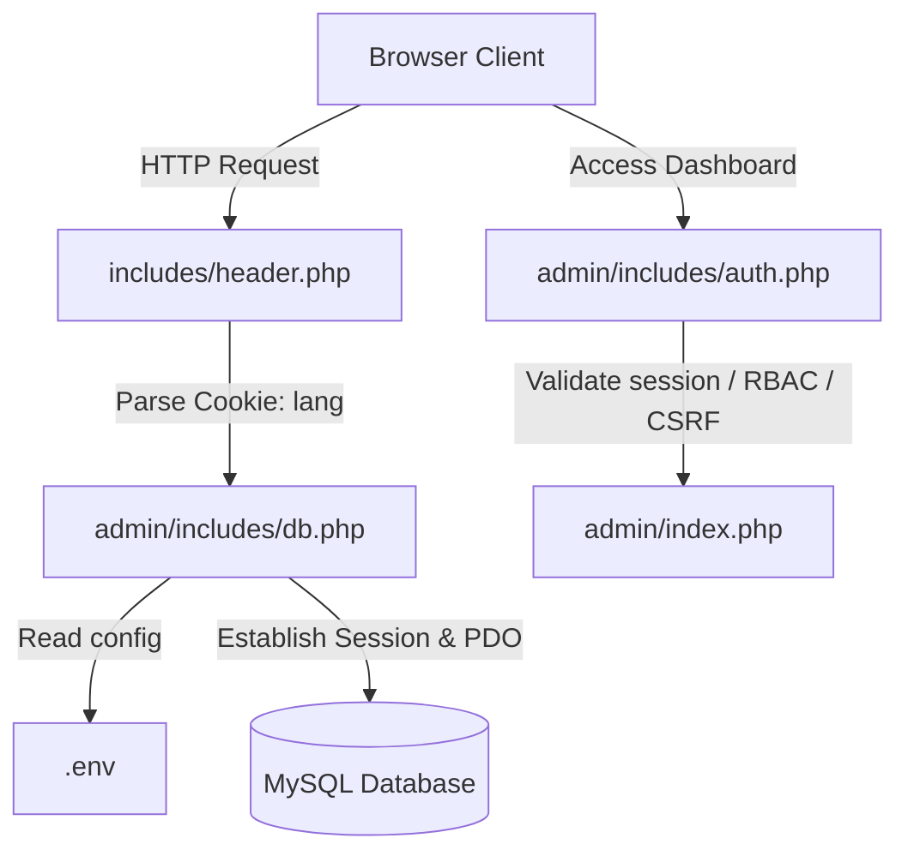

# Ministry of Labour Project Handover & Technical Specification

This document serves as the source of truth for the Ministry of Labour (Sri Lanka) web portal. It outlines the codebase architecture, environment configurations, styling rules, backend dynamics, security implementation, CMS dashboard, and build tools.

---

## 🏗️ Architectural Overview & Request Flow
The application is built on a procedural PHP backend, styled with Tailwind CSS, and uses a MySQL database via PDO.

1. **Global Configuration (`.env`):** Defines DB credentials, SMTP Mail parameters, Google reCAPTCHA v2 keys, and environment toggles (`APP_ENV`).
2. **Database Connection (`db.php`):** Parses `.env`, configures strict PDO parameters, checks active language cookies, and defines utility path functions.
3. **Session & Security (`auth.php`):** Implements secure session parameters, inactivity check timeouts, CSRF tokens, and Role-Based Access Control (RBAC).

---

## 🎨 Styling & Design Systems (Tailwind & Vanilla CSS)
The application leverages a curated color scheme and responsive system compiled via Tailwind CLI v3:

### 1. Color Palette & Typography (`tailwind.config.js`)
* **Primary Color (`#13273F`):** A premium dark slate blue used for navbars, primary action buttons, and dominant layout blocks.
* **Secondary Color (`#4E0000`):** A deep burgundy/maroon used as a secondary brand identity, statistics block backgrounds, and hover indicators.
* **Fonts:**
  * **Headings:** Montserrat (`font-montserrat`) to deliver premium, uppercase, and tracked headers.
  * **Body:** Inter (`font-inter`) for legible reading.

### 2. Base Settings & Custom Layouts (`input.css`)
* **Responsive Base Sizes:** Scaled font sizes relative to HTML viewport sizes (14.5px on mobile, 15px on small tablet, 16px on desktop) to keep layouts proportioned.
* **Smooth Scrolling:** Enabled globally (`scroll-behavior: smooth`) on `html` tags.
* **Custom Scrollbars:** Tailored scrollbar widths (`8px` for global viewports, `5px` for compact lists) styled in brand colors.
* **Utility Animations:**
  * `.animate-marquee`: Slides text horizontally in an infinite loop for news tickers.
  * `.animate-fade-in`: Custom Bezier fade-up/in transition for async component rendering.
  * `.animate-float`: Subtle up/down hover displacement.

### 3. Advanced UI/UX Components
* **Scroll Animations (AOS):** `aos.js` is globally initialized in `footer.php` with `data-aos="fade-up"`.
* **Glassmorphism:** The main header uses `backdrop-blur-md` for a premium frosted glass effect on scroll.
* **Micro-Interactions:** Custom Tailwind classes (`.news-card`, `.service-card`, `.focus-card`) implement smooth scaling, icon rotations, and cubic-bezier shadows on hover.
* **Toast Notifications (Admin):** The backend relies on a custom `window.showToast(message, type)` function (via `admin.js`) for success/error alerts instead of blocking `alert()` dialogues.

---

## ⚙️ Backend Logic & Database Handling

### 1. Connection Isolation & Environment Safeguards (`db.php`)
* **Manual `.env` Parsing:** Implements a fallback manual parser to read `.env` configurations even if PHP's native `parse_ini_file` is disabled by the hosting provider's security policies.
* **Dynamic Error Reporting:**
  * `development` environment: Automatically enables full debugging warnings via `ini_set('display_errors', 1)` and `error_reporting(E_ALL)`.
  * `production` environment: Suppresses error display (`display_errors = 0`) to prevent leaking code details, logging errors to system logs instead.
* **Database Charset:** Enforces `utf8mb4` encoding to support Unicode, ensuring Sinhalese (`si`) and Tamil (`ta`) strings load correctly.

### 2. High-Performance Caching System (`Cache.php`)
* **JSON File Caching:** Heavy homepage queries (News, Announcements, Statistics) are wrapped in `Cache::get()` and `Cache::set()`.
* **Time-To-Live (TTL):** The cache duration defaults to 5 minutes (300 seconds), reading from the `cache/` directory. This mitigates MySQL connection overloads during traffic spikes.

### 3. Multi-Language (Localization) Engine
* **Locale Detection:** Set in `$_COOKIE['lang']` (fallback to `'en'`).
* **Font Overrides:** Done dynamically in [header.php](file:///c:/xampp/htdocs/Ministry-of-Labour/includes/header.php):
  * Sinhalese -> Overrides all text to `Noto Sans Sinhala`.
  * Tamil -> Overrides all text to `Noto Sans Tamil`.
* **Database Suffix Fallback:** Database queries fetch base columns (e.g. `title`) and check language suffixes (`title_si`, `title_ta`). PHP scripts select localized strings if they are populated, falling back to English.

### 4. Search Suggestion API (`search-suggest.php`)
* **AJAX Autocomplete:** An endpoint that returns JSON suggestions for News, Vacancies, Procurements, and static pages based on a GET query (`?q=`).
* **Language Aware:** It respects the `$_COOKIE['lang']` to search against `title_si` or `title_ta` and resolves static pages against translated keyword mappings.

### 5. Server-Level Optimizations (`.htaccess`)
* **Pretty URLs:** Removes `.php` extensions and enables SEO-friendly routes (e.g. `news/123` resolves to `news-single.php?id=123`).
* **Compression & Caching:** Uses `mod_deflate` to gzip HTML/CSS/JS and `mod_expires` for aggressive browser caching of static assets.
* **Security Constraints:** Hard blocks access to sensitive files (`.env`, `.sql`, `.git`) and enforces a custom 404 router.

---

## 🔒 Security Architecture
The application maintains strict protection layers against common web vulnerabilities:

### 1. Database prepared statements
* **Native Prep Enforcements:** Handled using `$pdo->setAttribute(PDO::ATTR_EMULATE_PREPARES, false)`. This sends SQL queries and parameter bindings separately to the MySQL engine, preventing SQL Injection exploits.

### 2. Session Hygiene & CSRF Defenses (`auth.php`)
* **Session Cookie Properties:** Cookies are generated using:
  * `httponly => true`: Prevents client-side scripts (JS) from accessing the session ID cookie (guards against Session Hijacking via XSS).
  * `samesite => 'Lax'`: Mitigates Cross-Site Request Forgery (CSRF) on navigation paths.
  * `secure => true`: Enforces HTTPS transmission (if SSL is active).
* **Session Fixation Defense:** Triggers `session_regenerate_id(true)` upon successful credentials verification to discard old session identifiers.
* **Inactivity Timeout:** Monitors active admin activity. If idle for `300 seconds` (5 minutes), the session is destroyed and the user is redirected to the login.
* **Brute-Force Rate Limiting:** Tracked via `Cache.php` in `admin/login.php`. If an IP fails to log in 5 times, they are locked out for 15 minutes (900 seconds) before they can attempt again.
* **CSRF Token Verification:** 
  * Generates random tokens via `bin2hex(random_bytes(32))`.
  * Verifies POST/GET variables with a cryptographically-secure, constant-time compare function: `hash_equals($_SESSION['csrf_token'], $token)`.

### 3. Output Sanitization & Spam Prevention
* **XSS Defense:** Forms and dynamic outputs employ `htmlspecialchars(stripslashes(trim($data)))` within `sanitizeInput()` to eliminate malicious script injections.
* **Google reCAPTCHA v2:** Implemented on public-facing endpoints (e.g. `process-contact.php`) requiring server-side API verification (`https://www.google.com/recaptcha/api/siteverify`) before processing emails or database inserts.

### 4. Email & SMTP Handling (`Mailer.php`)
* **Centralized Utility (`App\Utilities\Mailer`):** A custom wrapper that dynamically loads `.env` variables on demand and uses `PHPMailer`.
* **Dynamic Security Modes:** Automatically switches between `ENCRYPTION_SMTPS` (for port 465) and `ENCRYPTION_STARTTLS` (for port 587 or 25).
* **SSL Bypass Support:** Supports `SMTP_BYPASS_SSL` via `.env` to allow self-signed certificates or unverified peers for internal network relays.

---

## 🖥️ CMS Admin Panel Operations

### 1. Role-Based Access Control (RBAC)
User accounts are classified into specific capability matrices:
* **`executive_officer` (Administrator):** Master role with access to user management, booking approvals, news, IAU records, statistics adjustments, vacancies, procurements, and global configurations.
* **`content_editor`:** Restricted to managing public articles and news logs.

### 2. Secure File Upload Handler (`functions.php`)
All uploads (notices, vacancy PDFs, official images) run through a centralized validator `handleFileUpload()`:
1. **Size check:** Rejects files exceeding the configured limit (defaults to `5MB`).
2. **Real MIME-Type lookup:** Performs verification using `FILEINFO_MIME_TYPE` (`finfo_open`) or `mime_content_type` rather than trusting the user's HTTP headers.
3. **Extension Whitelisting:** Strictly limits uploads to `['jpg', 'jpeg', 'png', 'webp', 'pdf']` to prevent remote execution exploits (RCE).
4. **Filename Sanitization:** Replaces special characters with hyphens to form a clean URL-slug.
5. **Collision Protection:** Appends a random hash `uniqid()` to prevent rewriting existing files.
6. **Date-Based Organization:** Stores files in folder hierarchies organized by year/month (e.g. `uploads/2026/07/`).

### 3. Content Creation & Workflow (e.g., `news-add.php`)
* **Rich Text Editing (Quill.js):** Uses Quill.js for WYSIWYG editing, syncing HTML content to hidden inputs upon form submission.
* **Auto-Translate API:** Integrates the Google Translate API (`translate.googleapis.com`) to instantly translate English titles and body content into Sinhala and Tamil via AJAX buttons.
* **Publishing Workflow:** Implements a strict state machine (`Draft` -> `Pending Approval` -> `Published`). Only `executive_officer` roles (or those with `approve_news` permissions) can finalize publications.
* **Live Media Preview:** Uses native JS `FileReader` to generate immediate thumbnail previews for single (cover) and multiple (gallery) image uploads before form submission, with client-side 5MB size validation.

---

## 🛠️ Build Pipeline
The asset compilation workflow uses Tailwind CLI. Scripts are configured in `package.json`:
* **Development Build (Watch Mode):** `npm run dev`
* **Production Build (Minified):** `npm run build:prod`

## 🗂️ Workflow & Templates
* **Templates (`templates/`):** When generating new UI or CMS pages, always look for boilerplate files here to duplicate. This saves tokens and guarantees architecture consistency.
* **Task Management (`TODO.md`):** Sequential project goals should be listed in `TODO.md` at the project root. The AI should follow these incrementally.

---

### 2026-07-14 (Home Page Statistics Order, Linking, and Admin Controls)
* **Files:** [index.php](file:///c:/xampp/htdocs/Ministry-of-Labour/index.php), [admin/manage-statistics.php](file:///c:/xampp/htdocs/Ministry-of-Labour/admin/manage-statistics.php), [admin/includes/auth.php](file:///c:/xampp/htdocs/Ministry-of-Labour/admin/includes/auth.php), [includes/header.php](file:///c:/xampp/htdocs/Ministry-of-Labour/includes/header.php), [downloads.php](file:///c:/xampp/htdocs/Ministry-of-Labour/downloads.php), [.agents/handover.md](file:///c:/xampp/htdocs/Ministry-of-Labour/.agents/handover.md)
* **Author:** Antigravity AI
* **Change Description:** Reordered homepage statistics: Affiliated Institutions (linked to section), Labour Acts Enforced (plain text), ILO Ratified Conventions (linked to Normlex country profile URL), and Total Visitors (automated count). Updated the admin panel to disable editing for `total_visitors` both on the frontend interface and in the backend POST handler. Configured cache purging on stats update. Added explicit type hinting to functions in `auth.php` and `manage-statistics.php` (including `mixed $val` on visitor count formatting) to clear IDE parameter type notices. Moved the homepage **Institutions** section to display directly before the **Quick Links** section. Updated the Ministry's contact telephone to `011 2581991` and email to `info@labourmin.gov.lk` in the header top bar. Renamed **Circuit Bungalow** to **Ampara Circuit Bungalow** inside the homepage Quick Links. Modified the homepage **Acts & Amendments** link in the Downloads section to pass `?category=acts-amendments`. Added support for the compound `acts-amendments` category in the frontend filter dropdown and JavaScript search handler of [downloads.php](file:///c:/xampp/htdocs/Ministry-of-Labour/downloads.php), so it correctly shows only Acts and Amendments on page load.

### 2026-07-14 (Created NLAC Page and linked to Quick Links)
* **Files:** [nlac.php](file:///c:/xampp/htdocs/Ministry-of-Labour/nlac.php), [includes/footer.php](file:///c:/xampp/htdocs/Ministry-of-Labour/includes/footer.php), [index.php](file:///c:/xampp/htdocs/Ministry-of-Labour/index.php)
* **Author:** Antigravity AI
* **Change Description:** Created a new static page `nlac.php` for the National Labour Advisory Council matching the existing frontend template design with Tailwind CSS and grid layouts. Appended the link to the "Quick Links" section in the footer, and updated the NLAC focus card in the homepage "Quick Links" section to point directly to the new page instead of the old section anchor.

### 2026-07-13 (Admin Session Inactivity Timeout Adjustment)
* **Files:** [admin/includes/auth.php](file:///c:/xampp/htdocs/Ministry-of-Labour/admin/includes/auth.php), [.agents/handover.md](file:///c:/xampp/htdocs/Ministry-of-Labour/.agents/handover.md)
* **Author:** Antigravity AI
* **Change Description:** Adjusted the inactivity session timeout value from 10 minutes (600 seconds) to 5 minutes (300 seconds) to strictly conform to meeting progress requirements.

### 2026-07-13 (Housekeeping & Temporary File Deletion)
* **Files:** None (Deleted: `test_db.php`, `test_db_iau.php`, `test_post.php`), [.agents/handover.md](file:///c:/xampp/htdocs/Ministry-of-Labour/.agents/handover.md)
* **Author:** Antigravity AI
* **Change Description:** Cleaned up the repository by deleting three redundant, unreferenced test files (`test_db.php`, `test_db_iau.php`, and `test_post.php`) from the root directory to maintain a clean codebase.

### 2026-07-13 (Affiliated Institutions & About Us UI/UX Responsive Split-Pane & Visual Polish)
* **Files:** [index.php](file:///c:/xampp/htdocs/Ministry-of-Labour/index.php), [about-us.php](file:///c:/xampp/htdocs/Ministry-of-Labour/about-us.php), [input.css](file:///c:/xampp/htdocs/Ministry-of-Labour/input.css), [assets/js/main.js](file:///c:/xampp/htdocs/Ministry-of-Labour/assets/js/main.js), [.agents/handover.md](file:///c:/xampp/htdocs/Ministry-of-Labour/.agents/handover.md)
* **Author:** Antigravity AI
* **Change Description:** Replaced the Affiliated Institutions (home) and Divisions & Functions (about us) selector switcher layouts with unified split-pane tab card containers. Designed vertical tab buttons inside a left sidebar on desktop (`md:flex-row`), merging the active tab directly into the white right-side content pane using border overlays (`-mr-[1px]` and `border-r-white`). Integrated premium icon bubbles (`.icon-bubble`) inside the tab buttons that scale and colorize on hover/active states, matching the website's visual style. Programmed responsive media queries that collapse the sidebar into a horizontal scrollable tab bar on mobile (`max-width: 767px`) with `snap-x` CSS snapping and resolved overlap issues by styling them as clean, non-shrinking pill chips (`shrink-0 w-auto`). Updated active tab scroll triggers to dynamically run `.scrollIntoView` for active tabs on mobile to smoothly center them upon user click. Polished the About Us page with grayscale-to-color partner filters, image collage scale overlays, a gradient background for the vision/mission card, and glass hover lifting for organizational chart diagrams and officials cards.

### 2026-07-13 (PHPUnit Automated Test Suite Removal)
* **Files:** [.agents/AGENTS.md](file:///c:/xampp/htdocs/Ministry-of-Labour/.agents/AGENTS.md), [package.json](file:///c:/xampp/htdocs/Ministry-of-Labour/package.json), [composer.json](file:///c:/xampp/htdocs/Ministry-of-Labour/composer.json), [composer.lock](file:///c:/xampp/htdocs/Ministry-of-Labour/composer.lock), [phpunit.xml](file:///c:/xampp/htdocs/Ministry-of-Labour/phpunit.xml), [tests/](file:///c:/xampp/htdocs/Ministry-of-Labour/tests), [.phpunit.cache/](file:///c:/xampp/htdocs/Ministry-of-Labour/.phpunit.cache), [.agents/handover.md](file:///c:/xampp/htdocs/Ministry-of-Labour/.agents/handover.md)
* **Author:** Antigravity AI
* **Change Description:** Removed the PHPUnit automated test suite from the repository completely to streamline local development. Deleted the `tests/` directory, the PHPUnit cache directory `.phpunit.cache/`, and the `phpunit.xml` configuration file. Pruned the `phpunit` composer dependencies using `composer update --no-dev` and removed the `"test"` command from `package.json` scripts. Cleaned up workspace rules in `AGENTS.md` to remove the requirement of running tests during updates.

### 2026-07-13 (Documentation Update: UI/UX Audit)
* **Files:** [.agents/handover.md](file:///c:/xampp/htdocs/Ministry-of-Labour/.agents/handover.md), [.agents/AGENTS.md](file:///c:/xampp/htdocs/Ministry-of-Labour/.agents/AGENTS.md)
* **Author:** Antigravity AI
* **Change Description:** Performed a comprehensive codebase audit to document existing advanced UI/UX features (AOS scroll animations, Glassmorphism headers, Custom scrollbars, and Toast notifications). Updated `AGENTS.md` to strictly enforce the use of `showToast` in the admin panel over native `alert()`.

### 2026-07-12 (SEO & Social Sharing Preview Fix)
* **Files:** [includes/header.php](file:///c:/xampp/htdocs/Ministry-of-Labour/includes/header.php)
* **Author:** Antigravity AI
* **Change Description:** Reorganized `header.php` to define and compute `$base_url` prior to processing page metadata. Implemented dynamic prefixing logic that converts all relative OG and Twitter image assets into fully qualified absolute URLs. Added comprehensive Twitter Card meta tags (`summary_large_image`) for rich link previews across all major social networks (WhatsApp, Twitter/X, Facebook).

### 2026-07-12 (Global UI Micro-Animations)
* **Files:** [input.css](file:///c:/xampp/htdocs/Ministry-of-Labour/input.css)
* **Author:** Antigravity AI
* **Change Description:** Upgraded components in `input.css` to add smooth transitions, responsive card highlights, and micro-interactions. Buttons gain an extra 4px lift and custom ambient glowing shadows (`hover:shadow-[#4E0000]/25`) with a cubic-bezier transition. Cards (service, focus, news, statistics) now scale/translate smoothly with rotating icons on hover. Compiled assets using `npm run build:prod`.

### 2026-07-12 (Custom 404 Error Page)
* **Files:** [404.php](file:///c:/xampp/htdocs/Ministry-of-Labour/404.php)
* **Author:** Antigravity AI
* **Change Description:** Re-implemented the custom `404.php` error page with a highly polished design. Added a tri-lingual translation array supporting English, Sinhala, and Tamil based on user cookies (`lang`). Added subtle animations, glowing icons, and card hover translations to match design systems.

### 2026-07-12 (Automated Testing Framework)
* **Files:** [phpunit.xml](file:///c:/xampp/htdocs/Ministry-of-Labour/phpunit.xml), [tests/CacheTest.php](file:///c:/xampp/htdocs/Ministry-of-Labour/tests/CacheTest.php), [package.json](file:///c:/xampp/htdocs/Ministry-of-Labour/package.json)
* **Author:** Antigravity AI
* **Change Description:** Installed PHPUnit via Composer. Created the `tests/` directory and wrote an automated suite (`CacheTest.php`) to test the TTL expiration, saving, and deletion mechanics of the JSON Cache system. Added `npm run test` script.

### 2026-07-12 (Rate Limiting Security)
* **Files:** [admin/login.php](file:///c:/xampp/htdocs/Ministry-of-Labour/admin/login.php)
* **Author:** Antigravity AI
* **Change Description:** Implemented a brute-force rate limiter using `Cache.php`. IP addresses that fail to login 5 times are locked out for 15 minutes. Successful logins immediately clear the lockout cache.

### 2026-07-12 (Caching Implementation)
* **Files:** [includes/Cache.php](file:///c:/xampp/htdocs/Ministry-of-Labour/includes/Cache.php), [index.php](file:///c:/xampp/htdocs/Ministry-of-Labour/index.php)
* **Author:** Antigravity AI
* **Change Description:** Implemented a high-performance JSON file-based caching layer for the homepage to prevent database bottlenecks. Created `Cache.php` utility. Wrapped `$recentNewsRaw`, `$announcementsRaw`, and `$statisticsList` inside `Cache::get()` with a 5-minute TTL.

### 2026-07-12 (CSS Layout)
* **File:** [index.php](file:///c:/xampp/htdocs/Ministry-of-Labour/index.php)
* **Author:** Antigravity AI
* **Change Description:** Resolved a conflicting layout CSS warning on the News scrolling ticker bar (`line 174`). Removed the base `flex` class because `hidden` was also declared. This leaves `hidden` active on mobile viewports and transitions to `md:flex` on medium/large devices without layout bugs.
