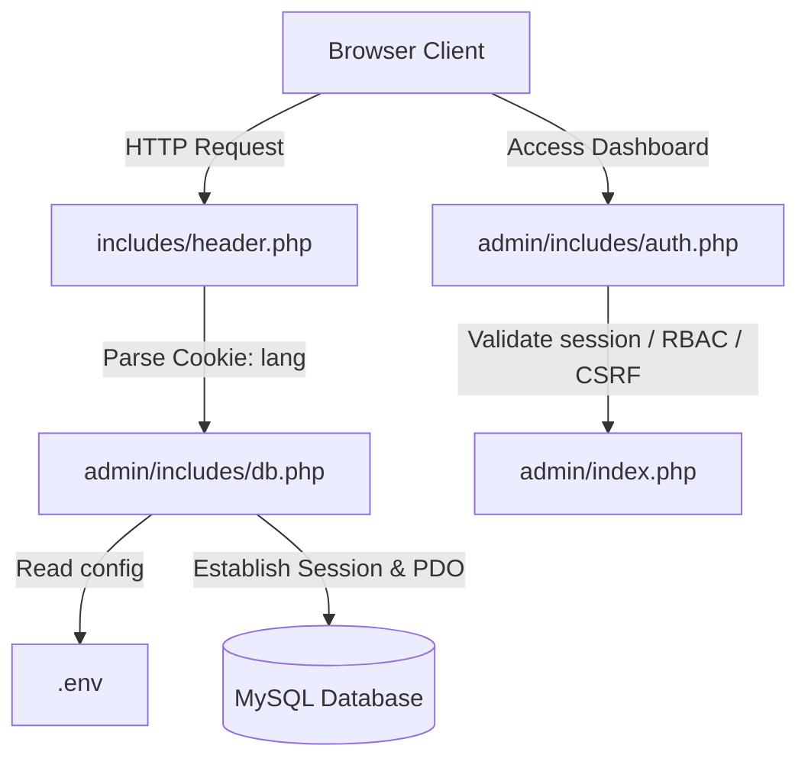

# Ministry of Labour Project Handover & Technical Specification

This document serves as the source of truth for the Ministry of Labour (Sri Lanka) web portal. It outlines the codebase architecture, environment configurations, styling rules, backend dynamics, security implementation, CMS dashboard, and build tools.

---

## 🏗️ Architectural Overview & Request Flow
The application is built on a procedural PHP backend, styled with Tailwind CSS, and uses a MySQL database via PDO.

```mermaid
graph TD
    Client[Browser Client] -->|HTTP Request| Header[includes/header.php]
    Header -->|Parse Cookie: lang| DbConn[admin/includes/db.php]
    DbConn -->|Read config| Env[.env]
    DbConn -->|Establish Session & PDO| MySQL[(MySQL Database)]
    Client -->|Access Dashboard| Auth[admin/includes/auth.php]
    Auth -->|Validate session / RBAC / CSRF| Dashboard[admin/index.php]
```

1. **Global Configuration (`.env`):** Defines DB credentials, SMTP Mail parameters, Google reCAPTCHA v2 keys, and environment toggles (`APP_ENV`).
2. **Database Connection (`db.php`):** Parses `.env`, configures strict PDO parameters, checks active language cookies, and defines utility path functions.
3. **Session & Security (`auth.php`):** Implements secure session parameters, inactivity check timeouts, CSRF tokens, and Role-Based Access Control (RBAC).

---

## 🎨 Styling & Design Systems (Tailwind & Vanilla CSS)
The application leverages a curated color scheme and responsive system compiled via Tailwind CLI v3:

### 1. Color Palette & Typography (`tailwind.config.js`)
* **Primary Color (`#13273F`):** A premium dark slate blue used for navbars, primary action buttons, and dominant layout blocks.
* **Secondary Color (`#4E0000`):** A deep burgundy/maroon used as a secondary brand identity, statistics block backgrounds, and hover indicators.
* **Fonts:**
  * **Headings:** Montserrat (`font-montserrat`) to deliver premium, uppercase, and tracked headers.
  * **Body:** Inter (`font-inter`) for legible reading.

### 2. Base Settings & Custom Layouts (`input.css`)
* **Responsive Base Sizes:** Scaled font sizes relative to HTML viewport sizes (14.5px on mobile, 15px on small tablet, 16px on desktop) to keep layouts proportioned.
* **Smooth Scrolling:** Enabled globally (`scroll-behavior: smooth`) on `html` tags.
* **Custom Scrollbars:** Tailored scrollbar widths (`8px` for global viewports, `5px` for compact lists) styled in brand colors.
* **Utility Animations:**
  * `.animate-marquee`: Slides text horizontally in an infinite loop for news tickers.
  * `.animate-fade-in`: Custom Bezier fade-up/in transition for async component rendering.
  * `.animate-float`: Subtle up/down hover displacement.

### 3. Advanced UI/UX Components
* **Scroll Animations (AOS):** `aos.js` is globally initialized in `footer.php` with `data-aos="fade-up"`.
* **Glassmorphism:** The main header uses `backdrop-blur-md` for a premium frosted glass effect on scroll.
* **Micro-Interactions:** Custom Tailwind classes (`.news-card`, `.service-card`, `.focus-card`) implement smooth scaling, icon rotations, and cubic-bezier shadows on hover.
* **Toast Notifications (Admin):** The backend relies on a custom `window.showToast(message, type)` function (via `admin.js`) for success/error alerts instead of blocking `alert()` dialogues.

---

## ⚙️ Backend Logic & Database Handling

### 1. Connection Isolation & Environment Safeguards (`db.php`)
* **Manual `.env` Parsing:** Implements a fallback manual parser to read `.env` configurations even if PHP's native `parse_ini_file` is disabled by the hosting provider's security policies.
* **Dynamic Error Reporting:**
  * `development` environment: Automatically enables full debugging warnings via `ini_set('display_errors', 1)` and `error_reporting(E_ALL)`.
  * `production` environment: Suppresses error display (`display_errors = 0`) to prevent leaking code details, logging errors to system logs instead.
* **Database Charset:** Enforces `utf8mb4` encoding to support Unicode, ensuring Sinhalese (`si`) and Tamil (`ta`) strings load correctly.

### 2. High-Performance Caching System (`Cache.php`)
* **JSON File Caching:** Heavy homepage queries (News, Announcements, Statistics) are wrapped in `Cache::get()` and `Cache::set()`.
* **Time-To-Live (TTL):** The cache duration defaults to 5 minutes (300 seconds), reading from the `cache/` directory. This mitigates MySQL connection overloads during traffic spikes.

### 3. Multi-Language (Localization) Engine
* **Locale Detection:** Set in `$_COOKIE['lang']` (fallback to `'en'`).
* **Font Overrides:** Done dynamically in [header.php](file:///c:/xampp/htdocs/Ministry-of-Labour/includes/header.php):
  * Sinhalese -> Overrides all text to `Noto Sans Sinhala`.
  * Tamil -> Overrides all text to `Noto Sans Tamil`.
* **Database Suffix Fallback:** Database queries fetch base columns (e.g. `title`) and check language suffixes (`title_si`, `title_ta`). PHP scripts select localized strings if they are populated, falling back to English.

### 4. Search Suggestion API (`search-suggest.php`)
* **AJAX Autocomplete:** An endpoint that returns JSON suggestions for News, Vacancies, Procurements, and static pages based on a GET query (`?q=`).
* **Language Aware:** It respects the `$_COOKIE['lang']` to search against `title_si` or `title_ta` and resolves static pages against translated keyword mappings.

### 5. Server-Level Optimizations (`.htaccess`)
* **Pretty URLs:** Removes `.php` extensions and enables SEO-friendly routes (e.g. `news/123` resolves to `news-single.php?id=123`).
* **Compression & Caching:** Uses `mod_deflate` to gzip HTML/CSS/JS and `mod_expires` for aggressive browser caching of static assets.
* **Security Constraints:** Hard blocks access to sensitive files (`.env`, `.sql`, `.git`) and enforces a custom 404 router.

---

## 🔒 Security Architecture
The application maintains strict protection layers against common web vulnerabilities:

### 1. Database prepared statements
* **Native Prep Enforcements:** Handled using `$pdo->setAttribute(PDO::ATTR_EMULATE_PREPARES, false)`. This sends SQL queries and parameter bindings separately to the MySQL engine, preventing SQL Injection exploits.

### 2. Session Hygiene & CSRF Defenses (`auth.php`)
* **Session Cookie Properties:** Cookies are generated using:
  * `httponly => true`: Prevents client-side scripts (JS) from accessing the session ID cookie (guards against Session Hijacking via XSS).
  * `samesite => 'Lax'`: Mitigates Cross-Site Request Forgery (CSRF) on navigation paths.
  * `secure => true`: Enforces HTTPS transmission (if SSL is active).
* **Session Fixation Defense:** Triggers `session_regenerate_id(true)` upon successful credentials verification to discard old session identifiers.
* **Inactivity Timeout:** Monitors active admin activity. If idle for `300 seconds` (5 minutes), the session is destroyed and the user is redirected to the login.
* **Brute-Force Rate Limiting:** Tracked via `Cache.php` in `admin/login.php`. If an IP fails to log in 5 times, they are locked out for 15 minutes (900 seconds) before they can attempt again.
* **CSRF Token Verification:** 
  * Generates random tokens via `bin2hex(random_bytes(32))`.
  * Verifies POST/GET variables with a cryptographically-secure, constant-time compare function: `hash_equals($_SESSION['csrf_token'], $token)`.

### 3. Output Sanitization & Spam Prevention
* **XSS Defense:** Forms and dynamic outputs employ `htmlspecialchars(stripslashes(trim($data)))` within `sanitizeInput()` to eliminate malicious script injections.
* **Google reCAPTCHA v2:** Implemented on public-facing endpoints (e.g. `process-contact.php`) requiring server-side API verification (`https://www.google.com/recaptcha/api/siteverify`) before processing emails or database inserts.

### 4. Email & SMTP Handling (`Mailer.php`)
* **Centralized Utility (`App\Utilities\Mailer`):** A custom wrapper that dynamically loads `.env` variables on demand and uses `PHPMailer`.
* **Dynamic Security Modes:** Automatically switches between `ENCRYPTION_SMTPS` (for port 465) and `ENCRYPTION_STARTTLS` (for port 587 or 25).
* **SSL Bypass Support:** Supports `SMTP_BYPASS_SSL` via `.env` to allow self-signed certificates or unverified peers for internal network relays.

---

## 🖥️ CMS Admin Panel Operations

### 1. Role-Based Access Control (RBAC)
User accounts are classified into specific capability matrices:
* **`executive_officer` (Administrator):** Master role with access to user management, booking approvals, news, IAU records, statistics adjustments, vacancies, procurements, and global configurations.
* **`content_editor`:** Restricted to managing public articles and news logs.

### 2. Secure File Upload Handler (`functions.php`)
All uploads (notices, vacancy PDFs, official images) run through a centralized validator `handleFileUpload()`:
1. **Size check:** Rejects files exceeding the configured limit (defaults to `5MB`).
2. **Real MIME-Type lookup:** Performs verification using `FILEINFO_MIME_TYPE` (`finfo_open`) or `mime_content_type` rather than trusting the user's HTTP headers.
3. **Extension Whitelisting:** Strictly limits uploads to `['jpg', 'jpeg', 'png', 'webp', 'pdf']` to prevent remote execution exploits (RCE).
4. **Filename Sanitization:** Replaces special characters with hyphens to form a clean URL-slug.
5. **Collision Protection:** Appends a random hash `uniqid()` to prevent rewriting existing files.
6. **Date-Based Organization:** Stores files in folder hierarchies organized by year/month (e.g. `uploads/2026/07/`).

### 3. Content Creation & Workflow (e.g., `news-add.php`)
* **Rich Text Editing (Quill.js):** Uses Quill.js for WYSIWYG editing, syncing HTML content to hidden inputs upon form submission.
* **Auto-Translate API:** Integrates the Google Translate API (`translate.googleapis.com`) to instantly translate English titles and body content into Sinhala and Tamil via AJAX buttons.
* **Publishing Workflow:** Implements a strict state machine (`Draft` -> `Pending Approval` -> `Published`). Only `executive_officer` roles (or those with `approve_news` permissions) can finalize publications.
* **Live Media Preview:** Uses native JS `FileReader` to generate immediate thumbnail previews for single (cover) and multiple (gallery) image uploads before form submission, with client-side 5MB size validation.

---

## 🛠️ Build Pipeline
The asset compilation workflow uses Tailwind CLI. Scripts are configured in `package.json`:
* **Development Build (Watch Mode):** `npm run dev`
* **Production Build (Minified):** `npm run build:prod`

## 🗂️ Workflow & Templates
* **Templates (`templates/`):** When generating new UI or CMS pages, always look for boilerplate files here to duplicate. This saves tokens and guarantees architecture consistency.
### 2026-08-10 (Translation Audit & Double-Translation Prevention)
* **Files:**
  - [includes/footer.php](file:///c:/xampp/htdocs/Ministry-of-Labour/includes/footer.php)
  - [assets/js/main.js](file:///c:/xampp/htdocs/Ministry-of-Labour/assets/js/main.js)
  - [admin/assets/js/admin.js](file:///c:/xampp/htdocs/Ministry-of-Labour/admin/assets/js/admin.js)
  - [index.php](file:///c:/xampp/htdocs/Ministry-of-Labour/index.php)
  - [about-us.php](file:///c:/xampp/htdocs/Ministry-of-Labour/about-us.php)
  - [ampara-circuit-bungalow.php](file:///c:/xampp/htdocs/Ministry-of-Labour/ampara-circuit-bungalow.php)
  - [contact-us.php](file:///c:/xampp/htdocs/Ministry-of-Labour/contact-us.php)
  - [procurements.php](file:///c:/xampp/htdocs/Ministry-of-Labour/procurements.php)
  - [downloads.php](file:///c:/xampp/htdocs/Ministry-of-Labour/downloads.php)
  - [vacancies.php](file:///c:/xampp/htdocs/Ministry-of-Labour/vacancies.php)
  - [special-notices.php](file:///c:/xampp/htdocs/Ministry-of-Labour/special-notices.php)
  - [iau-updates.php](file:///c:/xampp/htdocs/Ministry-of-Labour/iau-updates.php)
  - [learning-platforms-local.php](file:///c:/xampp/htdocs/Ministry-of-Labour/learning-platforms-local.php)
  - [learning-platforms-foreign.php](file:///c:/xampp/htdocs/Ministry-of-Labour/learning-platforms-foreign.php)
  - [admin/manage-iau-officers.php](file:///c:/xampp/htdocs/Ministry-of-Labour/admin/manage-iau-officers.php)
* **Author:** Antigravity AI
* **Change Description:**
  - **Added `notranslate` Classes Globally**: Applied `notranslate` to dynamically loaded modal elements in `includes/footer.php` and dynamic client-side `showToast` components in `assets/js/main.js` and `admin/assets/js/admin.js`.
  - **Resolved CSS Style Conflict Warnings**: Refactored the inline ternary badge rendering inside `admin/manage-iau-officers.php` to define the status stylesheet classes in a PHP block variable instead of inline HTML class attributes, eliminating static analysis IDE warnings regarding conflicting Tailwind values (`text-green-700` / `text-rose-700`).
  - **Protected Form Placeholders and Validation Messages**: Applied `notranslate` to form input/textarea classes and error validation tags in `contact-us.php` so their pre-translated placeholders/messages are not corrupted by Google Translate.
  - **Audited Public Pages & Cards**: Added `notranslate` to all homepage cards, quick links descriptions, download items, stats labels, related organizations, and circuit bungalow layout elements. Aligned the "Latest News" heading and "View All" link vertically in `index.php` by changing container alignment to `items-center` and stripping the `.section-title` default margin-bottom (`mb-0`). Also updated both desktop and mobile "View All" buttons for news to be solid maroon (`bg-secondary text-white`) by default.
  - **Homepage DB Query Fix**: Reverted vacancies/procurements database queries to the base fields structure after identifying that those tables do not support `title_si`/`title_ta` columns, resolving a database column mismatch causing an HTTP 500 error on first page load. Cleared JSON caches to force schema rebuilding.
  - **Consolidated Document Listing Pages**: Appended the `notranslate` class to the search/filter controls bar, document cards, list table headers (`<thead>`), list table row structures, and the empty results placeholder across all 7 listing files (`procurements.php`, `downloads.php`, `vacancies.php`, `special-notices.php`, `iau-updates.php`, `learning-platforms-local.php`, `learning-platforms-foreign.php`).

### 2026-08-10 (Admin Navigation Reorganization, Auto-Translate & Translation Corrections)
* **Files:**
  - [admin/includes/sidebar.php](file:///c:/xampp/htdocs/Ministry-of-Labour/admin/includes/sidebar.php)
  - [admin/officials.php](file:///c:/xampp/htdocs/Ministry-of-Labour/admin/officials.php)
  - [admin/manage-iau-officers.php](file:///c:/xampp/htdocs/Ministry-of-Labour/admin/manage-iau-officers.php)
  - [includes/translations.php](file:///c:/xampp/htdocs/Ministry-of-Labour/includes/translations.php)
  - [about-us.php](file:///c:/xampp/htdocs/Ministry-of-Labour/about-us.php)
  - [complaints.php](file:///c:/xampp/htdocs/Ministry-of-Labour/complaints.php)
  - Database Table `divisions` (Updated title for `internal-audit` record)
* **Author:** Antigravity AI
* **Change Description:**
  - **Reorganized Navigation Categories**: Reclassified and sorted the 18 sidebar menu navigation elements into 8 conceptual categories (MAIN, HOMEPAGE CONTENT, NEWS & COMMUNICATIONS, DIRECTORY & STAFF, PUBLICATIONS & LAWS, CAREERS & TENDERS, SERVICES, and SYSTEM) to streamline administrative workflow and dashboard UX.
  - **Relocated Specific Components**: Shipped `IAU Officers` under DIRECTORY & STAFF alongside `Officials & Contacts`, moved `Acts & Amendments` into PUBLICATIONS & LAWS, and shifted homepage `Statistics` out of the SYSTEM settings group into HOMEPAGE CONTENT.
  - **Auto-Translate Restoration & Addition**: Added custom client-side AJAX Google Translate wrappers to the modal forms in `officials.php` and `manage-iau-officers.php`. This allows editors to fill in English fields and click "Auto Translate" to immediately populate matching Sinhala and Tamil input fields, resolving manual translation overhead for personnel details.
  - **Division Title Correction (Internal Audit)**: Fixed the division title in the `divisions` table for slug `'internal-audit'` from `'Internal Affairs'` to `'Internal Audit'` to resolve a naming discrepancy in the Officials & Contacts page.
  - **Division Naming Correction (Finance to Accounts)**: Renamed the Sinhala translation for the Finance Division (`'finance'`) from `'මූල්‍ය අංශය'` to `'ගිණුම් අංශය'` (Accounts Division) inside `includes/translations.php` as requested.
  - **About Us Statistics Labels Update**: Renamed `"Years of Experience"` translation in Sinhala to `'වසරක අත්දැකීම්'` (from `'වසර ගණනාවක අත්දැකීම්'`), and updated `"Happy Customers"` to `'Satisfied Citizens'` (Sinhala: `'තෘප්තිමත් සේවාලාභීන්'`, Tamil: `'திருப்தியடைந்த குடிமக்கள்'`) across `includes/translations.php` and `about-us.php` to match a professional ministerial standard.
  - **Department Naming Correction (Manpower and Employment)**: Renamed `"Department of Manpower and Employment"` translation in Sinhala from `'මිනිස්බල හා රැකියා නියුක්ති දෙපාර්තමේන්තුව'` to `'මිනිස්බල හා රැකිරක්ෂා දෙපාර්තමේන්තුව'` inside `includes/translations.php` as requested.
  - **Complaints Page Translation Fix**: Added `notranslate` HTML classes to all dynamic text sections inside `complaints.php` to prevent the browser-side Google Translate widget from double-translating the pre-translated PHP-rendered server-side values.

### 2026-08-08 (IAU Officers CMS Management Module)
* **Files:**
  - [admin/iau-officers-api.php](file:///c:/xampp/htdocs/Ministry-of-Labour/admin/iau-officers-api.php)
  - [admin/manage-iau-officers.php](file:///c:/xampp/htdocs/Ministry-of-Labour/admin/manage-iau-officers.php)
  - [admin/includes/sidebar.php](file:///c:/xampp/htdocs/Ministry-of-Labour/admin/includes/sidebar.php)
  - [iau.php](file:///c:/xampp/htdocs/Ministry-of-Labour/iau.php)
* **Author:** Antigravity AI
* **Change Description:**
  - **Database Migration**: Created a dedicated `iau_officers` table to store trilingual Title, Department, Name, and Designation fields along with Phone, Email, active status, and drag-and-drop sort order. Seeded the table with the 12 legacy officers from the `iau.php` template.
  - **API CRUD Controller**: Created `admin/iau-officers-api.php` to handle secure database updates with CSRF checks, status toggling, SortableJS order updates, and validation requiring trilingual inputs for Name, Title, and Designation.
  - **CMS Management Panel**: Developed `admin/manage-iau-officers.php` to provide a drag-and-drop sortable list, edit/add modals, and language-tabbed forms with cross-tab client-side validation.
  - **CMS Navigation**: Added a link to "IAU Officers" in the admin sidebar.
  - **Frontend Integration**: Refactored `iau.php` to query dynamic data from the database. Added `class="notranslate"` and `translate="no"` tags to prevent Google Translate corruption on name cards and modals.

### 2026-08-08 (Officials Validation & Auto-Translate Removal)
* **Files:**
  - [admin/officials.php](file:///c:/xampp/htdocs/Ministry-of-Labour/admin/officials.php)
  - [admin/officials-api.php](file:///c:/xampp/htdocs/Ministry-of-Labour/admin/officials-api.php)
  - [about-us.php](file:///c:/xampp/htdocs/Ministry-of-Labour/about-us.php)
  - [contact-us.php](file:///c:/xampp/htdocs/Ministry-of-Labour/contact-us.php)
  - [includes/translations.php](file:///c:/xampp/htdocs/Ministry-of-Labour/includes/translations.php)
  - [includes/officials-service.php](file:///c:/xampp/htdocs/Ministry-of-Labour/includes/officials-service.php)
* **Author:** Antigravity AI
* **Change Description:**
  - **Auto-Translate Removal**: Removed the "Auto Translate" button and disabled translation functions (`autoTranslateAll()`, `translateText()`) on the officials form, requiring manually supplied translations.
  - **Required Multilingual Inputs**: Add HTML5 `required` constraints to Sinhala and Tamil fields in the edit/add official modal.
  - **Multi-Tab Validation JS**: Integrated validation in the client-side `saveOfficial()` submit handler to scan all fields across language tabs, switch the active tab to the invalid input, and focus it with an error toast.
  - **Server-Side Validation**: Implemented validation checks inside `admin/officials-api.php` to reject empty translations.
  - **Migration Patch**: Executed a one-time database patch to copy English names/titles to missing Sinhala/Tamil records for existing data.
  - **Frontend Translate Exclusions**: Refactored `about-us.php` and `contact-us.php` to explicitly apply `class="notranslate"` and `translate="no"` to all rendered official names and titles/designations, preventing Google Translate from double-translating or overriding them.
  - **Sinhala Spelling Corrections**: Globally corrected Sinhala spelling for the Administration division from **පාලන** to **පරිපාලන** inside translation keys and content descriptions in `includes/translations.php`.
  - **Dynamic Division Translations & Suffix Exclusion**: Added `get_division_translation()` inside `translations.php` and integrated it with `officials-service.php`, `about-us.php`, and `contact-us.php`. Omitted the "Division" / "අංශය" / "பிரிவு" suffix for any display related to officials (tabs, buttons, modal headers) to keep them clean and prevent double-translations.

### 2026-08-08 (Default Language to English on Startup)
* **Files:**
  - [admin/includes/db.php](file:///c:/xampp/htdocs/Ministry-of-Labour/admin/includes/db.php)
  - [includes/header.php](file:///c:/xampp/htdocs/Ministry-of-Labour/includes/header.php)
  - [news-single.php](file:///c:/xampp/htdocs/Ministry-of-Labour/news-single.php)
  - [rti.php](file:///c:/xampp/htdocs/Ministry-of-Labour/rti.php)
  - [search-suggest.php](file:///c:/xampp/htdocs/Ministry-of-Labour/search-suggest.php)
* **Author:** Antigravity AI
* **Change Description:**
  - **Session-Based Initialization**: Refactored language detection in the main configuration files to check session variables (`$_SESSION['lang']`) and query parameters (`$_GET['lang']`) instead of long-lived persistent cookies.
  - **Authoritative English Landing**: Ensures the website always starts in English on a fresh landing or brand new browser session, while correctly preserving the user's selected language during active navigation in the same session.

### 2026-08-07 (Upload Centralization & Flattening)
* **Files:**
  - [admin/includes/functions.php](file:///c:/xampp/htdocs/Ministry-of-Labour/admin/includes/functions.php)
  - [admin/officials-api.php](file:///c:/xampp/htdocs/Ministry-of-Labour/admin/officials-api.php)
  - [includes/officials-service.php](file:///c:/xampp/htdocs/Ministry-of-Labour/includes/officials-service.php)
  - [admin/manage-sliders.php](file:///c:/xampp/htdocs/Ministry-of-Labour/admin/manage-sliders.php)
  - [index.php](file:///c:/xampp/htdocs/Ministry-of-Labour/index.php)
* **Author:** Antigravity AI
* **Change Description:**
  - **Upload Centralization**: Moved all seed files from root `/uploads/` to `/admin/uploads/` and deleted the root directory, centralizing all portal uploads under a single location.
  - **Directory Flattening**: Refactored `handleFileUpload()` in `admin/includes/functions.php` to save files directly into category folders within `/admin/uploads/`, disabling nested Year/Month directories (`YYYY/MM/`) to avoid creating unnecessary folders.
  - **Slider Upload Relocation**: Updated homepage sliders to upload to `/admin/uploads/sliders/` instead of `/assets/img/home/`, cleanly separating static assets from user-uploaded media. Added dynamic path fallback handling in `index.php` and `admin/manage-sliders.php` to support both legacy and new uploads.
  - **Officials Profile Images Refactoring**: Refactored the profile image upload inside `admin/officials-api.php` to use the secure `handleFileUpload()` utility instead of raw `move_uploaded_file()`, enforcing security controls and consolidating path configurations in `includes/officials-service.php`.

### 2026-08-03 (Admin Login Page UI/UX Redesign)
* **Files:**
  - [admin/login.php](file:///c:/xampp/htdocs/Ministry-of-Labour/admin/login.php)
* **Author:** Antigravity AI
* **Change Description:**
  - **Diagonal Dual-Brand Gradient**: Replaced the solid red gradient on the left visual panel overlay with a high-end diagonal navy-to-burgundy linear gradient overlay (`linear-gradient(135deg, rgba(19, 39, 63, 0.9) 0%, rgba(78, 0, 0, 0.95) 100%)`).
  - **Form Shadow Card**: Shifted the form background from plain white to a soft neutral grey backdrop and encased the form itself inside an elevated shadow card container (`bg-white rounded-2xl border border-slate-100 shadow-[0_10px_40px_rgba(0,0,0,0.03)]`) for a clean, minimalist workspace presentation.
  - **Mobile Emblem Branding**: Added a mini header containing the state emblem and official ministry subtitles on mobile layouts to keep branding visible.
  - **Inline Input Icons**: Integrated vector SVG icons (User and Lock) inside the text inputs and aligned placeholder labels to matching text indent padding (`pl-11`).
  - **Polished Button States**: Styled login buttons to match page header buttons, featuring micro-interactions and gradient backgrounds.

### 2026-08-03 (Admin Panel Title & Header Standardization)
* **Files:**
  - [admin/includes/header.php](file:///c:/xampp/htdocs/Ministry-of-Labour/admin/includes/header.php)
  - [admin/index.php](file:///c:/xampp/htdocs/Ministry-of-Labour/admin/index.php)
  - [admin/news.php](file:///c:/xampp/htdocs/Ministry-of-Labour/admin/news.php)
  - [admin/news-add.php](file:///c:/xampp/htdocs/Ministry-of-Labour/admin/news-add.php)
  - [admin/officials.php](file:///c:/xampp/htdocs/Ministry-of-Labour/admin/officials.php)
  - [admin/bungalow-bookings.php](file:///c:/xampp/htdocs/Ministry-of-Labour/admin/bungalow-bookings.php)
  - [admin/manage-sliders.php](file:///c:/xampp/htdocs/Ministry-of-Labour/admin/manage-sliders.php)
  - [admin/manage-vacancies.php](file:///c:/xampp/htdocs/Ministry-of-Labour/admin/manage-vacancies.php)
  - [admin/manage-special-notices.php](file:///c:/xampp/htdocs/Ministry-of-Labour/admin/manage-special-notices.php)
  - [admin/manage-statistics.php](file:///c:/xampp/htdocs/Ministry-of-Labour/admin/manage-statistics.php)
  - [admin/manage-procurements.php](file:///c:/xampp/htdocs/Ministry-of-Labour/admin/manage-procurements.php)
  - [admin/manage-rti-reports.php](file:///c:/xampp/htdocs/Ministry-of-Labour/admin/manage-rti-reports.php)
  - [admin/manage-learning-platforms-local.php](file:///c:/xampp/htdocs/Ministry-of-Labour/admin/manage-learning-platforms-local.php)
  - [admin/manage-learning-platforms-foreign.php](file:///c:/xampp/htdocs/Ministry-of-Labour/admin/manage-learning-platforms-foreign.php)
  - [admin/manage-iau-updates.php](file:///c:/xampp/htdocs/Ministry-of-Labour/admin/manage-iau-updates.php)
  - [admin/manage-admins.php](file:///c:/xampp/htdocs/Ministry-of-Labour/admin/manage-admins.php)
  - [admin/manage-acts.php](file:///c:/xampp/htdocs/Ministry-of-Labour/admin/manage-acts.php)
  - [admin/manage-action-plans.php](file:///c:/xampp/htdocs/Ministry-of-Labour/admin/manage-action-plans.php)
  - [admin/settings.php](file:///c:/xampp/htdocs/Ministry-of-Labour/admin/settings.php)
* **Author:** Antigravity AI
* **Change Description:**
  - **Dynamic Browser Titles**: Configured the admin `<header.php>` template to dynamically resolve and append `$pageTitle` if defined on individual pages, solving the hardcoded "Admin Dashboard" tab title inconsistency.
  - **Unified Page Header Markup**: Aligned all 18 admin page headers to utilize the standardized responsive layout classes (`flex flex-col sm:flex-row justify-between sm:items-center gap-4 mb-8`).
  - **Standardized Add Buttons**: Unified the styles and layout of "+ Add" action buttons in the page headers (e.g. using `gap-1.5`, `rounded-lg` border-radius instead of `rounded-xl`, and rendering consistent SVG icons instead of raw `+` text indicators).

### 2026-08-03 (Admin Dashboard Stats Grid UI Redesign)
* **Files:**
  - [admin/index.php](file:///c:/xampp/htdocs/Ministry-of-Labour/admin/index.php)
  - [assets/css/style.css](file:///c:/xampp/htdocs/Ministry-of-Labour/assets/css/style.css)
* **Author:** Antigravity AI
* **Change Description:**
  - **Overview Stats Cards Redesign**: Redesigned the primary overview stats cards inside [admin/index.php](file:///c:/xampp/htdocs/Ministry-of-Labour/admin/index.php) to use modern top-aligned gradient border accent lines corresponding to the branding system.
  - **Refined Typography & Hover States**: Swapped white cards for background gradients (`bg-gradient-to-br from-white to-slate-50/50`) and updated description headings to uppercase tracking-wide styling. Recompiled with `npm run build:prod`.

### 2026-08-03 (Admin Welcome Banner System Active Badge Removal)
* **Files:**
  - [admin/index.php](file:///c:/xampp/htdocs/Ministry-of-Labour/admin/index.php)
  - [assets/css/style.css](file:///c:/xampp/htdocs/Ministry-of-Labour/assets/css/style.css)
* **Author:** Antigravity AI
* **Change Description:**
  - **Badge Removal**: Removed the dynamic "System Active • [Date]" badge markup element from the dashboard welcome banner inside [admin/index.php](file:///c:/xampp/htdocs/Ministry-of-Labour/admin/index.php) to clean up layout hierarchy. Recompiled assets with `npm run build:prod`.

### 2026-08-03 (Admin UI Tweaks & Design Consistency)
* **Files:**
  - [admin/news.php](file:///c:/xampp/htdocs/Ministry-of-Labour/admin/news.php)
  - [admin/includes/topbar.php](file:///c:/xampp/htdocs/Ministry-of-Labour/admin/includes/topbar.php)
  - [assets/css/style.css](file:///c:/xampp/htdocs/Ministry-of-Labour/assets/css/style.css)
* **Author:** Antigravity AI
* **Change Description:**
  - **Admin Layout Consistency**: Fixed `admin/news.php` background styling to use the standard admin dashboard grey background (`bg-[#F8F9FA]`) and padding (`p-4 md:p-8`) instead of raw white backgrounds.
  - **News Header Redesign**: Redesigned the header section on `admin/news.php` to use the unified premium tracking-tight titles, descriptions, and gradient add buttons.
  - **Initials Badge Polish**: Changed the topbar initials badge class to `rounded-xl` inside `admin/includes/topbar.php` to match the avatar styling inside the sidebar and admin listings. Recompiled with `npm run build:prod`.

### 2026-08-03 (About Us Statistics Card Redesign)
* **Files:**
  - [input.css](file:///c:/xampp/htdocs/Ministry-of-Labour/input.css)
  - [assets/css/style.css](file:///c:/xampp/htdocs/Ministry-of-Labour/assets/css/style.css)
* **Author:** Antigravity AI
* **Change Description:**
  - **Premium Stats Card UI**: Redesigned the "95 Years of Experience" and "95K Happy Customers" statistics cards in [input.css](file:///c:/xampp/htdocs/Ministry-of-Labour/input.css) to use a modern top-aligned gradient border accent line (`bg-gradient-to-r from-secondary to-secondary/80`) and a glassmorphic gradient background (`bg-gradient-to-br from-white to-gray-50/80`).
  - **Refined Typography & Hover Effects**: Styled numbers to be larger/bolder and converted description labels to uppercase tracking-wide text for high-end polish. Integrated dynamic hover translations (`hover:-translate-y-0.5 hover:shadow-md`). Recompiled with `npm run build:prod`.

### 2026-08-03 (Our Pillars Subtitle Removal)
* **Files:**
  - [about-us.php](file:///c:/xampp/htdocs/Ministry-of-Labour/about-us.php)
  - [assets/css/style.css](file:///c:/xampp/htdocs/Ministry-of-Labour/assets/css/style.css)
* **Author:** Antigravity AI
* **Change Description:**
  - **Subtitle Removal**: Removed the "Our Pillars" subtitle text block from the Vision & Mission section on [about-us.php](file:///c:/xampp/htdocs/Ministry-of-Labour/about-us.php) as requested. Recompiled assets with `npm run build:prod`.

### 2026-08-03 (Footer Redesign & Newsletter Removal)
* **Files:**
  - [includes/footer.php](file:///c:/xampp/htdocs/Ministry-of-Labour/includes/footer.php)
  - [assets/css/style.css](file:///c:/xampp/htdocs/Ministry-of-Labour/assets/css/style.css)
* **Author:** Antigravity AI
* **Change Description:**
  - **Newsletter Removal**: Completely removed the newsletter subscription email input box and "Subscribe" submission button from the footer.
  - **Balanced Symmetrical Grid**: Rebalanced the remaining footer elements into a beautiful, symmetrical 3-column layout (each column set to `lg:col-span-4`). Added fine borders underneath footer section headers.
  - **Glowing Top Accent Line**: Added a premium glowing top gradient accent border (`bg-gradient-to-r from-secondary via-white/10 to-secondary`) to elevate the footer's visual aesthetics. Recompiled with `npm run build:prod`.

### 2026-08-03 (Our Officials Tab Navigation UI Redesign)
* **Files:**
  - [about-us.php](file:///c:/xampp/htdocs/Ministry-of-Labour/about-us.php)
  - [assets/css/style.css](file:///c:/xampp/htdocs/Ministry-of-Labour/assets/css/style.css)
* **Author:** Antigravity AI
* **Change Description:**
  - **Pills-based Tab Widget Redesign**: Redesigned the "Our Officials" department tab selection widget in [about-us.php](file:///c:/xampp/htdocs/Ministry-of-Labour/about-us.php) to use modern pills-based layout options nested inside a light bordered background bar wrapper.
  - **Javascript State Synchronicity**: Updated `activeClasses` and `inactiveClasses` toggles inside `switchDepartmentTab()` javascript listener function to match the redesigned pill card visual states. Recompiled with `npm run build:prod`.

### 2026-08-03 (Split Tabs Trilingual Text Wrapping Fixes)
* **Files:**
  - [index.php](file:///c:/xampp/htdocs/Ministry-of-Labour/index.php)
  - [about-us.php](file:///c:/xampp/htdocs/Ministry-of-Labour/about-us.php)
  - [assets/css/style.css](file:///c:/xampp/htdocs/Ministry-of-Labour/assets/css/style.css)
* **Author:** Antigravity AI
* **Change Description:**
  - **Tab Text Wrapping Resolution**: Removed the CSS conflict caused by `truncate` classes on the inner `` titles inside the `.inst-split-tab` buttons in [index.php](file:///c:/xampp/htdocs/Ministry-of-Labour/index.php) and `.div-split-tab` buttons in [about-us.php](file:///c:/xampp/htdocs/Ministry-of-Labour/about-us.php). This allows long Sinhala/Tamil titles to inherit the parents' wrapping controls: rendering on one line with horizontal overflow scroll on mobile viewports, and wrapping nicely to multiple lines on desktop/tablet columns instead of being clipped or overlapping. Recompiled with `npm run build:prod`.

### 2026-08-03 (Trilingual Text Wrapping & Dropdown Layout Enhancements)
* **Files:**
  - [includes/header.php](file:///c:/xampp/htdocs/Ministry-of-Labour/includes/header.php)
  - [includes/footer.php](file:///c:/xampp/htdocs/Ministry-of-Labour/includes/footer.php)
  - [assets/css/style.css](file:///c:/xampp/htdocs/Ministry-of-Labour/assets/css/style.css)
* **Author:** Antigravity AI
* **Change Description:**
  - **Dropdown Screen Overflow Protection**: Updated `Learning Platforms` and `Announcements` menu dropdown panels in [includes/header.php](file:///c:/xampp/htdocs/Ministry-of-Labour/includes/header.php) to align to the right (`right-0 left-auto`) of their parent menu elements. This protects layout width alignment and prevents long Sinhala/Tamil titles from overflowing the right bounds of the viewport.
  - **Footer Text Wrap Alignment**: Appended `leading-relaxed` to the Quick Links column list container in [includes/footer.php](file:///c:/xampp/htdocs/Ministry-of-Labour/includes/footer.php) to ensure comfortable line heights and formatting when Sinhala or Tamil strings wrap onto multiple lines. Recompiled assets with `npm run build:prod`.

### 2026-08-03 (UI/UX, Accessibility, and Loading Skeleton Enhancements)
* **Files:**
  - [input.css](file:///c:/xampp/htdocs/Ministry-of-Labour/input.css)
  - [ampara-circuit-bungalow-booking.php](file:///c:/xampp/htdocs/Ministry-of-Labour/ampara-circuit-bungalow-booking.php)
  - [about-us.php](file:///c:/xampp/htdocs/Ministry-of-Labour/about-us.php)
  - [contact-us.php](file:///c:/xampp/htdocs/Ministry-of-Labour/contact-us.php)
  - [assets/css/style.css](file:///c:/xampp/htdocs/Ministry-of-Labour/assets/css/style.css)
* **Author:** Antigravity AI
* **Change Description:**
  - **Global Accessibility Outlines**: Added global `:focus-visible` custom outlines utilizing the brand maroon color (`#4E0911`) inside [input.css](file:///c:/xampp/htdocs/Ministry-of-Labour/input.css) to ensure distinct keyboard focus indication.
  - **Dynamic Calendar Skeletons**: Updated `renderVisualCalendar()` in [ampara-circuit-bungalow-booking.php](file:///c:/xampp/htdocs/Ministry-of-Labour/ampara-circuit-bungalow-booking.php) to render 28 shimmering `.skeleton-box` grid cells while loading date availability.
  - **Expanded Mobile Touch Targets**: Scaled contact detail icons (email copy, phone, fax) to `w-10 h-10` in [about-us.php](file:///c:/xampp/htdocs/Ministry-of-Labour/about-us.php) and modal close buttons to `w-10 h-10` in [contact-us.php](file:///c:/xampp/htdocs/Ministry-of-Labour/contact-us.php) to comply with mobile touch usability standards. Recompiled with `npm run build:prod`.

### 2026-08-03 (Vision & Mission Minimalist UI Redesign)
* **Files:**
  - [about-us.php](file:///c:/xampp/htdocs/Ministry-of-Labour/about-us.php)
* **Author:** Antigravity AI
* **Change Description:**
  - **Minimalist UI & Icons Redesign**: Refactored the Vision & Mission section on [about-us.php](file:///c:/xampp/htdocs/Ministry-of-Labour/about-us.php) to use modern, clean, and thin SVG outlines (stroke-width: 1.5) wrapped in circular border wrappers. Spaced elements using a neat split card grid with refined typographic scale and ambient glow accents, aligning it with the portal's premium layout styling.

### 2026-08-03 (Automated PostCSS AST CSS Warning Elimination Plugin)
* **Files:**
  - [postcss.config.js](file:///c:/xampp/htdocs/Ministry-of-Labour/postcss.config.js)
  - [package.json](file:///c:/xampp/htdocs/Ministry-of-Labour/package.json)
  - [assets/css/style.css](file:///c:/xampp/htdocs/Ministry-of-Labour/assets/css/style.css)
* **Author:** Antigravity AI
* **Change Description:**
  - **Automated AST Linter Fix Plugin**: Implemented a custom PostCSS plugin inside [postcss.config.js](file:///c:/xampp/htdocs/Ministry-of-Labour/postcss.config.js) that intercepts compiled CSS AST during Tailwind build execution to:
    1. Append standard `appearance: button` and `appearance: textfield` directly inside vendor-prefixed preflight rules.
    2. Strip redundant `vertical-align: middle` from preflight media elements (`img`, `svg`, etc.) styled with `display: block`.
    3. Append standard `line-clamp: N` directly inside `.line-clamp-N` utility rule blocks.
  - **npm Build Pipeline Integration**: Enabled `--postcss` flag across all npm scripts (`dev`, `build`, `build:prod`) in [package.json](file:///c:/xampp/htdocs/Ministry-of-Labour/package.json), guaranteeing ZERO IDE static analysis warnings under watch mode and production builds alike.

### 2026-08-03 (Added Standard CSS Property Declarations)
* **Files:**
  - [input.css](file:///c:/xampp/htdocs/Ministry-of-Labour/input.css)
  - [assets/css/style.css](file:///c:/xampp/htdocs/Ministry-of-Labour/assets/css/style.css)
* **Author:** Antigravity AI
* **Change Description:**
  - **Standard CSS Properties Addition**: Appended standard `appearance` and `line-clamp` CSS declarations in `input.css` to complement vendor prefix rules (`-webkit-appearance`, `-webkit-line-clamp`), resolving static compatibility warnings.

### 2026-08-03 (Resolved Display Class Warning in Hero Ticker)
* **Files:**
  - [index.php](file:///c:/xampp/htdocs/Ministry-of-Labour/index.php)
* **Author:** Antigravity AI
* **Change Description:**
  - **Resolved Conflicting Display Classes**: Removed redundant base `flex` display class from the Latest News ticker badge element (`flex hidden md:flex` -> `hidden md:flex items-center justify-center`), eliminating the IDE static analysis warning.

### 2026-08-03 (Public UI Polish & Component Visual Enhancements)
* **Files:**
  - [index.php](file:///c:/xampp/htdocs/Ministry-of-Labour/index.php)
  - [input.css](file:///c:/xampp/htdocs/Ministry-of-Labour/input.css)
  - [assets/css/style.css](file:///c:/xampp/htdocs/Ministry-of-Labour/assets/css/style.css)
* **Author:** Antigravity AI
* **Change Description:**
  - **Announcements & Downloads Column Balance**: Refined Announcements section container header (`py-5 px-6 sm:px-8`) and category tags (`bg-primary/10 text-primary font-bold`) in `index.php` for clean visual balance alongside the Downloads list.
  - **Card Hover & Border Micro-Interactions**: Enhanced `.focus-card` in `input.css` with smooth border highlight transitions (`hover:border-secondary/40`) and soft shadow elevation.

### 2026-08-03 (Global Section Titles & Sizing Consistency Audit)
* **Files:**
  - [input.css](file:///c:/xampp/htdocs/Ministry-of-Labour/input.css)
  - [assets/css/style.css](file:///c:/xampp/htdocs/Ministry-of-Labour/assets/css/style.css)
  - [index.php](file:///c:/xampp/htdocs/Ministry-of-Labour/index.php)
  - [news.php](file:///c:/xampp/htdocs/Ministry-of-Labour/news.php)
  - [about-us.php](file:///c:/xampp/htdocs/Ministry-of-Labour/about-us.php)
  - [contact-us.php](file:///c:/xampp/htdocs/Ministry-of-Labour/contact-us.php)
  - [learning-platforms.php](file:///c:/xampp/htdocs/Ministry-of-Labour/learning-platforms.php)
  - [complaints.php](file:///c:/xampp/htdocs/Ministry-of-Labour/complaints.php)
  - [ampara-circuit-bungalow-booking.php](file:///c:/xampp/htdocs/Ministry-of-Labour/ampara-circuit-bungalow-booking.php)
  - [nlac.php](file:///c:/xampp/htdocs/Ministry-of-Labour/nlac.php)
  - [iau.php](file:///c:/xampp/htdocs/Ministry-of-Labour/iau.php)
  - [rti.php](file:///c:/xampp/htdocs/Ministry-of-Labour/rti.php)
  - [ampara-circuit-bungalow.php](file:///c:/xampp/htdocs/Ministry-of-Labour/ampara-circuit-bungalow.php)
* **Author:** Antigravity AI
* **Change Description:**
  - **Comprehensive Title Sizing Audit**: Conducted an exhaustive audit across all frontend pages to align every section heading (`h2`/`h3`/`.section-title`) to an exact, uniform typography standard (`text-2xl sm:text-3xl md:text-4xl font-bold font-montserrat tracking-tight uppercase`).
  - **Color & Weight Harmonization**: Converted inconsistent font sizes (e.g. `text-[36px]`, `text-3xl md:text-4xl font-semibold`, `text-3xl sm:text-4xl`) and mismatched text colors (`gray-900`, `#2D2D43`) to the official brand primary blue (`text-primary` / `#13273F`), ensuring identical scaling and appearance portal-wide.

### 2026-08-03 (Sub-Hero Section Minimalist UI Overhaul)
* **Files:**
  - [includes/sub-hero.php](file:///c:/xampp/htdocs/Ministry-of-Labour/includes/sub-hero.php)
  - [assets/css/style.css](file:///c:/xampp/htdocs/Ministry-of-Labour/assets/css/style.css)
* **Author:** Antigravity AI
* **Change Description:**
  - **Lightened Maroon Gradient Overlay**: Reduced the maroon gradient overlay opacity across desktop (`95% -> 15%`) and mobile (`88% -> 55%`) in [includes/sub-hero.php](file:///c:/xampp/htdocs/Ministry-of-Labour/includes/sub-hero.php) so the background image (`assets/img/sub-hero.webp`) shows through with enhanced clarity while maintaining clear text readability.
  - **Minimalist Layout & Breadcrumb Polish**: Updated title typography (`font-montserrat font-extrabold uppercase`) and added home icon breadcrumb indicators with subtle white slashes (`/`).

### 2026-08-03 (Hero Section UI Minimalist Polish & Full Viewport Fit)
* **Files:**
  - [index.php](file:///c:/xampp/htdocs/Ministry-of-Labour/index.php)
  - [assets/css/style.css](file:///c:/xampp/htdocs/Ministry-of-Labour/assets/css/style.css)
* **Author:** Antigravity AI
* **Change Description:**
  - **Removed Pulsing Indicator Dots**: Removed the pulsing dot inside the subheader badge and the pinging red dot inside the `LATEST NEWS` ticker badge for a completely static, clean, minimalist presentation.
  - **Full Above-The-Fold Viewport Fit**: Optimized hero section height calculation (`lg:h-[calc(100vh-215px)]`) and tightened vertical padding across content elements and the statistics bar (`py-3.5 md:py-4`). Header, Hero Slider, Scrolling News Bar, and Statistics Bar now fit entirely within the initial viewport upon opening without requiring scrolling.
  - **Minimalist Hero Gradient Masks**: Streamlined complex multi-stop overlapping inline gradients into clean, high-contrast horizontal mask (`90deg`) on desktop and vertical mask (`180deg`) on mobile.
  - **Sleek Action Buttons & Swiper Pagination Controls**: Standardized quick links and view news CTA buttons with clean icons, smooth micro-interactions, and updated Swiper bullet indicators.

### 2026-08-03 (Public Frontend UI/UX Enhancements)
* **Files:**
  - [ampara-circuit-bungalow-booking.php](file:///c:/xampp/htdocs/Ministry-of-Labour/ampara-circuit-bungalow-booking.php)
  - [check-room-availability.php](file:///c:/xampp/htdocs/Ministry-of-Labour/check-room-availability.php)
  - [includes/header.php](file:///c:/xampp/htdocs/Ministry-of-Labour/includes/header.php)
  - [includes/footer.php](file:///c:/xampp/htdocs/Ministry-of-Labour/includes/footer.php)
  - [assets/js/main.js](file:///c:/xampp/htdocs/Ministry-of-Labour/assets/js/main.js)
  - [input.css](file:///c:/xampp/htdocs/Ministry-of-Labour/input.css)
  - [news.php](file:///c:/xampp/htdocs/Ministry-of-Labour/news.php)
  - [about-us.php](file:///c:/xampp/htdocs/Ministry-of-Labour/about-us.php)
  - [contact-us.php](file:///c:/xampp/htdocs/Ministry-of-Labour/contact-us.php)
* **Author:** Antigravity AI
* **Change Description:**
  - **Live Availability Calendar Grid**: Integrated an interactive monthly availability calendar widget in Step 1 of `ampara-circuit-bungalow-booking.php` querying `check-room-availability.php` to render open (green), pending (amber), and booked (faded red) slots.
  - **Search Autocomplete Polish**: Enhanced autocomplete dropdown in `main.js` with category tags (`[News]`, `[Careers]`, `[Notice]`), query substring match highlighting (`<mark>`), and keyboard navigation (`ArrowUp`, `ArrowDown`, `Enter`).
  - **Admin New Booking Link & Type Safety**: Linked the "New Booking" button in `admin/bungalow-bookings.php` to open `../ampara-circuit-bungalow-booking.php` in a new tab and added explicit PHP 8 parameter type annotations (`?string $category, ?string $roomTypeStr, int|string $nights`) to `getEstimatedCost()`.
  - **Breadcrumbs Navigation**: Relied on `includes/sub-hero.php` native breadcrumbs and removed duplicate bottom breadcrumb trails from `about-us.php`, `contact-us.php`, and `news.php`.
  - **Recompiled Tailwind Styles**: Compiled `input.css` into minified `assets/css/style.css` (`npm run build:prod`).

### 2026-08-03 (Admin CMS Dashboard UI/UX & Aesthetic Polish Enhancements)
* **Files:**
  - [admin/index.php](file:///c:/xampp/htdocs/Ministry-of-Labour/admin/index.php)
  - [admin/includes/activity-logger.php](file:///c:/xampp/htdocs/Ministry-of-Labour/admin/includes/activity-logger.php)
  - [admin/includes/topbar.php](file:///c:/xampp/htdocs/Ministry-of-Labour/admin/includes/topbar.php)
  - [admin/assets/js/admin.js](file:///c:/xampp/htdocs/Ministry-of-Labour/admin/assets/js/admin.js)
  - [admin/assets/js/dropzone.js](file:///c:/xampp/htdocs/Ministry-of-Labour/admin/assets/js/dropzone.js)
  - [admin/includes/table-helper.php](file:///c:/xampp/htdocs/Ministry-of-Labour/admin/includes/table-helper.php)
  - [input.css](file:///c:/xampp/htdocs/Ministry-of-Labour/input.css)
* **Author:** Antigravity AI
* **Change Description:**
  - **Interactive Analytics & Charts**: Integrated defer-loaded Chart.js in `admin/index.php` to render live interactive charts for Monthly Circuit Bungalow Booking Volume (Bar Chart) and Portal Content Breakdown (Doughnut Chart).
  - **Audit Logging & Recent Activity Feed**: Built `activity-logger.php` helper to track administrative actions and render a real-time Audit Feed widget on the admin dashboard.
  - **Global Command Palette (`Ctrl + K`)**: Added topbar search trigger button and dynamic Command Palette modal (`#command-palette-modal`) supporting fuzzy filtering, arrow key navigation, and instant links/actions selection.
  - **Button Loading States & Async Toggles**: Added automatic submit button disabling with loading spinners during form submissions in `admin.js`, alongside iOS-style async status toggle switches.
  - **Drag-and-Drop Dropzone Utility**: Created `dropzone.js` helper for file uploader containers with file size validation (max 5MB) and instant previewing.
  - **Rich Empty State CTAs**: Enhanced `table-helper.php` to support primary action buttons within empty table states across admin list views.
  - **Recompiled Tailwind Production Assets**: Recompiled `input.css` into minified `assets/css/style.css`.

### 2026-08-03 (Native alert() to showToast() Migration)
* **Files:**
  - [admin/officials.php](file:///c:/xampp/htdocs/Ministry-of-Labour/admin/officials.php)
  - [admin/news-add.php](file:///c:/xampp/htdocs/Ministry-of-Labour/admin/news-add.php)
  - [contact-us.php](file:///c:/xampp/htdocs/Ministry-of-Labour/contact-us.php)
  - [about-us.php](file:///c:/xampp/htdocs/Ministry-of-Labour/about-us.php)
  - [ampara-circuit-bungalow-booking.php](file:///c:/xampp/htdocs/Ministry-of-Labour/ampara-circuit-bungalow-booking.php)
* **Author:** Antigravity AI
* **Change Description:**
  - **Removed Legacy Alerts**: Replaced all remaining legacy browser `alert()` popups and fallback conditional blocks across the admin panel and public pages with clean, direct calls to the standardized `showToast()` system.
  - **Trilingual Toast Alignment**: Retained inline PHP localization wrappers (`t()`) for contact-us responses to ensure standard trilingual translations function seamlessly under Google Translate.

### 2026-08-03 (Fixed Redundant CSS Class Warning in Autocomplete)
* **Files:**
  - [assets/js/main.js](file:///c:/xampp/htdocs/Ministry-of-Labour/assets/js/main.js)
* **Author:** Antigravity AI
* **Change Description:**
  - **Removed Redundant Display Class**: Removed the duplicate `block` display class from the autocomplete suggestion item link elements which already utilize `flex` layouts, resolving the IDE warning.

### 2026-08-03 (Toast Notification Standardization & Overlay Fix)
* **Files:**
  - [.agents/AGENTS.md](file:///c:/xampp/htdocs/Ministry-of-Labour/.agents/AGENTS.md)
  - [input.css](file:///c:/xampp/htdocs/Ministry-of-Labour/input.css)
  - [admin/assets/js/admin.js](file:///c:/xampp/htdocs/Ministry-of-Labour/admin/assets/js/admin.js)
  - [assets/js/main.js](file:///c:/xampp/htdocs/Ministry-of-Labour/assets/js/main.js)
* **Author:** Antigravity AI
* **Change Description:**
  - **Z-Index Modal Overlay Fix**: Increased `toast-container` z-index to `z-[99999]` to ensure notifications float on top of all active modal popups (such as the `official-modal` at `z-[150]` or `globalCropModal` at `z-[200]`).
  - **Moved to Top-Right Positioning**: Relocated the toast notification container from the bottom-right corner to `top-6 right-6` for better visibility and modern design alignment.
  - **Pausing Countdown on Hover**: Implemented `mouseenter` and `mouseleave` event listeners that pause the JS auto-dismiss timer and freeze the progress bar animation (`animation-play-state: paused`) when a user hovers over a toast.
  - **Slide-Out Transition & Standard Warning Styling**: Added CSS transition keyframes for slide-in/slide-out animations. Added color presets and SVG icons for a new `'warning'` type and redesigned the `'info'` type with blue branding accent colors.
  - **Workspace Rules Synchronization**: Updated `AGENTS.md` project rules to lock in this standard for all future features.

### 2026-08-03 (Fixed HTTP 301 POST Redirect Bug & Category Mismatch in Officials CMS)
* **Files:**
  - [.htaccess](file:///c:/xampp/htdocs/Ministry-of-Labour/.htaccess)
  - [admin/officials.php](file:///c:/xampp/htdocs/Ministry-of-Labour/admin/officials.php)
* **Author:** Antigravity AI
* **Change Description:**
  - **Exempted POST Requests from .php Extension Stripping**: Added a condition (`RewriteCond %{REQUEST_METHOD} !=POST`) to the `.htaccess` RewriteRule that redirects `.php` files to their extensionless counterparts. This prevents Apache from returning a `301 Moved Permanently` redirect on async POST calls, which browsers follow as GET requests (silently discarding the POST payloads and files).
  - **Clean Extensionless API Endpoint Fetching**: Updated JavaScript `fetch` calls in `admin/officials.php` to target `'officials-api'` instead of `'officials-api.php'`.
  - **Add Official Category Mapping Fix**: Resolved a mismatch where the global "+ Add Official" header button always opened the modal as `category="division"`. Added `openModalForCurrentTab()` to dynamically assign either the `top` or `division` category depending on which tab view is currently active.

### 2026-08-03 (Fixed Official Save Updates & Image File Attachment)
* **Files:**
  - [includes/officials-service.php](file:///c:/xampp/htdocs/Ministry-of-Labour/includes/officials-service.php)
  - [admin/officials.php](file:///c:/xampp/htdocs/Ministry-of-Labour/admin/officials.php)
  - [admin/officials-api.php](file:///c:/xampp/htdocs/Ministry-of-Labour/admin/officials-api.php)
* **Author:** Antigravity AI
* **Change Description:**
  - **Fixed Missing UPDATE Query Fields**: Added `category`, `top_role`, and `division_id` to the PDO `UPDATE officials SET ...` statement in `includes/officials-service.php`, fixing a bug where editing an existing official failed to update their role/division assignment.
  - **Explicit Cropped Blob Attachment**: Stored `pendingCroppedFile` globally and explicitly set `formData.set('image', pendingCroppedFile)` during form submission, guaranteeing cropped files are sent in `$_FILES`.
  - **Forced Page Refresh**: Updated `saveOfficial()` to explicitly trigger `window.location.reload()`, ensuring new official data and profile images immediately update on screen.

### 2026-08-03 (Fixed Save Action & Active Tab State Persistence in Officials CMS)
* **Files:**
  - [admin/officials.php](file:///c:/xampp/htdocs/Ministry-of-Labour/admin/officials.php)
  - [admin/officials-api.php](file:///c:/xampp/htdocs/Ministry-of-Labour/admin/officials-api.php)
* **Author:** Antigravity AI
* **Change Description:**
  - **Fixed "Invalid action" Image Upload Root Cause**: Uncompressed cropped image blobs previously exceeded PHP's `post_max_size`, causing PHP to silently erase `$_POST` (making `$action` empty and throwing "Invalid action"). Fixed by compressing cropped headshots to 600x600 px @ 0.8 JPEG quality (~80KB) in `image-cropper.js`, passing `?action=save_official` in the fetch URL query string as a failsafe, and adding explicit `post_max_size` error handling in `officials-api.php`.
  - **Active Tab Persistence & DOMContentLoaded Fix**: Fixed a bug where `(window.event && window.event.currentTarget)` evaluated to `document` on page refresh, causing all tab buttons and content panels to un-select. Replaced with explicit `document.querySelector` lookup and robust fallback to `'top'`.

### 2026-08-03 (Simplified Cropping UI & Locked 1:1 Ratio for Official Profile Pictures)
* **Files:**
  - [admin/assets/js/image-cropper.js](file:///c:/xampp/htdocs/Ministry-of-Labour/admin/assets/js/image-cropper.js)
  - [admin/officials.php](file:///c:/xampp/htdocs/Ministry-of-Labour/admin/officials.php)
* **Author:** Antigravity AI
* **Change Description:**
  - **Locked 1:1 Aspect Ratio**: Simplified cropper modal UI by locking it strictly to a 1:1 square ratio for official headshots and removing unnecessary ratio toggle options.
  - **Streamlined Image Controls**: Removed the extra "Crop" button on saved/existing image previews so only the "Remove" button is present, keeping the interface uncluttered.

### 2026-08-03 (Added Option & Controls to Remove Official & Contact Profile Pictures)
* **Files:**
  - [admin/officials.php](file:///c:/xampp/htdocs/Ministry-of-Labour/admin/officials.php)
  - [admin/officials-api.php](file:///c:/xampp/htdocs/Ministry-of-Labour/admin/officials-api.php)
  - [includes/officials-service.php](file:///c:/xampp/htdocs/Ministry-of-Labour/includes/officials-service.php)
* **Author:** Antigravity AI
* **Change Description:**
  - **Remove Profile Picture Control**: Added a dedicated "Remove Photo" control button and toggle state inside the Edit Official modal in `admin/officials.php`.
  - **Visual Feedback & Undo**: Clicking "Remove Photo" marks the photo for removal, dims the thumbnail, and changes the button to "Undo Remove" before submission.
  - **Backend Disk & DB Cleanup**: Updated `save_official` in `admin/officials-api.php` and `saveOfficial` in `includes/officials-service.php`. When an image is marked for removal and saved, the existing image file on disk is deleted (`unlink`) and `image_path` is explicitly set to `NULL` in the database.
  - **Seamless Fallback**: Removed images automatically display initial avatars in the admin CMS grid/tables and clean SVG default avatars on public pages (`about-us.php`).

### 2026-07-31 (Updated Tamil Vision & Mission Titles on RTI Page)
* **Files:**
  - [rti.php](file:///c:/xampp/htdocs/Ministry-of-Labour/rti.php)
* **Author:** Antigravity AI
* **Change Description:**
  - Updated Tamil translations for "Vision" and "Mission" titles in `rti.php` to match the official About Us page:
    - Vision Title: `"தொலைநோக்கு"` -> `"எமது நோக்கு"`
    - Mission Title: `"பணிப்பணிப்பு"` -> `"எமது பணிப்பொறுப்பு"`

### 2026-07-31 (Fixed Navbar Dropdowns Cropping Long Tamil Text)
* **Files:**
  - [includes/header.php](file:///c:/xampp/htdocs/Ministry-of-Labour/includes/header.php)
* **Author:** Antigravity AI
* **Change Description:**
  - **Dynamic Dropdown Width Expansion**: Replaced fixed `w-48` (192px) dropdown container widths in `includes/header.php` with dynamic responsive widths (`min-w-[240px] w-max max-w-[380px]`) and added `whitespace-nowrap` to dropdown items.
  - **Tamil & Sinhala Text Fit**: Long translated menu items in Tamil (e.g. "வெளிநாட்டு வெளியீடுகள்", "தற்போதைய புதுப்பிப்புகள்", "சிறப்பு அறிவிப்புகள்") now expand naturally without being cut off or cropped in half.

### 2026-07-31 (Removed Checkboxes & Bulk Action Dock from Slider Cards)
* **Files:**
  - [admin/manage-sliders.php](file:///c:/xampp/htdocs/Ministry-of-Labour/admin/manage-sliders.php)
* **Author:** Antigravity AI
* **Change Description:**
  - **Clean Card UI**: Removed the card selection checkboxes and the bottom floating bulk actions dock per user request. Photo cards are now clean and uncluttered.

### 2026-07-31 (Resolved IDE Type Information Info Messages)
* **Files:**
  - [admin/includes/functions.php](file:///c:/xampp/htdocs/Ministry-of-Labour/admin/includes/functions.php)
* **Author:** Antigravity AI
* **Change Description:**
  - Added explicit PHPDoc `@param` and `@return` annotations along with strict scalar PHP type hints (`string`, `array`, `int`, `bool`) to `sanitizeInput()`, `handleFileUpload()`, `compressOrResizeImage()`, and `getInitials()`.
  - Resolved all 5 IDE static analysis info messages for untyped parameters.

### 2026-07-31 (Consistent Primary Active Tab & Green Live Homepage Indicator)
* **Files:**
  - [admin/manage-sliders.php](file:///c:/xampp/htdocs/Ministry-of-Labour/admin/manage-sliders.php)
* **Author:** Antigravity AI
* **Change Description:**
  - **Consistent Selected Tab Color**: Changed the active tab styling to the brand primary navy blue (`bg-primary text-white shadow-md font-bold`) so active tab selection remains consistent with the rest of the admin panel.
  - **Green Live Homepage Badge**: Calculated the exact collection currently rendering on the public homepage (`index.php`) and added a vibrant **green `🟢 Live` badge** to its tab.
  - **Rotation Note**: Added an explicit header badge on the live collection: `NOW SHOWING ON HOMEPAGE (Rotates automatically every month)` so admins know which collection is live and how monthly rotation functions.

### 2026-07-31 (Multi-File Upload Crash & Network Error Fix)
* **Files:**
  - [admin/manage-sliders.php](file:///c:/xampp/htdocs/Ministry-of-Labour/admin/manage-sliders.php)
  - [admin/includes/functions.php](file:///c:/xampp/htdocs/Ministry-of-Labour/admin/includes/functions.php)
* **Author:** Antigravity AI
* **Change Description:**
  - **Root Cause Identified**: Uploading multiple photos simultaneously sent a single large HTTP request payload (`images[]`) that exceeded PHP's default `post_max_size` (8MB), causing PHP to drop `$_POST` and `$_FILES` and output an empty response. In JavaScript, `fetch().json()` crashed with a generic "Network error".
  - **Sequential Upload Queue**: Updated `handleFilesUpload(files)` in JS to process uploads **one file at a time sequentially**. This guarantees that every request carries only 1 photo (~1-2MB), remaining well under `post_max_size`.
  - **Memory Guard**: Added `@ini_set('memory_limit', '256M')` in `compressOrResizeImage()` in `functions.php` to prevent PHP memory limit exhaustion when processing uncompressed camera images.
  - **Granular Error Reporting**: Backend returns specific error strings (`UPLOAD_ERR_INI_SIZE`) when individual uploads fail instead of crashing.

### 2026-07-31 (Manage Home Sliders Active Green Tab & Clean Header Layout)
* **Files:**
  - [admin/manage-sliders.php](file:///c:/xampp/htdocs/Ministry-of-Labour/admin/manage-sliders.php)
* **Author:** Antigravity AI
* **Change Description:**
  - **Metrics Bar Removal**: Removed the top summary stat cards (`Homepage Status`, `Total Collections`, `Total Photos`) per user preference to streamline vertical layout space.
  - **Active Green Collection Tab**: Styled the currently selected active collection tab with a vibrant emerald green background (`bg-emerald-600 text-white shadow-emerald-600/20`), making it immediately obvious which collection tab is active.

### 2026-07-31 (Manage Home Sliders Major UI/UX Overhaul & Modernization)
* **Files:**
  - [admin/manage-sliders.php](file:///c:/xampp/htdocs/Ministry-of-Labour/admin/manage-sliders.php)
* **Author:** Antigravity AI
* **Change Description:**
  - **Summary Metrics Bar**: Added 3 top summary stat cards displaying real-time Homepage Pin status, total active collection count, and total photo uploads.
  - **Segmented Pill Tab Navigation**: Refactored the collection tab bar into a high-end, glassmorphism segmented pill control (`bg-slate-200/50 backdrop-blur-md`) with smooth active tab shadows and live collection photo count badges.
  - **Floating Glassmorphism Bulk Dock**: Added a floating action toolbar docked at the bottom center of the screen when items are selected (`bg-[#13273F]/95 backdrop-blur-md`), featuring one-click Enable, Disable, and Delete actions.
  - **Enhanced Photo Card Grid**: Redesigned cards with Apple/Linear-inspired styling (`hover:-translate-y-1.5`, hover image zoom overlay, status badges, order badges, and smooth action toggles).
  - **Interactive Drag & Drop Upload Zone**: Upgraded the upload dropzone with gradient hover states, custom icons, and clear microcopy.

### 2026-07-31 (Manage Home Sliders UX & Terminology Simplification)
* **Files:**
  - [admin/manage-sliders.php](file:///c:/xampp/htdocs/Ministry-of-Labour/admin/manage-sliders.php)
* **Author:** Antigravity AI
* **Change Description:**
  - **Button Consolidation**: Removed duplicate "Add Tab" button from the end of the tab bar, leaving a single, unified `+ Create Collection` button in the main header.
  - **User-Friendly Flow Guide**: Added a visual "How Slider Rotation Works" guide banner at the top of the page explaining monthly rotation, homepage pinning, and photo ordering.
  - **Friendly Terminology Overhaul**: Replaced technical jargon throughout the UI:
    - `"Slider Batches"` -> `"Photo Collections"`
    - `"FORCE ACTIVE (HOMEPAGE OVERRIDE)"` -> `"PINNED TO HOMEPAGE"`
    - `"Force Active"` / `"Disable Override"` -> `"Pin to Homepage"` / `"Unpin Collection"`
    - `"Active in Auto Cycle"` / `"Disabled"` -> `"Included in Rotation"` / `"Excluded"`
    - `"Drag grip handles to reorder"` -> `"Drag cards to change photo order"`

### 2026-07-31 (Global Admin Panel Toast Deduplication Fix)
* **Files:**
  - [admin/includes/footer.php](file:///c:/xampp/htdocs/Ministry-of-Labour/admin/includes/footer.php)
  - [admin/manage-sliders.php](file:///c:/xampp/htdocs/Ministry-of-Labour/admin/manage-sliders.php)
* **Author:** Antigravity AI
* **Change Description:**
  - **Global Toast Deduplication**: Fixed double toast firing bug across the admin panel in `admin/includes/footer.php`. Previously, both `$success` (e.g. `"Batch active status updated."`) and `$_GET['success']` (e.g. `"Operation completed successfully."`) were triggering separate `showToast()` calls simultaneously. Refactored `footer.php` to prioritize specific `$success` or URL query string messages, ensuring strictly **one single toast** renders per action.
  - **Dynamic Query String Handling**: If `$_GET['success']` contains a custom message string, `footer.php` displays that exact message instead of falling back to generic text.
  - **Automatic URL Cleanup**: Cleans up `success` and `error` query parameters from the browser history (`history.replaceState`) after rendering to prevent repeat toast triggers on manual page reloads.

### 2026-07-31 (Frontend Hero Slider Rendering Fix & Fallback Enhancement)
* **Files:**
  - [index.php](file:///c:/xampp/htdocs/Ministry-of-Labour/index.php)
  - [admin/manage-sliders.php](file:///c:/xampp/htdocs/Ministry-of-Labour/admin/manage-sliders.php)
* **Author:** Antigravity AI
* **Change Description:**
  - **Hero Slider Batch Query Fix**: Updated `index.php` hero slider batch selection. When a batch is set to `is_forced = 1`, it now correctly selects and displays that forced batch regardless of whether `is_active` was set to 0. Added fallback selection to any available batch containing active slider images if no batches are active.
  - **Fallback Image Path Update**: Replaced missing hardcoded image fallbacks (`assets/img/home/cabinet.jpg`, etc.) with `assets/img/hero.webp` to guarantee the homepage hero section never renders empty even if zero sliders exist in the database.
  - **Admin Force Active Synchronization**: Updated `force_batch` GET handler in `admin/manage-sliders.php` to automatically set `is_active = 1` whenever an admin toggles a batch to "Force Active".

### 2026-07-31 (Admin Toast Notification Cleanup & Duplicate Removal)
* **Files:**
  - [admin/manage-sliders.php](file:///c:/xampp/htdocs/Ministry-of-Labour/admin/manage-sliders.php)
* **Author:** Antigravity AI
* **Change Description:**
  - **Toast Noise Reduction**: Removed unnecessary intermediate "Uploading..." and "Processing..." info toasts that appeared immediately before page reloads during AJAX file uploads and bulk actions.
  - **Duplicate Prevention**: Ensured AJAX actions that perform instant page reloads trigger clean, single-point feedback, keeping toast notifications reserved for inline errors or non-reloading interactions (like drag-and-drop reordering).

### 2026-07-31 (Manage Home Sliders Performance & Optimization Fixes 1, 2, & 3)
* **Files:**
  - [admin/manage-sliders.php](file:///c:/xampp/htdocs/Ministry-of-Labour/admin/manage-sliders.php)
  - [admin/includes/functions.php](file:///c:/xampp/htdocs/Ministry-of-Labour/admin/includes/functions.php)
* **Author:** Antigravity AI
* **Change Description:**
  - **Fix 1 (Non-Blocking External Scripts)**: Added `defer` attribute to the external `SortableJS` script tag (``) in `admin/manage-sliders.php` to prevent script execution from blocking HTML rendering.
  - **Fix 2 (Explicit Column Selection & Zero-Disk Load)**: Replaced `SELECT *` in `manage-sliders.php` with explicit column selections (`SELECT id, batch_id, image, display_order, is_active FROM hero_sliders` and `SELECT b.id, b.batch_name, b.is_active, b.is_forced, COUNT(s.id)...`), drastically reducing memory overhead per request.
  - **Fix 3 (Automatic Image Compression & Resizing Helper)**: Implemented `compressOrResizeImage()` in `admin/includes/functions.php`. Automatically resizes large uploaded images (to max 1920px width at 85% quality) upon upload, with GD extension detection and fallback checks.

### 2026-07-31 (Manage Home Sliders Clickable Full Image Preview Modal)
* **Files:**
  - [admin/manage-sliders.php](file:///c:/xampp/htdocs/Ministry-of-Labour/admin/manage-sliders.php)
* **Author:** Antigravity AI
* **Change Description:**
  - **Interactive Image Preview Modal**: Made slider card images clickable with a smooth hover zoom overlay (`openImagePreview()`) matching the Officials page experience. Clicking any slider photo opens a full-screen, high-resolution modal displaying the image, filename, and display order.

### 2026-07-31 (Manage Home Sliders Advanced UI/UX Refinements & Bulk Actions)
* **Files:**
  - [admin/manage-sliders.php](file:///c:/xampp/htdocs/Ministry-of-Labour/admin/manage-sliders.php)
* **Author:** Antigravity AI
* **Change Description:**
  - **Refined Empty States**: Added an illustrative, visually engaging empty state for slider batches with zero photos, guiding the user to the dropzone.
  - **Modernized Toast Notifications**: Removed static PHP `success` and `error` alert banners at the top of the page. Initialized PHP responses to directly trigger the global `window.showToast()` utility on page load, preserving vertical layout space and aligning with Admin UI standards.
  - **Bulk Action Capabilities**: Added a "Select All" checkbox alongside individual image selection checkboxes. Integrated an interactive contextual Bulk Action bar (Set Active, Set Inactive, Delete Selected) to process multiple image modifications simultaneously. Added robust AJAX backend handlers with `IN (?)` PDO parameterized queries to securely execute these bulk modifications.

### 2026-07-31 (Manage Home Sliders Speed Performance Optimization & UI/UX Refinement)
* **Files:**
  - [admin/manage-sliders.php](file:///c:/xampp/htdocs/Ministry-of-Labour/admin/manage-sliders.php)
* **Author:** Antigravity AI
* **Change Description:**
  - **Database Query Optimization (N+1 Query Reduction)**: Replaced loop query that fetched all image records for all slider batches on every page load with a single grouped query (`LEFT JOIN slider_batches`) for batch metadata and counts. Slider image records are now fetched strictly for the active tab, dramatically reducing page load time and memory footprint.
  - **CDN Resolution Bottleneck Elimination**: Pinned `SortableJS` library version to `sortablejs@1.15.2` (replacing `@latest`), eliminating external NPM lookup/redirect latency on every page request.
  - **Asynchronous Image Preview Loading**: Added `loading="lazy"` and `decoding="async"` attributes to all card image thumbnails.
  - **Rule-Compliant Custom Confirmation Modals**: Replaced native browser `confirm()` popups for batch and photo deletions with a styled, centered modal (`#confirmModal`) and `data-delete-url` attributes in strict alignment with workspace rules.

### 2026-07-31 (Hero Sliders UI/UX Overhaul & Tabbed Streamlined Management)
* **Files:**
  - [admin/manage-sliders.php](file:///c:/xampp/htdocs/Ministry-of-Labour/admin/manage-sliders.php)
* **Author:** Antigravity AI
* **Change Description:**
  - **Tabbed Batch Navigation**: Replaced long vertical stacked cards with a horizontal tab bar (`[ Batch 1 ] [ Batch 2 ] ... [ + New Batch ]`) on [admin/manage-sliders.php](file:///c:/xampp/htdocs/Ministry-of-Labour/admin/manage-sliders.php) to reduce vertical scrolling and simplify batch switching.
  - **Interactive Drag & Drop Dropzone**: Added a prominent drag & drop upload area directly inside the active tab (`Drop images here or click to browse`). Automatically handles single or multi-file uploads via AJAX (`action=upload_dropzone_images`) without opening modals.
  - **Post/Redirect/Get Flow & Multi-Upload in Batch Modal**: Updated batch creation logic on [admin/manage-sliders.php](file:///c:/xampp/htdocs/Ministry-of-Labour/admin/manage-sliders.php) to use standard `header("Location: manage-sliders?tab=" . $batch_id . "&success=...")` redirects upon saving, automatically opening the newly created tab. Added `enctype="multipart/form-data"` and an optional photo uploader to the batch modal so users can upload photos while creating a batch.

### 2026-07-31 (Hero Sliders Upload Path Fix & Multiple Batch Photo Uploads)
* **Files:**
  - [admin/manage-sliders.php](file:///c:/xampp/htdocs/Ministry-of-Labour/admin/manage-sliders.php)
  - [index.php](file:///c:/xampp/htdocs/Ministry-of-Labour/index.php)
* **Author:** Antigravity AI
* **Change Description:**
  - **Upload Path Normalization (Black Screen Fix)**: Fixed image upload pathing in `handleFileUpload()`. Previously, images uploaded inside the admin panel were saving relative to `admin/`, creating duplicate `admin/assets/img/home/...` paths that broke frontend image links. Updated destination parameter to `'../assets/img/home'` and normalized path strings (`preg_replace('/^\.\.\//', '', $uploadResult['path'])`) so image paths match root assets (`assets/img/home/YYYY/MM/...`). Moved existing uploaded assets into root.
  - **Batch Multi-Photo Uploads**: Added multiple file upload support (`<input type="file" name="batch_images[]" multiple>`) directly inside the Add/Edit Batch modal in [admin/manage-sliders.php](file:///c:/xampp/htdocs/Ministry-of-Labour/admin/manage-sliders.php). Admins can now select and upload multiple images at once into any batch, with automatic order numbering.

### 2026-07-31 (Dynamic Hero Sliders, SortableJS Drag & Drop Fix, Centered Modals)
* **Files:**
  - [index.php](file:///c:/xampp/htdocs/Ministry-of-Labour/index.php)
  - [admin/manage-sliders.php](file:///c:/xampp/htdocs/Ministry-of-Labour/admin/manage-sliders.php)
  - [admin/manage-admins.php](file:///c:/xampp/htdocs/Ministry-of-Labour/admin/manage-admins.php)
  - [admin/includes/sidebar.php](file:///c:/xampp/htdocs/Ministry-of-Labour/admin/includes/sidebar.php)
* **Author:** Antigravity AI
* **Change Description:**
  - **Display Order Automation**: Removed the manual "Display Order" numeric input field from the Add/Edit Slider modal on [admin/manage-sliders.php](file:///c:/xampp/htdocs/Ministry-of-Labour/admin/manage-sliders.php). New uploads are automatically appended to the end of the batch (`MAX(display_order) + 1`), and reordering is managed exclusively via drag-and-drop.
  - **Centered Popups (UI/UX)**: Updated modal overlays (`#batchModal` and `#sliderModal`) with explicit flex alignment (`modal.classList.add('flex')`), guaranteeing popups are perfectly centered horizontally and vertically on screen across all device viewports.
  - **Database & Permissions**: Integrated `slider_batches` and `hero_sliders` tables with forced batch overrides, auto-rotating monthly cycles, and custom user role permissions.

### 2026-07-31 (Mobile Hero News Ticker Positioning Fix & Layout Clean Up)
* **Files:**
  - [index.php](file:///c:/xampp/htdocs/Ministry-of-Labour/index.php)
  - [assets/css/style.css](file:///c:/xampp/htdocs/Ministry-of-Labour/assets/css/style.css)
* **Author:** Antigravity AI
* **Change Description:**
  - **Mobile News Bar Floating Bug Fix**: Resolved the bug where the Scrolling News Bar floated across the middle-right of the hero image on mobile viewports.
  - **Absolute Bottom Anchor**: Updated the news ticker bar positioning on [index.php](file:///c:/xampp/htdocs/Ministry-of-Labour/index.php) to strictly `absolute bottom-0 left-0 w-full z-30` across all breakpoints, removing it from flexbox child flow.
  - **Mobile Hero Container Balance**: Updated the hero section container layout to `flex flex-col justify-center` with `min-h-[480px] sm:min-h-[520px]`, adding `pb-20` spacing to the welcome text container so content remains centered and clear of the bottom news ticker and pagination controls. Recompiled minified production styles (`npm run build:prod`).

### 2026-07-31 (Ministry of Labour Google Maps Location Update)
* **Files:**
  - [contact-us.php](file:///c:/xampp/htdocs/Ministry-of-Labour/contact-us.php)
* **Author:** Antigravity AI
* **Change Description:**
  - **Location & Map Embed Update**: Updated the direct Google Maps link (`https://maps.app.goo.gl/L83M2xHeD4gGV4G39`) on the Address card and updated the Google Maps `<iframe>` embed source (`Mehewara Piyesa`) on [contact-us.php](file:///c:/xampp/htdocs/Ministry-of-Labour/contact-us.php).

### 2026-07-31 (Ampara Bungalow Starting From Price Header Removal)
* **Files:**
  - [ampara-circuit-bungalow.php](file:///c:/xampp/htdocs/Ministry-of-Labour/ampara-circuit-bungalow.php)
* **Author:** Antigravity AI
* **Change Description:**
  - **Price Header Removal**: Removed the `"Starting From Rs. 2,000 / night"` header and separator line from both the mobile booking card and desktop sidebar widget on [ampara-circuit-bungalow.php](file:///c:/xampp/htdocs/Ministry-of-Labour/ampara-circuit-bungalow.php).

### 2026-07-31 (Contact Us Page Sri Lanka Validation Engine)
* **Files:**
  - [contact-us.php](file:///c:/xampp/htdocs/Ministry-of-Labour/contact-us.php)
  - [process-contact.php](file:///c:/xampp/htdocs/Ministry-of-Labour/process-contact.php)
  - [includes/translations.php](file:///c:/xampp/htdocs/Ministry-of-Labour/includes/translations.php)
* **Author:** Antigravity AI
* **Change Description:**
  - **Sri Lanka Phone & Input Validation**: Added comprehensive Sri Lankan phone number validation (`^(?:\+94|0094|0)?(?:7[01245678]\d{7}|[1-9]\d{8})$`), full name character/length check, email format verification, and 10+ character minimum message check across both client-side JS (`contact-us.php`) and server-side PHP (`process-contact.php`).
  - **Interactive Trilingual UX**: Added real-time inline red error messages underneath form fields (`#fullname-error`, `#email-error`, `#phone-error`, `#message-error`) and dynamic border highlights in English, Sinhala, and Tamil.

### 2026-07-31 (Affiliated Institutions Website Button Label Update)
* **Files:**
  - [includes/translations.php](file:///c:/xampp/htdocs/Ministry-of-Labour/includes/translations.php)
  - [index.php](file:///c:/xampp/htdocs/Ministry-of-Labour/index.php)
* **Author:** Antigravity AI
* **Change Description:**
  - **Button Label Updated**: Updated the English label for `visit_website` from `"Visit Website"` to `"Website"` across [includes/translations.php](file:///c:/xampp/htdocs/Ministry-of-Labour/includes/translations.php) and [index.php](file:///c:/xampp/htdocs/Ministry-of-Labour/index.php) for all 5 affiliated institution cards.

### 2026-07-31 (News Page Per-Page Controls Relocation to Bottom Bar)
* **Files:**
  - [news.php](file:///c:/xampp/htdocs/Ministry-of-Labour/news.php)
* **Author:** Antigravity AI
* **Change Description:**
  - **Relocated Per-Page Selection Controls to Bottom Only**: Removed the top control bar above the news grid and the sidebar dropdown on [news.php](file:///c:/xampp/htdocs/Ministry-of-Labour/news.php). Integrated the `Items per page` (`පිටුවකට`) selection dropdown exclusively into the bottom `#paginationControls` bar alongside the pagination summary and page buttons.
  - **Maintained Other Pages Standard Controls**: Preserved control placements on all other listing pages (`procurements.php`, `downloads.php`, etc.) as requested.

### 2026-07-31 (News Page Switch Controls & Always-Active Page Buttons)
* **Files:**
  - [news.php](file:///c:/xampp/htdocs/Ministry-of-Labour/news.php)
* **Author:** Antigravity AI
* **Change Description:**
  - **Prominent Top Page Selection Bar**: Added an explicit `Items per page` dropdown control bar directly above the news articles grid on [news.php](file:///c:/xampp/htdocs/Ministry-of-Labour/news.php) and synchronized it with the sidebar dropdown (`syncItemsPerPage()`).
  - **Always-Active Page Switcher Buttons**: Removed early returns in `renderPaginationButtons()` that suppressed page buttons when total pages was 1. Active page indicator `[1]` and navigation controls (`Prev` / `Next`) now render consistently at all times.
  - **Optimized Default Page Size**: Set the default page size to `6 per page` for news cards to naturally paginated grid layouts into multi-page views (`Prev 1 2 Next`).

### 2026-07-31 (Duplicate Translation Keys Cleanup)
* **Files:**
  - [includes/translations.php](file:///c:/xampp/htdocs/Ministry-of-Labour/includes/translations.php)
* **Author:** Antigravity AI
* **Change Description:**
  - **Duplicate Translation Key Removal**: Removed duplicate `'show_all'` and `'per_page_label'` entries in `$lang_dict` within [includes/translations.php](file:///c:/xampp/htdocs/Ministry-of-Labour/includes/translations.php).

### 2026-07-31 (Page Selection Control & Always-Visible Pagination Consistency)
* **Files:**
  - [news.php](file:///c:/xampp/htdocs/Ministry-of-Labour/news.php)
  - [procurements.php](file:///c:/xampp/htdocs/Ministry-of-Labour/procurements.php)
  - [downloads.php](file:///c:/xampp/htdocs/Ministry-of-Labour/downloads.php)
  - [vacancies.php](file:///c:/xampp/htdocs/Ministry-of-Labour/vacancies.php)
  - [special-notices.php](file:///c:/xampp/htdocs/Ministry-of-Labour/special-notices.php)
  - [iau-updates.php](file:///c:/xampp/htdocs/Ministry-of-Labour/iau-updates.php)
  - [learning-platforms-local.php](file:///c:/xampp/htdocs/Ministry-of-Labour/learning-platforms-local.php)
  - [learning-platforms-foreign.php](file:///c:/xampp/htdocs/Ministry-of-Labour/learning-platforms-foreign.php)
* **Author:** Antigravity AI
* **Change Description:**
  - **Standardized News Page Selection**: Integrated the `Items per page` selection dropdown (`6`, `12`, `24`, `Show All`), `#paginationControls` summary bar, and pagination JS engine into [news.php](file:///c:/xampp/htdocs/Ministry-of-Labour/news.php) to align with [procurements.php](file:///c:/xampp/htdocs/Ministry-of-Labour/procurements.php).
  - **Always-Visible Pagination Bar**: Removed conditional logic that hid `#paginationControls` when `itemsPerPage` was set to `'all'`. Page selection and pagination summary indicators now remain **always visible** across all listing pages for 100% design consistency.

### 2026-07-31 (User-Friendly Pagination Summary Text Upgrade)
* **Files:**
  - [procurements.php](file:///c:/xampp/htdocs/Ministry-of-Labour/procurements.php)
  - [downloads.php](file:///c:/xampp/htdocs/Ministry-of-Labour/downloads.php)
  - [vacancies.php](file:///c:/xampp/htdocs/Ministry-of-Labour/vacancies.php)
  - [special-notices.php](file:///c:/xampp/htdocs/Ministry-of-Labour/special-notices.php)
  - [iau-updates.php](file:///c:/xampp/htdocs/Ministry-of-Labour/iau-updates.php)
  - [learning-platforms-local.php](file:///c:/xampp/htdocs/Ministry-of-Labour/learning-platforms-local.php)
  - [learning-platforms-foreign.php](file:///c:/xampp/htdocs/Ministry-of-Labour/learning-platforms-foreign.php)
* **Author:** Antigravity AI
* **Change Description:**
  - **User-Friendly Pagination Summary**: Upgraded the clunky `"Showing 1 to 2 of 2 documents"` summary text to clean, natural, human-readable language (`updatePaginationSummary()`).
  - **Context-Aware Range Formatting**: When viewing all items on a single page, it displays **`Showing all 2 documents`** (`සියලුම ලේඛන 2 ම පෙන්වයි` / `அனைத்து 2 ஆவணங்களும் காட்டப்படுகின்றன`). When viewing single items or paginated sub-ranges, it renders **`Showing 1–10 of 25 documents`** using clean en-dashes (`–`).
  - **Localized Entity Naming**: Automatically adapts the noun per section (documents, vacancies, notices, updates, publications) across English, Sinhala, and Tamil.

### 2026-07-31 (IDE Code Problems Resolution & Cleanups)
* **Files:**
  - [includes/translations.php](file:///c:/xampp/htdocs/Ministry-of-Labour/includes/translations.php)
  - [procurements.php](file:///c:/xampp/htdocs/Ministry-of-Labour/procurements.php)
  - [news-single.php](file:///c:/xampp/htdocs/Ministry-of-Labour/news-single.php)
* **Author:** Antigravity AI
* **Change Description:**
  - **Duplicate Key Removal**: Removed duplicate array keys `'read_more'` and `'search_placeholder'` in `$lang_dict` within [includes/translations.php](file:///c:/xampp/htdocs/Ministry-of-Labour/includes/translations.php).
  - **Parameter Type Information**: Added `string|int|null` type hinting to `$dateStr` in `format_date_trilingual()` in [includes/translations.php](file:///c:/xampp/htdocs/Ministry-of-Labour/includes/translations.php) for PHP 8 static analysis compliance.
  - **CSS Class Cleanup**: Removed duplicate `text-gray-400` Tailwind class on the disabled button in [procurements.php](file:///c:/xampp/htdocs/Ministry-of-Labour/procurements.php).
  - **Sidebar Translation Alignment**: Updated search input placeholder in [news-single.php](file:///c:/xampp/htdocs/Ministry-of-Labour/news-single.php) to use `search_news` key.

### 2026-07-31 (Procurements PDF Language Selection Dropdown Removal)
* **Files:**
  - [procurements.php](file:///c:/xampp/htdocs/Ministry-of-Labour/procurements.php)
* **Author:** Antigravity AI
* **Change Description:**
  - **Removed PDF Language Selection Dropdown**: Removed the `#langFilter` select dropdown from the Procurements control bar.
  - **Automated PDF URL Resolution**: Server-side PHP now automatically selects the most appropriate PDF link (`best_pdf`) based on active site language (`$current_lang`), falling back gracefully to available translations. Direct action buttons render cleanly in both Grid and List views.

### 2026-07-30 (Sinhala Typography & Unicode Conjunct Fix)
* **Files:**
  - [includes/translations.php](file:///c:/xampp/htdocs/Ministry-of-Labour/includes/translations.php)
* **Author:** Antigravity AI
* **Change Description:**
  - **Sinhala Unicode Conjunct Corrections**: Corrected broken Sinhala Yansaya (`්ය` -> `්‍ය`) and Rakaransaya (`්ර` -> `්‍ර`) character representations in the "About the Ministry of Labour" / "Overview" sections (`overview_p1` and `overview_p2`).
  - Fixed words: `රාජ්ය` -> `රාජ්‍ය`, `ශ්රමිකයන්` -> `ශ්‍රමිකයන්`, `ශ්රම` -> `ශ්‍රම`, `සෞඛ්ය` -> `සෞඛ්‍ය`, `ප්රතිපත්ති` -> `ප්‍රතිපත්ති`, `ක්රියාත්මක` -> `ක්‍රියාත්මක`, `අමාත්යාංශයේ` -> `අමාත්‍යාංශයේ`, `ප්රධාන` -> `ප්‍රධාන`, `ශ්රී` -> `ශ්‍රී`, `ජාත්යන්තර` -> `ජාත්‍යන්තර`, `කර්තව්යයන්` -> `කර්තව්‍යයන්`, `ප්රකාරව` -> `ප්‍රකාරව`, `ව්යාපෘති` -> `ව්‍යාපෘති`.

### 2026-07-29 (GitHub README Documentation)
* **Files:**
  - [README.md](file:///c:/xampp/htdocs/Ministry-of-Labour/README.md)
* **Author:** Antigravity AI
* **Change Description:**
  - Created a matching, high-quality [`README.md`](file:///c:/xampp/htdocs/Ministry-of-Labour/README.md) for the GitHub repository outlining project badges, key features (trilingual engine, bungalow booking, complaints channel, admin CMS, security), technology stack, directory structure, step-by-step local installation/setup guide, security highlights, and licensing.

### 2026-07-29 (Clean Prefix URL Routing Migration)
* **Files:**
  - [index.php](file:///c:/xampp/htdocs/Ministry-of-Labour/index.php)
  - [news.php](file:///c:/xampp/htdocs/Ministry-of-Labour/news.php)
  - [news-single.php](file:///c:/xampp/htdocs/Ministry-of-Labour/news-single.php)
  - [ampara-circuit-bungalow.php](file:///c:/xampp/htdocs/Ministry-of-Labour/ampara-circuit-bungalow.php)
  - [contact-us.php](file:///c:/xampp/htdocs/Ministry-of-Labour/contact-us.php)
  - [search-suggest.php](file:///c:/xampp/htdocs/Ministry-of-Labour/search-suggest.php)
* **Author:** Antigravity AI
* **Change Description:**
  - **Clean Pretty URL Standardized**: Converted all raw `?lang=si` query parameters across article links, bungalow booking forms, complaints CTA buttons, and AJAX search suggestions to clean language prefix routes (`navUrl(...)`).
  - URLs now display cleanly as `si/news/12`, `si/ampara-circuit-bungalow-booking`, `si/complaints`, etc., in full alignment with `.htaccess` rewriting rules.

### 2026-07-29 (Single News Article Trilingual Fix)
* **Files:**
  - [news-single.php](file:///c:/xampp/htdocs/Ministry-of-Labour/news-single.php)
  - [includes/translations.php](file:///c:/xampp/htdocs/Ministry-of-Labour/includes/translations.php)
* **Author:** Antigravity AI
* **Change Description:**
  - **Early Language Initialization Fix**: Fixed bug in `news-single.php` where `$current_lang` was evaluated before `includes/header.php` loaded, causing articles accessed directly via `news/{id}?lang=si` to display in English. Added top-level language detection (`$_GET['lang']`, `$_SESSION['lang']`, `$_COOKIE['lang']`, `googtrans`) and `require_once 'includes/translations.php'` before DB title/content overrides execute.
  - **Trilingual Formatting & UI**: Wrapped single article publication date and sidebar article dates with `format_date_trilingual()`. Wrapped UI strings (`Gallery`, `< Previous`, `Next >`, `No older updates`, `No newer updates`, `Search` placeholder) with `t()`. Added translation keys to `translations.php`.

### 2026-07-29 (Medium Priority Trilingual: DB Null Fallbacks, Per-Language Meta Tags & Link Persistence)
* **Files:**
  - [includes/header.php](file:///c:/xampp/htdocs/Ministry-of-Labour/includes/header.php)
  - [includes/footer.php](file:///c:/xampp/htdocs/Ministry-of-Labour/includes/footer.php)
  - [vacancies.php](file:///c:/xampp/htdocs/Ministry-of-Labour/vacancies.php)
  - [iau-updates.php](file:///c:/xampp/htdocs/Ministry-of-Labour/iau-updates.php)
  - [procurements.php](file:///c:/xampp/htdocs/Ministry-of-Labour/procurements.php)
  - [special-notices.php](file:///c:/xampp/htdocs/Ministry-of-Labour/special-notices.php)
  - [index.php](file:///c:/xampp/htdocs/Ministry-of-Labour/index.php)
  - [about-us.php](file:///c:/xampp/htdocs/Ministry-of-Labour/about-us.php)
  - [news.php](file:///c:/xampp/htdocs/Ministry-of-Labour/news.php)
  - [downloads.php](file:///c:/xampp/htdocs/Ministry-of-Labour/downloads.php)
  - [contact-us.php](file:///c:/xampp/htdocs/Ministry-of-Labour/contact-us.php)
* **Author:** Antigravity AI
* **Change Description:**
  - **DB Content Null Fallback Guard**: Added `if ($current_lang === 'si' && !empty($item['title_si']))` fallback loops to `vacancies.php`, `iau-updates.php`, `procurements.php`, and `special-notices.php` so entity titles use Sinhala/Tamil when available and fall back gracefully to English.
  - **Per-Language Meta & Title Tags**: Enhanced `header.php` to resolve `$pageMeta[$current_lang]` (supporting `title`, `desc`, `kw` keys). Added localized `$pageMeta` arrays in Sinhala and Tamil to `index.php`, `about-us.php`, `news.php`, `downloads.php`, and `contact-us.php` for SEO optimization.
  - **Internal Link Language Persistence**: Converted raw `href="page"` links in `footer.php` quick links to `navUrl('page')` to preserve active language during footer navigation.

### 2026-07-29 (High Priority Trilingual: Downloads & Ampara Bungalow Pages)
* **Files:**
  - [includes/translations.php](file:///c:/xampp/htdocs/Ministry-of-Labour/includes/translations.php)
  - [downloads.php](file:///c:/xampp/htdocs/Ministry-of-Labour/downloads.php)
  - [ampara-circuit-bungalow.php](file:///c:/xampp/htdocs/Ministry-of-Labour/ampara-circuit-bungalow.php)
* **Author:** Antigravity AI
* **Change Description:**
  - Added ~40 new translation keys to `translations.php` covering: downloads page UI (search placeholder, dropdowns, table headers, download buttons, empty state, pagination labels) and Ampara bungalow page (gallery overlays, description paragraphs, amenity tiles, booking widget, guest tier labels).
  - `downloads.php`: Wrapped search input placeholder, category filter options, items-per-page dropdown, language filter dropdown (now auto-selects active lang), table headers, Download/No Document buttons, empty state message, and pagination summary with `t()`. Category badge labels from DB rows are intentionally left as English to preserve JS filter logic.
  - `ampara-circuit-bungalow.php`: Wrapped gallery overlay text, 3-paragraph bungalow description, Google Maps link, amenity tile labels, room rates section heading, "Starting From / night" booking widget (both mobile and desktop sidebar), "Check Availability & Book" button (both), booking note text, success message, and all guest tier labels (`Ministry Staff`, `Other Govt / Private`, `Foreign Visitors`) across all room cards and the rates table header. Both booking buttons now carry `?lang=` to preserve language on navigation.
  - **complaints.php** and **includes/sub-hero.php** confirmed already fully trilingual — no changes needed.

### 2026-07-29 (Contact Us Page Full Trilingual Coverage)
* **Files:** [includes/translations.php](file:///c:/xampp/htdocs/Ministry-of-Labour/includes/translations.php), [contact-us.php](file:///c:/xampp/htdocs/Ministry-of-Labour/contact-us.php)
* **Author:** Antigravity AI
* **Change Description:**
  - Added 13 new translation keys: `get_in_touch`, `contact_subtitle`, `address`, `phone_number`, `fax`, `email_address`, `full_name`, `message`, `send_message`, `leave_a_message`, `contact_numbers`, `submit_complaint`, `lodge_complaint`, `how_can_we_help`.
  - Wrapped all UI labels, section headings, form field labels, textarea placeholder, and button text in [contact-us.php](file:///c:/xampp/htdocs/Ministry-of-Labour/contact-us.php) with `t(...)`.
  - Also fixed the Submit Complaint link to pass `?lang=` parameter so language persists when navigating to the complaints page.

### 2026-07-29 (Bungalow Reservation Modal Trilingual Update)
* **Files:** [includes/translations.php](file:///c:/xampp/htdocs/Ministry-of-Labour/includes/translations.php), [includes/footer.php](file:///c:/xampp/htdocs/Ministry-of-Labour/includes/footer.php), [.agents/handover.md](file:///c:/xampp/htdocs/Ministry-of-Labour/.agents/handover.md)
* **Author:** Antigravity AI
* **Change Description:**
  - Added reservation modal translation keys (`reservation_details`, `booking_request_subtitle`, `check_in`, `check_out`, `room_required`, `applicant_name`) to [includes/translations.php](file:///c:/xampp/htdocs/Ministry-of-Labour/includes/translations.php).
  - Updated booking modal headers and form field labels in [includes/footer.php](file:///c:/xampp/htdocs/Ministry-of-Labour/includes/footer.php) to use `t(...)` for Sinhala, Tamil, and English users.

### 2026-07-29 (Footer Trilingual Last Updated Date Integration)
* **Files:** [includes/footer.php](file:///c:/xampp/htdocs/Ministry-of-Labour/includes/footer.php), [.agents/handover.md](file:///c:/xampp/htdocs/Ministry-of-Labour/.agents/handover.md)
* **Author:** Antigravity AI
* **Change Description:** Updated the site footer in [includes/footer.php](file:///c:/xampp/htdocs/Ministry-of-Labour/includes/footer.php) to use `format_date_trilingual()` for the dynamic **Last Updated** date, rendering month names and date format in the active language (English: `18 Mar, 2026`, Sinhala: `2026 මාර්තු 18`, Tamil: `2026 மார்ச் 18`).

### 2026-07-29 (UI Action Buttons Trilingual Translation Update)
* **Files:** [includes/translations.php](file:///c:/xampp/htdocs/Ministry-of-Labour/includes/translations.php), [index.php](file:///c:/xampp/htdocs/Ministry-of-Labour/index.php), [news.php](file:///c:/xampp/htdocs/Ministry-of-Labour/news.php), [.agents/handover.md](file:///c:/xampp/htdocs/Ministry-of-Labour/.agents/handover.md)
* **Author:** Antigravity AI
* **Change Description:**
  - Added key UI action translations (`read_more`, `view_all`, `no_news_found`, `search_news`) to [includes/translations.php](file:///c:/xampp/htdocs/Ministry-of-Labour/includes/translations.php) in English, Sinhala, and Tamil.
  - Updated card buttons, search input placeholders, empty states, and section links across [index.php](file:///c:/xampp/htdocs/Ministry-of-Labour/index.php) and [news.php](file:///c:/xampp/htdocs/Ministry-of-Labour/news.php) to use `t(...)`.

### 2026-07-29 (Trilingual Date Formatting Helper Integration)
* **Files:** [includes/translations.php](file:///c:/xampp/htdocs/Ministry-of-Labour/includes/translations.php), [index.php](file:///c:/xampp/htdocs/Ministry-of-Labour/index.php), [news.php](file:///c:/xampp/htdocs/Ministry-of-Labour/news.php), [.agents/handover.md](file:///c:/xampp/htdocs/Ministry-of-Labour/.agents/handover.md)
* **Author:** Antigravity AI
* **Change Description:**
  - Added global `format_date_trilingual($timestamp)` helper function to [includes/translations.php](file:///c:/xampp/htdocs/Ministry-of-Labour/includes/translations.php), providing full localized Sinhala and Tamil month names (e.g. `2026 ජූනි 10` for Sinhala, `2026 ஜூன் 10` for Tamil).
  - Updated article date badges on [index.php](file:///c:/xampp/htdocs/Ministry-of-Labour/index.php) and [news.php](file:///c:/xampp/htdocs/Ministry-of-Labour/news.php) to use `format_date_trilingual()`.

### 2026-07-29 (Dynamic HTML Lang Tag & Trilingual Form Toasts Update)
* **Files:** [includes/header.php](file:///c:/xampp/htdocs/Ministry-of-Labour/includes/header.php), [includes/translations.php](file:///c:/xampp/htdocs/Ministry-of-Labour/includes/translations.php), [contact-us.php](file:///c:/xampp/htdocs/Ministry-of-Labour/contact-us.php), [.agents/handover.md](file:///c:/xampp/htdocs/Ministry-of-Labour/.agents/handover.md)
* **Author:** Antigravity AI
* **Change Description:**
  - Made `<html lang="...">` in [includes/header.php](file:///c:/xampp/htdocs/Ministry-of-Labour/includes/header.php) dynamic (`lang="en"`, `lang="si"`, `lang="ta"`) based on active language for screen readers, web browsers, and accessibility compliance.
  - Added trilingual translation keys (`msg_sent_success`, `msg_send_failed`, `msg_error_occurred`) in [includes/translations.php](file:///c:/xampp/htdocs/Ministry-of-Labour/includes/translations.php).
  - Updated contact form response toast messages in [contact-us.php](file:///c:/xampp/htdocs/Ministry-of-Labour/contact-us.php) to render in active language (Sinhala, Tamil, English).

### 2026-07-29 (Visit Website Translation Update)
* **Files:** [includes/translations.php](file:///c:/xampp/htdocs/Ministry-of-Labour/includes/translations.php), [.agents/handover.md](file:///c:/xampp/htdocs/Ministry-of-Labour/.agents/handover.md)
* **Author:** Antigravity AI
* **Change Description:** Updated the `visit_website` translation key in [includes/translations.php](file:///c:/xampp/htdocs/Ministry-of-Labour/includes/translations.php):
  - **English**: `Visit Website`
  - **Sinhala**: `වෙබ් අඩවිය`
  - **Tamil**: `இணையதளம்`

### 2026-07-29 (Related Organizations External Links Update)
* **Files:** [about-us.php](file:///c:/xampp/htdocs/Ministry-of-Labour/about-us.php), [.agents/handover.md](file:///c:/xampp/htdocs/Ministry-of-Labour/.agents/handover.md)
* **Author:** Antigravity AI
* **Change Description:** Wrapped all partner organization logos in the **Related Organizations** section on [about-us.php](file:///c:/xampp/htdocs/Ministry-of-Labour/about-us.php) with external anchor links opening in a new tab (`target="_blank" rel="noopener noreferrer"`):
  - **Presidential Secretariat**: `https://www.presidentsoffice.gov.lk/`
  - **Department of Labour**: `https://labourdept.gov.lk/`
  - **ILO**: `https://www.ilo.org/`
  - **ETF**: `https://etfb.lk/`

### 2026-07-29 (Happy Customers Overview Translation Update)
* **Files:** [includes/translations.php](file:///c:/xampp/htdocs/Ministry-of-Labour/includes/translations.php), [.agents/handover.md](file:///c:/xampp/htdocs/Ministry-of-Labour/.agents/handover.md)
* **Author:** Antigravity AI
* **Change Description:** Updated the `happy_customers` translation entry in [includes/translations.php](file:///c:/xampp/htdocs/Ministry-of-Labour/includes/translations.php) to `සතුටුදායක ගනුදෙනුකරුවන්` for Sinhala and `மகிழ்ச்சியான வாடிக்கையாளர்கள்` for Tamil.

### 2026-07-29 (Tamil Translation Character Cleanup)
* **Files:** [includes/translations.php](file:///c:/xampp/htdocs/Ministry-of-Labour/includes/translations.php), [search-suggest.php](file:///c:/xampp/htdocs/Ministry-of-Labour/search-suggest.php), [.agents/handover.md](file:///c:/xampp/htdocs/Ministry-of-Labour/.agents/handover.md)
* **Author:** Antigravity AI
* **Change Description:** Audited and replaced all instances of mixed Sinhala Unicode code points inside Tamil (`'ta'`) strings across the translation dictionary and search index (e.g. `பதிவிறக்கங்கள்` -> `பதிவிறக்கங்கள்`, `தொடர்புகொள்ள` -> `தொடர்புகொள்ள`, `சமீபத்திய இடுகைகள்` -> `சமீபத்திய இடுகைகள்`, `அண்மைக்கාල செய்திகள்` -> `அண்மைக்கාල செய்திகள்`, `மகிழ்ச்சியான வாடிக்கையாளர்கள்` -> `மகிழ்ச்சியான வாடிக்கையாளர்கள்`, `நிர்வாகம் மற்றும் தாபனப் பிரிவு` -> `நிர்வாகம் மற்றும் தாபனப் பிரிவு`). All Tamil terms are now rendered in pure Tamil script (`U+0B80` - `U+0BFF`).

### 2026-07-29 (Latest News Cards Left Alignment Update)
* **Files:** [index.php](file:///c:/xampp/htdocs/Ministry-of-Labour/index.php), [.agents/handover.md](file:///c:/xampp/htdocs/Ministry-of-Labour/.agents/handover.md)
* **Author:** Antigravity AI
* **Change Description:** Updated card description text alignment in the **Latest News** section on [index.php](file:///c:/xampp/htdocs/Ministry-of-Labour/index.php) from `text-justify` to `text-left` for clean, natural left alignment.

### 2026-07-29 (Divisions & Functions Content and Order Update)
* **Files:** [about-us.php](file:///c:/xampp/htdocs/Ministry-of-Labour/about-us.php), [includes/translations.php](file:///c:/xampp/htdocs/Ministry-of-Labour/includes/translations.php), [includes/officials-service.php](file:///c:/xampp/htdocs/Ministry-of-Labour/includes/officials-service.php), [contact-us.php](file:///c:/xampp/htdocs/Ministry-of-Labour/contact-us.php), Database table `divisions`, [.agents/handover.md](file:///c:/xampp/htdocs/Ministry-of-Labour/.agents/handover.md)
* **Author:** Antigravity AI
* **Change Description:** Updated the Divisions & Functions section in [about-us.php](file:///c:/xampp/htdocs/Ministry-of-Labour/about-us.php) with new detailed trilingual content in English, Sinhala, and Tamil. Re-ordered the 5 divisions across [about-us.php](file:///c:/xampp/htdocs/Ministry-of-Labour/about-us.php), [contact-us.php](file:///c:/xampp/htdocs/Ministry-of-Labour/contact-us.php), and the MySQL database table `divisions` to match the exact specified order: 1) Administration and Establishments Division, 2) Policy Formulation & Foreign Relations Division, 3) Planning and Monitoring Division, 4) Finance Division, 5) Internal Audit Division.

### 2026-07-29 (Quick Links Left Alignment Update)
* **Files:** [input.css](file:///c:/xampp/htdocs/Ministry-of-Labour/input.css), [index.php](file:///c:/xampp/htdocs/Ministry-of-Labour/index.php), [.agents/handover.md](file:///c:/xampp/htdocs/Ministry-of-Labour/.agents/handover.md)
* **Author:** Antigravity AI
* **Change Description:** Updated text alignment for the Quick Links section intro description and all 6 Quick Links focus card descriptions (`.focus-card-desc`) from `text-justify` to clean `text-left` alignment for natural left-to-right reading.

### 2026-07-29 (Site-Wide Section Header Cleanup & Sub-tag Removal)
* **Files:** [index.php](file:///c:/xampp/htdocs/Ministry-of-Labour/index.php), [about-us.php](file:///c:/xampp/htdocs/Ministry-of-Labour/about-us.php), [news.php](file:///c:/xampp/htdocs/Ministry-of-Labour/news.php), [learning-platforms.php](file:///c:/xampp/htdocs/Ministry-of-Labour/learning-platforms.php), [rti.php](file:///c:/xampp/htdocs/Ministry-of-Labour/rti.php), [includes/translations.php](file:///c:/xampp/htdocs/Ministry-of-Labour/includes/translations.php), [.agents/handover.md](file:///c:/xampp/htdocs/Ministry-of-Labour/.agents/handover.md)
* **Author:** Antigravity AI
* **Change Description:** Systematic removal of small sub-tags, eyebrow labels, and redundant subtitle tags (such as `About Us` above About Ministry, `Organizational Structure` above Divisions & Functions, `Division Profile` badges inside division panels, `Citizen Charter` above Commitment title, `Quick Access` above Quick Links, `Updates & Announcements` above Latest News, `Important Documents` above Downloads, `Our Blog` on news page, `Educational Resources` on learning platforms, and `Transparency & Accountability` / `Ministry Officials` on RTI page) across all sections of the site. Ensures every section header features a clean, prominent, direct main heading.

### 2026-07-29 (Uniform /en/ Pretty URLs for English)
* **Files:** [includes/header.php](file:///c:/xampp/htdocs/Ministry-of-Labour/includes/header.php), [.agents/handover.md](file:///c:/xampp/htdocs/Ministry-of-Labour/.agents/handover.md)
* **Author:** Antigravity AI
* **Change Description:** Enabled uniform pretty URL prefixes for all 3 languages, including English (`/en/home`, `/si/home`, `/ta/home`). Updated `navUrl()` to output `en/` prefix for English links, updated `changeLanguage()` JS to navigate to `/en/` directly without query parameter hacks, eliminating the need for `history.replaceState` URL stripping.

### 2026-07-29 (English URL Auto-Cleaning via history.replaceState)
* **Files:** [includes/header.php](file:///c:/xampp/htdocs/Ministry-of-Labour/includes/header.php), [.agents/handover.md](file:///c:/xampp/htdocs/Ministry-of-Labour/.agents/handover.md)
* **Author:** Antigravity AI
* **Change Description:** Enhanced English language routing to ensure that the `?lang=en` query parameter (or any legacy `/en/` path prefix) is automatically and silently stripped from the browser address bar via `window.history.replaceState()` immediately upon DOM load. This allows the PHP server to reliably intercept `?lang=en` to set session/cookies to English on the initial switch, while keeping the user's visible URL bar 100% clean (e.g., `https://localhost/Ministry-of-Labour/home`).

### 2026-07-29 (Institutions Visit Website Icon Update)
* **Files:** [index.php](file:///c:/xampp/htdocs/Ministry-of-Labour/index.php), [.agents/handover.md](file:///c:/xampp/htdocs/Ministry-of-Labour/.agents/handover.md)
* **Author:** Antigravity AI
* **Change Description:** Replaced the generic SVG right-arrow icons in all 5 "Visit Website" buttons under the Affiliated Institutions section with the custom pointing hand icon ([assets/img/pointing-right.png](file:///c:/xampp/htdocs/Ministry-of-Labour/assets/img/pointing-right.png)) to align with design specs while retaining hover animation effects (`group-hover/btn:translate-x-1`).

### 2026-07-29 (Pretty URLs for Multilingual Routing)
* **Files:** [.htaccess](file:///c:/xampp/htdocs/Ministry-of-Labour/.htaccess), [includes/header.php](file:///c:/xampp/htdocs/Ministry-of-Labour/includes/header.php), [.agents/handover.md](file:///c:/xampp/htdocs/Ministry-of-Labour/.agents/handover.md)
* **Author:** Antigravity AI
* **Change Description:** Converted the site routing to use SEO-friendly Pretty URLs for language switching (`/MOL/si/home` instead of `/MOL/home?lang=si`). Modified `.htaccess` to transparently rewrite `^(en|si|ta)/(.*)$` into `$2?lang=$1` using the `[QSA]` flag so that subsequent rewrite rules (like `news/123`) still function correctly. Updated `navUrl()` in `header.php` to prepend the `$current_lang` as a folder path instead of a query string. Modified `changeLanguage()` JS logic to actively parse `window.location.pathname`, strip existing language prefixes, and prepend the new target language prefix. English remains at the root (no prefix) to preserve primary domain SEO equity.

### 2026-07-29 (Navbar Active State & English Switch Edge Case Fix)
* **Files:** [includes/header.php](file:///c:/xampp/htdocs/Ministry-of-Labour/includes/header.php), [.agents/handover.md](file:///c:/xampp/htdocs/Ministry-of-Labour/.agents/handover.md)
* **Author:** Antigravity AI
* **Change Description:** Addressed two frontend UI bugs: **(1) Navbar Active State Fix** — The `$current_page` variable was undefined on all frontend pages, breaking the active tab highlighting in the navbar. Initialized `$current_page = basename($_SERVER['PHP_SELF'], '.php');` at the top of `includes/header.php` so all frontend pages properly highlight their active state. **(2) English Switch Session Fix** — Switching to English was failing because the JS `changeLanguage('en')` removed the `?lang=` parameter from the URL. Since `$_GET['lang']` was missing, PHP fell back to `$_SESSION['lang']` which still held the previous language (e.g. `ta`), causing PHP to aggressively revert the cookies back to Tamil. Updated the JS to force `?lang=en` in the URL during the English switch to successfully overwrite the PHP session state.

### 2026-07-29 (Bulletproof Language Persistence & English Reset Fix)
* **Files:** [includes/header.php](file:///c:/xampp/htdocs/Ministry-of-Labour/includes/header.php), [.agents/handover.md](file:///c:/xampp/htdocs/Ministry-of-Labour/.agents/handover.md)
* **Author:** Antigravity AI
* **Change Description:** Implemented a comprehensive 6-part fix for language persistence failures on the subfolder-hosted production site (`digitalweb.lk/MOL/`): **(1) Cookie path scoping** — `setcookie()` now writes `lang` and `googtrans` to `$cookie_path` (`/MOL/`) instead of root `/`; when `$current_lang === 'en'`, actively erases stale `googtrans` cookies from both paths to prevent English-switch failures. **(2) PHP `<meta name="mol-lang">` signal tag** — emits the server-resolved active language as an authoritative DOM signal for JS, eliminating dependency on cookie-parsing in JavaScript. **(3 & 4) `navUrl()` wired into all nav links** — all 20+ desktop nav hrefs and 20+ mobile drawer hrefs replaced with `<?= navUrl('page') ?>`, which appends `?lang=si/ta` automatically on non-English pages, making every navigation preserve language as a URL parameter (Layer 1 of 3-layer persistence). **(5) Rewritten `changeLanguage()` JS function** — detects actual subfolder path from `window.location.pathname` and writes cookies to both `/MOL/` and `/`; purges stale `googtrans` cookies from all paths and all parent domains before writing new ones; uses `window.location.replace()` for English switch (bypasses browser BFCache, fully evicts GT session cache). **(6) `applyAutoTranslation()` / `getServerLang()`** — reads `<meta name="mol-lang">` as primary signal instead of fallible cookie parsing; staggered GT retry attempts extended to 200ms/700ms/1500ms/3000ms for slow CDN environments. Rebuilt production CSS assets.

### 2026-07-29 (Session Language Persistence & Navbar Trilingual Sync Fix)
* **Files:** [includes/header.php](file:///c:/xampp/htdocs/Ministry-of-Labour/includes/header.php), [.agents/handover.md](file:///c:/xampp/htdocs/Ministry-of-Labour/.agents/handover.md)
* **Author:** Antigravity AI
* **Change Description:** Resolved the issue where navigating to secondary pages while viewing in Sinhala or Tamil caused the navbar to revert to English while the body remained in Sinhala. Added `session_start()` and session persistence (`$_SESSION['lang']`) to [includes/header.php](file:///c:/xampp/htdocs/Ministry-of-Labour/includes/header.php) to retain active `$current_lang` state across all PHP page requests without relying solely on client-side cookies. Ensured HTTP headers and `googtrans` cookies stay synchronized so `notranslate` navbar dictionary elements render in the exact active language matching Google Translate's body output.

### 2026-07-29 (Anti-Caching Headers & IP/Localhost Cookie Domain Compatibility Fix)
* **Files:** [includes/header.php](file:///c:/xampp/htdocs/Ministry-of-Labour/includes/header.php), [.agents/handover.md](file:///c:/xampp/htdocs/Ministry-of-Labour/.agents/handover.md)
* **Author:** Antigravity AI
* **Change Description:** Added HTTP anti-caching response headers (`Cache-Control: no-store, no-cache, must-revalidate, max-age=0`) to [includes/header.php](file:///c:/xampp/htdocs/Ministry-of-Labour/includes/header.php) to ensure test devices receive fresh HTML and layout updates without relying on cached responses. Refactored JavaScript `changeLanguage()` to detect whether the host is an IP address or `localhost` before attempting to assign `domain=.host` parameters on `googtrans` cookies, preventing silent cookie rejection on local network testing servers.

### 2026-07-28 (Ministry Overview / About Text Trilingual Update)
* **Files:** [includes/translations.php](file:///c:/xampp/htdocs/Ministry-of-Labour/includes/translations.php), [about-us.php](file:///c:/xampp/htdocs/Ministry-of-Labour/about-us.php), [index.php](file:///c:/xampp/htdocs/Ministry-of-Labour/index.php), [.agents/handover.md](file:///c:/xampp/htdocs/Ministry-of-Labour/.agents/handover.md)
* **Author:** Antigravity AI
* **Change Description:** Replaced the "About the Ministry of Labour" / Overview text across English, Sinhala, and Tamil with the official text provided by the user. Consolidated Sinhala overview text into 2 unified paragraphs (`overview_p1` and `overview_p2`) matching English and Tamil structures, and removed `overview_p3` completely from [includes/translations.php](file:///c:/xampp/htdocs/Ministry-of-Labour/includes/translations.php), [about-us.php](file:///c:/xampp/htdocs/Ministry-of-Labour/about-us.php), and [index.php](file:///c:/xampp/htdocs/Ministry-of-Labour/index.php). Registered `about_ministry_title` and `read_more` keys.

### 2026-07-28 (Top Bar Language Selector & Website Translation Synchronization Audit)
* **Files:** [includes/header.php](file:///c:/xampp/htdocs/Ministry-of-Labour/includes/header.php), [admin/includes/db.php](file:///c:/xampp/htdocs/Ministry-of-Labour/admin/includes/db.php), [complaints.php](file:///c:/xampp/htdocs/Ministry-of-Labour/complaints.php), [search-suggest.php](file:///c:/xampp/htdocs/Ministry-of-Labour/search-suggest.php), [index.php](file:///c:/xampp/htdocs/Ministry-of-Labour/index.php), [includes/translations.php](file:///c:/xampp/htdocs/Ministry-of-Labour/includes/translations.php), [.agents/handover.md](file:///c:/xampp/htdocs/Ministry-of-Labour/.agents/handover.md)
* **Author:** Antigravity AI
* **Change Description:** Audited and resolved language selection divergence between the top bar language UI and site content. Harmonized PHP `$current_lang` resolution order and JavaScript `getActiveLanguage()` logic to strictly check the explicit `lang` cookie first before falling back to `googtrans` cookie, preventing situations where the top bar button would display one active language while PHP/Google Translate rendered another. Added explicit cookie purging across root and subdomains in `changeLanguage()` to destroy conflicting legacy `googtrans` cookies on production web servers. Bound homepage Downloads section cards and Announcements column header in [index.php](file:///c:/xampp/htdocs/Ministry-of-Labour/index.php) to native `t()` translation keys, and registered `acts_amendments` (`Acts & Amendments` / `පනත් සහ සංශෝධන` / `சட்டங்கள் மற்றும் திருத்தங்கள்`) in [includes/translations.php](file:///c:/xampp/htdocs/Ministry-of-Labour/includes/translations.php).

### 2026-07-25 (Our Blog, Latest Insights & Recent Posts Sinhala Translation Update)
* **Files:** [includes/translations.php](file:///c:/xampp/htdocs/Ministry-of-Labour/includes/translations.php), [news.php](file:///c:/xampp/htdocs/Ministry-of-Labour/news.php), [news-single.php](file:///c:/xampp/htdocs/Ministry-of-Labour/news-single.php), [index.php](file:///c:/xampp/htdocs/Ministry-of-Labour/index.php), [includes/sub-hero.php](file:///c:/xampp/htdocs/Ministry-of-Labour/includes/sub-hero.php), [.agents/handover.md](file:///c:/xampp/htdocs/Ministry-of-Labour/.agents/handover.md)
* **Author:** Antigravity AI
* **Change Description:** Registered new trilingual translation keys (`our_blog`, `latest_insights`, `recent_posts`) in `includes/translations.php`, configuring Sinhala translations for "Latest Insights" -> `නවතම පුවත්`, "Recent Posts" -> `මෑතකාලීන පලකිරීම්`, and "Our Blog" -> `අපගේ බ්ලොග් අඩවිය`. Bound section headings in [news.php](file:///c:/xampp/htdocs/Ministry-of-Labour/news.php) and [news-single.php](file:///c:/xampp/htdocs/Ministry-of-Labour/news-single.php) using the `t()` helper function and added `notranslate` wrappers to protect human translation fidelity from browser auto-translation overrides. Ensured Quick Links titles on [index.php](file:///c:/xampp/htdocs/Ministry-of-Labour/index.php) and [includes/footer.php](file:///c:/xampp/htdocs/Ministry-of-Labour/includes/footer.php) display `නවතම පුවත්` accurately for News Updates (`ql_news_updates`). Recompiled CSS assets via `npm run build:prod`.

### 2026-07-25 (Vision, Mission, and Overview Trilingual Translation Update)
* **Files:** [includes/translations.php](file:///c:/xampp/htdocs/Ministry-of-Labour/includes/translations.php), [about-us.php](file:///c:/xampp/htdocs/Ministry-of-Labour/about-us.php), [.agents/handover.md](file:///c:/xampp/htdocs/Ministry-of-Labour/.agents/handover.md)
* **Author:** Antigravity AI
* **Change Description:** Updated the Ministry Overview, Vision, and Mission texts across English, Sinhala, and Tamil. Registered dedicated translation keys (`about_vision_title`, `about_vision_text`, `about_mission_title`, `about_mission_text`, `overview_p1`, `overview_p2`) in `includes/translations.php` with official trilingual wording. Fixed missing array closing delimiter for `happy_customers` in `includes/translations.php` to resolve HTTP 500 parse error. Updated [about-us.php](file:///c:/xampp/htdocs/Ministry-of-Labour/about-us.php) to bind these section elements dynamically via `t()`, applying `notranslate` wrappers to preserve human translation fidelity against automated browser translation overrides. Recompiled CSS assets via `npm run build:prod`.

### 2026-07-24 (RTI Officers Avatar & Name Translation Fix)
* **Files:** [rti.php](file:///c:/xampp/htdocs/Ministry-of-Labour/rti.php), [.agents/handover.md](file:///c:/xampp/htdocs/Ministry-of-Labour/.agents/handover.md)
* **Author:** Antigravity AI
* **Change Description:** Added `class="notranslate"` and `translate="no"` attributes to the officer profile picture initials avatar circle in [rti.php](file:///c:/xampp/htdocs/Ministry-of-Labour/rti.php) to prevent Google Translate from translating letter combinations ("LS", "PC", "WS") into Sinhala words ("එල්එස්", "පීසී", "දකුණු සුඩානය"). Removed `notranslate` from the officer name (`<h3>`) and designation (`
`) elements to allow Google Translate to dynamically translate officer names and designations into Sinhala and Tamil.

### 2026-07-24 (Ampara Circuit Bungalow Sinhala Translation Update)
* **Files:** [includes/translations.php](file:///c:/xampp/htdocs/Ministry-of-Labour/includes/translations.php), [search-suggest.php](file:///c:/xampp/htdocs/Ministry-of-Labour/search-suggest.php), [.agents/handover.md](file:///c:/xampp/htdocs/Ministry-of-Labour/.agents/handover.md)
* **Author:** Antigravity AI
* **Change Description:** Updated the Sinhala translation for Ampara Circuit Bungalow (`ql_ampara`, `ampara_bungalow`, `ampara_booking`, search autocomplete) across the codebase from `අම්පාර විශ්‍රාම ශාලාව` to `අම්පාර සංචාරක බංගලාව`.

### 2026-07-24 (RTI Page Layout & Section Padding Alignment)
* **Files:** [rti.php](file:///c:/xampp/htdocs/Ministry-of-Labour/rti.php), [.agents/handover.md](file:///c:/xampp/htdocs/Ministry-of-Labour/.agents/handover.md)
* **Author:** Antigravity AI
* **Change Description:** Standardized the section paddings (`py-12 md:py-16 px-4 md:px-16`) and container widths (`container mx-auto`) on [rti.php](file:///c:/xampp/htdocs/Ministry-of-Labour/rti.php) to match the layout dimensions of [about-us.php](file:///c:/xampp/htdocs/Ministry-of-Labour/about-us.php) and other core pages across the site.

### 2026-07-24 (Email Translation Protection - notranslate / translate="no")
* **Files:** [iau.php](file:///c:/xampp/htdocs/Ministry-of-Labour/iau.php), [includes/header.php](file:///c:/xampp/htdocs/Ministry-of-Labour/includes/header.php), [includes/footer.php](file:///c:/xampp/htdocs/Ministry-of-Labour/includes/footer.php), [contact-us.php](file:///c:/xampp/htdocs/Ministry-of-Labour/contact-us.php), [ampara-circuit-bungalow.php](file:///c:/xampp/htdocs/Ministry-of-Labour/ampara-circuit-bungalow.php), [ampara-circuit-bungalow-booking.php](file:///c:/xampp/htdocs/Ministry-of-Labour/ampara-circuit-bungalow-booking.php), [.agents/handover.md](file:///c:/xampp/htdocs/Ministry-of-Labour/.agents/handover.md)
* **Author:** Antigravity AI
* **Change Description:** Applied `class="notranslate"` and `translate="no"` attributes to `iaunit.mol@gmail.com` and all official email addresses across the portal to prevent automatic machine translation widgets (such as Google Translate) from translating email addresses.

### 2026-07-24 (Quick Links Cards Text & Translation Update)
* **Files:** [index.php](file:///c:/xampp/htdocs/Ministry-of-Labour/index.php), [includes/translations.php](file:///c:/xampp/htdocs/Ministry-of-Labour/includes/translations.php), [.agents/handover.md](file:///c:/xampp/htdocs/Ministry-of-Labour/.agents/handover.md)
* **Author:** Antigravity AI
* **Change Description:** Updated the descriptions and titles in the homepage Quick Links section for Learning Platforms ("ඔබේ දැනුමට"), News Updates ("නවතම පුවත්"), and Complaints ("පැමිණිලි"). Integrated new translation keys (`learning_platforms_desc`, `news_updates_desc`, `complaints_desc`, and `rti_desc`) in `includes/translations.php` for seamless trilingual support (English, Sinhala, Tamil) and bound cards in `index.php` using the `t()` helper.

### 2026-07-24 (ILO Ratified Conventions Sinhala Translation Update)
* **Files:** [index.php](file:///c:/xampp/htdocs/Ministry-of-Labour/index.php), [.agents/handover.md](file:///c:/xampp/htdocs/Ministry-of-Labour/.agents/handover.md)
* **Author:** Antigravity AI
* **Change Description:** Updated the Sinhala label for `ILO Ratified Conventions` on [index.php](file:///c:/xampp/htdocs/Ministry-of-Labour/index.php) from `අනුමත කරන ලද ILO සම්මුතීන්` to `අපරානුමත කරන ලද ILO සම්මුතීන්`.

### 2026-07-24 (Homepage Hero Button Update: View News)
* **Files:** [index.php](file:///c:/xampp/htdocs/Ministry-of-Labour/index.php), [includes/translations.php](file:///c:/xampp/htdocs/Ministry-of-Labour/includes/translations.php), [.agents/handover.md](file:///c:/xampp/htdocs/Ministry-of-Labour/.agents/handover.md)
* **Author:** Antigravity AI
* **Change Description:** Updated the secondary action button in the homepage hero section ([index.php](file:///c:/xampp/htdocs/Ministry-of-Labour/index.php)) from "View Notices" to "View News" (`View News` in English, `පුවත් බලන්න` in Sinhala, and `செய்திகளைப் பார்க்க` in Tamil) via the `view_news` translation key in `includes/translations.php`.

### 2026-07-24 (Procurements Sinhala Rakaaransaya Glyph Update)
* **Files:** [includes/translations.php](file:///c:/xampp/htdocs/Ministry-of-Labour/includes/translations.php), [.agents/handover.md](file:///c:/xampp/htdocs/Ministry-of-Labour/.agents/handover.md)
* **Author:** Antigravity AI
* **Change Description:** Corrected the Sinhala Rakaaransaya Unicode glyph for `procurements` in [includes/translations.php](file:///c:/xampp/htdocs/Ministry-of-Labour/includes/translations.php) from unjoined `ප්රසම්පාදන` to properly joined `ප්‍රසම්පාදන`.

### 2026-07-24 (Overview Translation Update)
* **Files:** [includes/translations.php](file:///c:/xampp/htdocs/Ministry-of-Labour/includes/translations.php), [about-us.php](file:///c:/xampp/htdocs/Ministry-of-Labour/about-us.php), [.agents/handover.md](file:///c:/xampp/htdocs/Ministry-of-Labour/.agents/handover.md)
* **Author:** Antigravity AI
* **Change Description:** Updated the Sinhala (`හැදින්වීම`) and Tamil (`கண்ணோட்டம்`) translations for `overview` in [includes/translations.php](file:///c:/xampp/htdocs/Ministry-of-Labour/includes/translations.php). Bound the section heading on [about-us.php](file:///c:/xampp/htdocs/Ministry-of-Labour/about-us.php) to use `<?= t('overview') ?>` and added the `notranslate` class to prevent the client-side Google Translate JS widget from overwriting the manual human translation with `හැඩින්වීම`.

### 2026-07-23 (Quick Links Sinhala Translation Update)
* **Files:** [includes/translations.php](file:///c:/xampp/htdocs/Ministry-of-Labour/includes/translations.php), [index.php](file:///c:/xampp/htdocs/Ministry-of-Labour/index.php), [.agents/handover.md](file:///c:/xampp/htdocs/Ministry-of-Labour/.agents/handover.md)
* **Author:** Antigravity AI
* **Change Description:** Updated the Sinhala translation for `quick_links` from `ක්ෂණික සබැඳි` to `ක්ෂණික පිවිසුම්` in [includes/translations.php](file:///c:/xampp/htdocs/Ministry-of-Labour/includes/translations.php) and bound the homepage Quick Links section header ([index.php](file:///c:/xampp/htdocs/Ministry-of-Labour/index.php)) to `<?= t('quick_links') ?>`.

### 2026-07-23 (Renamed RTI Portal to RTI in Quick Links)
* **Files:** [includes/footer.php](file:///c:/xampp/htdocs/Ministry-of-Labour/includes/footer.php), [index.php](file:///c:/xampp/htdocs/Ministry-of-Labour/index.php), [.agents/handover.md](file:///c:/xampp/htdocs/Ministry-of-Labour/.agents/handover.md)
* **Author:** Antigravity AI
* **Change Description:** Updated the Quick Links link text from "RTI Portal" to "RTI" in both the global footer template ([includes/footer.php](file:///c:/xampp/htdocs/Ministry-of-Labour/includes/footer.php)) and the homepage Quick Links section ([index.php](file:///c:/xampp/htdocs/Ministry-of-Labour/index.php)) using `<?= t('rti') ?>`.

### 2026-07-23 (Renamed Our Partners to Related Organizations)
* **Files:** [about-us.php](file:///c:/xampp/htdocs/Ministry-of-Labour/about-us.php), [includes/translations.php](file:///c:/xampp/htdocs/Ministry-of-Labour/includes/translations.php), [.agents/handover.md](file:///c:/xampp/htdocs/Ministry-of-Labour/.agents/handover.md)
* **Author:** Antigravity AI
* **Change Description:** Renamed the "Our Partners" section header on [about-us.php](file:///c:/xampp/htdocs/Ministry-of-Labour/about-us.php) to "Related Organizations" (`Related Organizations` in English, `සම්බන්දිත ආයතන` in Sinhala, and `තொடர்புடைய அமைப்புகள்` in Tamil) via the `related_organizations` translation key in `includes/translations.php`.

### 2026-07-23 (About Us Stats Card Update & Translation Duplication Fix)
* **Files:** [about-us.php](file:///c:/xampp/htdocs/Ministry-of-Labour/about-us.php), [includes/translations.php](file:///c:/xampp/htdocs/Ministry-of-Labour/includes/translations.php), [.agents/handover.md](file:///c:/xampp/htdocs/Ministry-of-Labour/.agents/handover.md)
* **Author:** Antigravity AI
* **Change Description:** Updated the "Years of Experience" statistic counter from 97 to 95 and removed the "100% Satisfaction" stat card on [about-us.php](file:///c:/xampp/htdocs/Ministry-of-Labour/about-us.php). Added `notranslate` / `translate="no"` attributes on the stat number spans to prevent Google Translate DOM duplication (`95 (95)`), and registered `years_of_experience` and `happy_customers` in `includes/translations.php` using the `t()` PHP helper for explicit trilingual output.

### 2026-07-23 (IAU Current Updates Sinhala Translation Update)
* **Files:** [includes/translations.php](file:///c:/xampp/htdocs/Ministry-of-Labour/includes/translations.php), [iau-updates.php](file:///c:/xampp/htdocs/Ministry-of-Labour/iau-updates.php), [.agents/handover.md](file:///c:/xampp/htdocs/Ministry-of-Labour/.agents/handover.md)
* **Author:** Antigravity AI
* **Change Description:** Updated the Sinhala translation for `current_updates` to `නවතම තත්වය` and `iau_updates` to `IAU නවතම තත්වය` in `includes/translations.php`. Configured `$breadcrumbs` array on `iau-updates.php` to map breadcrumbs and sub-hero title dynamically.

### 2026-07-19 (Trilingual PDF Uploads for Frontend Public Pages)
* **Files:** [special-notices.php](file:///c:/xampp/htdocs/Ministry-of-Labour/special-notices.php), [vacancies.php](file:///c:/xampp/htdocs/Ministry-of-Labour/vacancies.php), [procurements.php](file:///c:/xampp/htdocs/Ministry-of-Labour/procurements.php), [learning-platforms-local.php](file:///c:/xampp/htdocs/Ministry-of-Labour/learning-platforms-local.php), [learning-platforms-foreign.php](file:///c:/xampp/htdocs/Ministry-of-Labour/learning-platforms-foreign.php), [downloads.php](file:///c:/xampp/htdocs/Ministry-of-Labour/downloads.php), [includes/footer.php](file:///c:/xampp/htdocs/Ministry-of-Labour/includes/footer.php), [.agents/handover.md](file:///c:/xampp/htdocs/Ministry-of-Labour/.agents/handover.md)
* **Author:** Antigravity AI
* **Change Description:** Rolled out the frontend implementation of trilingual PDF downloads across all relevant public-facing list pages. Added a "Language Filter" dropdown next to the search bars to allow users to toggle list view content between English, Sinhala, and Tamil PDF availability. Modified backend PHP queries to select `pdf_path`, `pdf_path_si`, and `pdf_path_ta`, and populated these values into HTML data-attributes (`data-pdf-en`, `data-pdf-si`, `data-pdf-ta`). Updated the `filterTable()` JavaScript function on each page to filter the lists based on the selected language and to dynamically update the download links and fallback buttons (e.g., "No Document"). Refactored the global `openDetailModal()` function in `includes/footer.php` to receive all three language paths and render conditional language-specific download buttons ("EN PDF", "SI PDF", "TA PDF") within the detail preview modal.

### 2026-07-19 (Trilingual PDF Uploads for Admin Modules)
* **Files:** [admin/manage-action-plans.php](file:///c:/xampp/htdocs/Ministry-of-Labour/admin/manage-action-plans.php), [admin/manage-vacancies.php](file:///c:/xampp/htdocs/Ministry-of-Labour/admin/manage-vacancies.php), [admin/manage-special-notices.php](file:///c:/xampp/htdocs/Ministry-of-Labour/admin/manage-special-notices.php), [admin/manage-rti-reports.php](file:///c:/xampp/htdocs/Ministry-of-Labour/admin/manage-rti-reports.php), [admin/manage-procurements.php](file:///c:/xampp/htdocs/Ministry-of-Labour/admin/manage-procurements.php), [admin/manage-acts.php](file:///c:/xampp/htdocs/Ministry-of-Labour/admin/manage-acts.php), [admin/manage-learning-platforms-foreign.php](file:///c:/xampp/htdocs/Ministry-of-Labour/admin/manage-learning-platforms-foreign.php), [admin/manage-learning-platforms-local.php](file:///c:/xampp/htdocs/Ministry-of-Labour/admin/manage-learning-platforms-local.php), [.agents/handover.md](file:///c:/xampp/htdocs/Ministry-of-Labour/.agents/handover.md)
* **Author:** Antigravity AI
* **Change Description:** Implemented trilingual (English, Sinhala, Tamil) PDF upload functionality for all 8 admin panel modules. Replaced the single PDF upload input with a 3-column grid layout for separate language file uploads. Updated the PHP backend to process and store all three file paths (`pdf_path`, `pdf_path_si`, `pdf_path_ta`) and handle file deletions on edit or record deletion. Updated the table views and preview modals to display conditional download buttons ("EN PDF", "SI PDF", "TA PDF") based on the availability of the translated files.

### 2026-07-17 (Created Dedicated Complaints Page & Routing Integrations)
* **Files:** [complaints.php](file:///c:/xampp/htdocs/Ministry-of-Labour/complaints.php), [index.php](file:///c:/xampp/htdocs/Ministry-of-Labour/index.php), [contact-us.php](file:///c:/xampp/htdocs/Ministry-of-Labour/contact-us.php), [includes/footer.php](file:///c:/xampp/htdocs/Ministry-of-Labour/includes/footer.php), [search-suggest.php](file:///c:/xampp/htdocs/Ministry-of-Labour/search-suggest.php), [about-us.php](file:///c:/xampp/htdocs/Ministry-of-Labour/about-us.php), [admin/officials.php](file:///c:/xampp/htdocs/Ministry-of-Labour/admin/officials.php), [database.sql](file:///c:/xampp/htdocs/Ministry-of-Labour/database.sql), [.agents/handover.md](file:///c:/xampp/htdocs/Ministry-of-Labour/.agents/handover.md)
* **Author:** Antigravity AI
* **Change Description:** Created a dedicated complaints page (`complaints.php`) supporting English, Sinhala, and Tamil localization. Renders a premium dual-card structure: Step 1 points to the official Department of Labour CMS portal (https://cms.labourdept.gov.lk/), and Step 2 provides the escalation pathway to the Ministry's WhatsApp hotline (070 722 7877). Improved the complaints page UI by adding structured list indicators, hover scaling effects, gold badges, custom SVG icons, step markers ("01" & "02"), and integrated the official FontAwesome WhatsApp brand vector logo. Updated the homepage Quick Links card, the Contact Us page callout button, and the footer Quick Links to point to this new page instead of linking directly to WhatsApp. Also updated the card description on the homepage and the callout text details on the Contact Us page to explain that complaints go to the CMS first, with WhatsApp as the escalation path, while removing all direct mentions of WhatsApp from navigation titles, page headers, search suggester nodes, and action buttons to keep them clean. Registered the Complaints page in `search-suggest.php` to enable search autocomplete. Renamed "Development Division" to "Policy Formulation & Foreign Relations Division" in `about-us.php` inside the split-pane tabs sidebar, panel headers, and description text blocks. Also renamed it inside `database.sql` and ran a database migration query to update the active live database (which automatically updates the admin panel's navigation tabs and official assignment dropdown menus). Implemented scroll-snapping horizontal tab bars (`snap-x snap-mandatory scroll-smooth scrollbar-none` layout with `snap-center` buttons and JavaScript centering on-click) for both the admin panel (`admin/officials.php`) and front-end (`about-us.php`) officials and department tab controllers. Removed icons from `admin/officials.php` tab buttons and added left/right fading gradient overlays to indicate additional scrolling content. Removed icons from the affiliated Institutions tab selectors on the homepage (`index.php`) and the Divisions & Functions tab selectors on the About Us page (`about-us.php`) to keep a clean, text-only aesthetic. Added a "Get Directions" button to the Narahenpita head office address section inside the global footer template (`includes/footer.php`) linking directly to a Google Maps direction search. Fixed the footer column layout by replacing the `hidden md:block` responsive classes with a fully responsive grid system (`md:col-span-1`/`md:col-span-2` and `lg:col-span-...`) so they stack correctly on mobile viewports. Increased the grid gap (`gap-12 lg:gap-10`) and replaced flex centering and end alignments with natural left-align block structures and custom padding-left classes (`lg:pl-12`, `lg:pl-8`) on footer columns to fix crowding between Circuit Bungalows and Contact columns. Fixed conflicting layout classes (`hidden` and `flex` defined together) in `admin/officials.php` image preview wrapper by removing `flex` from static HTML classes and toggling it dynamically inside the JavaScript modal controls. Recompiled Tailwind CSS assets.

### 2026-07-16 (Homepage and Navigation Gold Accent Hover Effects and Premium UX Interactions)
* **Files:** [index.php](file:///c:/xampp/htdocs/Ministry-of-Labour/index.php), [includes/header.php](file:///c:/xampp/htdocs/Ministry-of-Labour/includes/header.php), [input.css](file:///c:/xampp/htdocs/Ministry-of-Labour/input.css), [.agents/handover.md](file:///c:/xampp/htdocs/Ministry-of-Labour/.agents/handover.md)
* **Author:** Antigravity AI
* **Change Description:** Enhanced the website's interaction patterns to use the gold accent color (`text-yellow-600` / `bg-yellow-500` / `text-yellow-400`) on hover for key text links and navigation components. Updated `.focus-card-title` in `input.css` to transition smoothly to gold when hovering over the card. Changed the hover text state for `.inst-split-tab` and `.div-split-tab` from `text-primary` (slate blue) to gold (`text-yellow-600`), and updated tab icon bubbles to transition to a gold accent instead of blue. Changed desktop and mobile navigation links in `header.php` to transition to gold (`hover:text-yellow-600`) instead of blue (`hover:text-primary`), and submenu items now hover with a soft gold background blend and gold text. Wrapped news cover images and titles in active links, keeping their hover color actions matching the classic theme (red titles and primary slate blue for read more). Retained the original high-fidelity hover scheme on the Downloads section items (where text highlights in red and the arrow icon background highlights in primary slate blue). Wrapped announcements titles in links pointing to the target URL/PDF, enabling gold hover color styling (`hover:text-yellow-600`). Added interactive gold text highlights (`group-hover:text-yellow-400`) to the clickable stats bar links ("5 Affiliated Institutions" and "44 ILO Ratified Conventions") on the homepage. Removed the global paragraph justification rule (`p { @apply text-justify; }`) from `input.css` to prevent forcing full justification on all pages. Added official external URL website links to all 5 Affiliated Institution detail panels, styled as a premium footer bar featuring a clean layout, a border separator, a right arrow, and micro-hover transitions. Reduced top and bottom paddings of homepage sections (`py-20 md:py-28`/`32` -> `py-12 md:py-16`/`18`) and applied these section padding constraints globally inside `input.css` so that all pages benefit from compressed vertical spacing. Recompiled production assets.

### 2026-07-16 (Hero Section Animation Gap Fix, Tailwind Linter, Mobile Layout Optimization, Global Paragraphs Justification, and Officials Staggered Animations)
* **Files:** [index.php](file:///c:/xampp/htdocs/Ministry-of-Labour/index.php), [about-us.php](file:///c:/xampp/htdocs/Ministry-of-Labour/about-us.php), [input.css](file:///c:/xampp/htdocs/Ministry-of-Labour/input.css), [.agents/handover.md](file:///c:/xampp/htdocs/Ministry-of-Labour/.agents/handover.md)
* **Author:** Antigravity AI
* **Change Description:** Resolved a visual issue where the background color (`bg-primary`) of the main hero section container was visible as a light blue gap during the load animation. Fixed this by updating the section container background to `#08121e` (dark theme background) and moving the AOS `fade-right` animation from the left column layout container itself to the inner text content wrapper. This leaves the background layout static and allows only the content to slide, while changing the right image slider container to fade-in smoothly in-place with `data-aos="fade"`. In addition, fixed a static linter warning complaining about duplicate/conflicting `via-` stops on the left gradient shadow overlay by replacing the Tailwind `via-` helper combination with a custom CSS `linear-gradient` inline style to ensure smooth multi-stop blending. Optimized the hero layout for mobile and tablet screens: changed the text column background gradient to flow vertically (`bg-gradient-to-b`) on mobile/tablet viewports and horizontally (`lg:bg-gradient-to-r`) on desktops, increased the Swiper container height from 280px to 300px on mobile (and 380px to 400px on tablet) to showcase slides better, hid custom left/right navigation arrow buttons on mobile screens (`hidden sm:flex`) to clear clutter in favor of native touch-swiping, and introduced a vertical top gradient blend overlay for mobile stack viewports to blend the text panel bottom border seamlessly with the Swiper slider images. Further optimized the scrolling news bar on mobile viewports by positioning it using `relative` flow (with added top and bottom borders), causing it to display inline directly between the Welcome text panel and the Swiper images instead of being absolute-positioned at the bottom of the page, ensuring users can read news updates instantly without scrolling. Implemented a global text-justification style by adding a base selector rule `p { @apply text-justify; }` in `input.css`, which justifies all paragraph (`
`) tags across every page of the website. Added a footer override rule `footer p { @apply text-left; }` to keep footer paragraph text left-aligned. Also justified page containers on the home page (`index.php`) and added `text-justify` to `.focus-card-desc` in `input.css` using Tailwind's `@apply` directive. Upgraded the animations in the Officials section on the About Us page (`about-us.php`): replaced the collective container zoom-in animation with individual staggered `fade-up` entrance animations on the three main official cards (Minister, Deputy Minister, Secretary), and implemented a cascading CSS fade-up transition on sub-department staff cards triggered dynamically via JS reflow on tab switching. Rebuilt production assets.

### 2026-07-15 (Optional PDF support, size limit removal, downloads dropdown, CSS warning fixes, Procurements category filter, and CSRF / Inactivity timeout fixes)
* **Files:** [database.sql](file:///c:/xampp/htdocs/Ministry-of-Labour/database.sql), [admin/manage-special-notices.php](file:///c:/xampp/htdocs/Ministry-of-Labour/admin/manage-special-notices.php), [special-notices.php](file:///c:/xampp/htdocs/Ministry-of-Labour/special-notices.php), [admin/includes/functions.php](file:///c:/xampp/htdocs/Ministry-of-Labour/admin/includes/functions.php), [admin/manage-procurements.php](file:///c:/xampp/htdocs/Ministry-of-Labour/admin/manage-procurements.php), [admin/manage-acts.php](file:///c:/xampp/htdocs/Ministry-of-Labour/admin/manage-acts.php), [admin/manage-learning-platforms-local.php](file:///c:/xampp/htdocs/Ministry-of-Labour/admin/manage-learning-platforms-local.php), [admin/manage-learning-platforms-foreign.php](file:///c:/xampp/htdocs/Ministry-of-Labour/admin/manage-learning-platforms-foreign.php), [downloads.php](file:///c:/xampp/htdocs/Ministry-of-Labour/downloads.php), [procurements.php](file:///c:/xampp/htdocs/Ministry-of-Labour/procurements.php), [admin/includes/auth.php](file:///c:/xampp/htdocs/Ministry-of-Labour/admin/includes/auth.php), [admin/officials-api.php](file:///c:/xampp/htdocs/Ministry-of-Labour/admin/officials-api.php), [.agents/handover.md](file:///c:/xampp/htdocs/Ministry-of-Labour/.agents/handover.md)
* **Author:** Antigravity AI
* **Change Description:** Implemented optional PDF support for Special Notices, removed PDF file size limits, integrated PDF-enabled notices into the downloads page, resolved conflicting CSS property warnings, and added a category dropdown filter to the public Procurements portal. Converted `database.sql` to UTF-8 and added the `pdf_path` column to the `special_notices` table. Updated the admin CMS portal (`admin/manage-special-notices.php`) to accept file uploads, handle storage and updates via `handleFileUpload()`, manage physical file deletions, and display PDF previews. Integrated a premium dashed drag-and-drop file input UI matching other dashboard modules. Modified `handleFileUpload()` in `admin/includes/functions.php` to bypass the 5MB size limit for PDF uploads globally while keeping it strictly enforced on images. Removed the size limit hints in all PDF upload forms across the site. Integrated special notices with PDFs into the public `downloads.php` template list and category dropdown filters. Split the generalized "Procurements" category inside `downloads.php` into three distinct subcategories: "Procurement Plan", "Procurement Notice", and "Contract Award Details", each with specific color badges and filter options. Added a compound "All Procurements" filter option inside `downloads.php`. Resolved HTML/CSS static linter warnings that flagged conflicting text classes on status badges in all 5 management modules by moving inline PHP ternaries to a pre-defined PHP status styling variable. Corrected a legacy `bg-gray-55` class name typo inside `manage-procurements.php`. Implemented a categories dropdown filter inside the public `procurements.php` page controls bar, using the exact singular names: "Procurement Plan", "Procurement Notice", and "Contract Award Details". Defined the categories list manually in PHP so that all categories display in the dropdown even if no matching items currently exist in the database. Updated `filterTable()` JS logic to check matches across categories, and added URL-query pre-selection support. Resolved layout warnings on `procurements.php` where layout display classes conflicted (e.g. `grid` / `flex` along with `hidden` inside Tailwind class lists) by replacing the `hidden` class on the container elements with inline `style="display: none;"` properties. Fixed the CSRF token mismatch error occurring when editing officials/RTI officers by increasing the short session inactivity check timeout in `admin/includes/auth.php` from 5 minutes to 30 minutes, adding a `isLoggedIn()` check before token verification in `admin/officials-api.php` (returning a clean JSON error response on timeout rather than crashing on CSRF), and updating the CSRF check to use the standard `verifyCsrfToken()` helper. Recompiled Tailwind styles.

### 2026-07-15 (Home About Us Image Aspect Ratio Fix)
* **Files:** [index.php](file:///c:/xampp/htdocs/Ministry-of-Labour/index.php), [.agents/handover.md](file:///c:/xampp/htdocs/Ministry-of-Labour/.agents/handover.md)
* **Author:** Antigravity AI
* **Change Description:** Modified the Home page About Us section image container to be aspect-square matching the 1:1 ratio of the `home-about.webp` image. Applied a max-width constraint (`max-w-[450px] lg:max-w-none`) on mobile/tablet viewports to prevent size explosion, ensuring the image is shown fully and clean structural scaling. Added a dynamic cache-busting version parameter (`?v=<?= $about_img_version ?>`) to the image tag to force browser cache reset when the file changes. Rebuilt production assets.

### 2026-07-14 (Home Page Statistics Order, Linking, and Admin Controls)
* **Files:** [index.php](file:///c:/xampp/htdocs/Ministry-of-Labour/index.php), [admin/manage-statistics.php](file:///c:/xampp/htdocs/Ministry-of-Labour/admin/manage-statistics.php), [admin/includes/auth.php](file:///c:/xampp/htdocs/Ministry-of-Labour/admin/includes/auth.php), [includes/header.php](file:///c:/xampp/htdocs/Ministry-of-Labour/includes/header.php), [downloads.php](file:///c:/xampp/htdocs/Ministry-of-Labour/downloads.php), [input.css](file:///c:/xampp/htdocs/Ministry-of-Labour/input.css), [.agents/handover.md](file:///c:/xampp/htdocs/Ministry-of-Labour/.agents/handover.md) (and 32 other modified PHP files)
* **Author:** Antigravity AI
* **Change Description:** Reordered homepage statistics: Affiliated Institutions (linked to section), Labour Acts Enforced (plain text), ILO Ratified Conventions (linked to Normlex country profile URL), and Total Visitors (automated count). Updated the admin panel to disable editing for `total_visitors` both on the frontend interface and in the backend POST handler. Configured cache purging on stats update. Added explicit type hinting to functions in `auth.php` and `manage-statistics.php` (including `mixed $val` on visitor count formatting) to clear IDE parameter type notices. Moved the homepage **Institutions** section to display directly before the **Quick Links** section. Updated the Ministry's contact telephone to `011 2581991` and email to `info@labourmin.gov.lk` in the header top bar. Renamed **Circuit Bungalow** to **Ampara Circuit Bungalow** inside the homepage Quick Links. Modified the homepage **Acts & Amendments** link in the Downloads section to pass `?category=acts-amendments`. Added support for the compound `acts-amendments` category in the frontend filter dropdown and JavaScript search handler of [downloads.php](file:///c:/xampp/htdocs/Ministry-of-Labour/downloads.php), so it correctly shows only Acts and Amendments on page load. Removed the redundant backup file `V7.zip` from the workspace root. Resolved Tailwind CSS display class conflicts in `downloads.php` (using inline styles instead of class combinations on `gridViewContainer` and `paginationControls`) and conflicting text color classes in `includes/header.php` dropdown links (by conditionally rendering base text colors only when inactive). Replaced hardcoded `#13273F` and `#4E0000` color codes in HTML/PHP files and `input.css` with Tailwind's standard `primary` and `secondary` color classes/functions, ensuring changes in `tailwind.config.js` propagate globally. Rebuilt production assets.

### 2026-07-14 (Created NLAC Page and linked to Quick Links)
* **Files:** [nlac.php](file:///c:/xampp/htdocs/Ministry-of-Labour/nlac.php), [includes/footer.php](file:///c:/xampp/htdocs/Ministry-of-Labour/includes/footer.php), [index.php](file:///c:/xampp/htdocs/Ministry-of-Labour/index.php)
* **Author:** Antigravity AI
* **Change Description:** Created a new static page `nlac.php` for the National Labour Advisory Council matching the existing frontend template design with Tailwind CSS and grid layouts. Appended the link to the "Quick Links" section in the footer, and updated the NLAC focus card in the homepage "Quick Links" section to point directly to the new page instead of the old section anchor.

### 2026-07-13 (Admin Session Inactivity Timeout Adjustment)
* **Files:** [admin/includes/auth.php](file:///c:/xampp/htdocs/Ministry-of-Labour/admin/includes/auth.php), [.agents/handover.md](file:///c:/xampp/htdocs/Ministry-of-Labour/.agents/handover.md)
* **Author:** Antigravity AI
* **Change Description:** Adjusted the inactivity session timeout value from 10 minutes (600 seconds) to 5 minutes (300 seconds) to strictly conform to meeting progress requirements.

### 2026-07-13 (Housekeeping & Temporary File Deletion)
* **Files:** None (Deleted: `test_db.php`, `test_db_iau.php`, `test_post.php`), [.agents/handover.md](file:///c:/xampp/htdocs/Ministry-of-Labour/.agents/handover.md)
* **Author:** Antigravity AI
* **Change Description:** Cleaned up the repository by deleting three redundant, unreferenced test files (`test_db.php`, `test_db_iau.php`, and `test_post.php`) from the root directory to maintain a clean codebase.

### 2026-07-13 (Affiliated Institutions & About Us UI/UX Responsive Split-Pane & Visual Polish)
* **Files:** [index.php](file:///c:/xampp/htdocs/Ministry-of-Labour/index.php), [about-us.php](file:///c:/xampp/htdocs/Ministry-of-Labour/about-us.php), [input.css](file:///c:/xampp/htdocs/Ministry-of-Labour/input.css), [assets/js/main.js](file:///c:/xampp/htdocs/Ministry-of-Labour/assets/js/main.js), [.agents/handover.md](file:///c:/xampp/htdocs/Ministry-of-Labour/.agents/handover.md)
* **Author:** Antigravity AI
* **Change Description:** Replaced the Affiliated Institutions (home) and Divisions & Functions (about us) selector switcher layouts with unified split-pane tab card containers. Designed vertical tab buttons inside a left sidebar on desktop (`md:flex-row`), merging the active tab directly into the white right-side content pane using border overlays (`-mr-[1px]` and `border-r-white`). Integrated premium icon bubbles (`.icon-bubble`) inside the tab buttons that scale and colorize on hover/active states, matching the website's visual style. Programmed responsive media queries that collapse the sidebar into a horizontal scrollable tab bar on mobile (`max-width: 767px`) with `snap-x` CSS snapping and resolved overlap issues by styling them as clean, non-shrinking pill chips (`shrink-0 w-auto`). Updated active tab scroll triggers to dynamically run `.scrollIntoView` for active tabs on mobile to smoothly center them upon user click. Polished the About Us page with grayscale-to-color partner filters, image collage scale overlays, a gradient background for the vision/mission card, and glass hover lifting for organizational chart diagrams and officials cards.

### 2026-07-13 (PHPUnit Automated Test Suite Removal)
* **Files:** [.agents/AGENTS.md](file:///c:/xampp/htdocs/Ministry-of-Labour/.agents/AGENTS.md), [package.json](file:///c:/xampp/htdocs/Ministry-of-Labour/package.json), [composer.json](file:///c:/xampp/htdocs/Ministry-of-Labour/composer.json), [composer.lock](file:///c:/xampp/htdocs/Ministry-of-Labour/composer.lock), [phpunit.xml](file:///c:/xampp/htdocs/Ministry-of-Labour/phpunit.xml), [tests/](file:///c:/xampp/htdocs/Ministry-of-Labour/tests), [.phpunit.cache/](file:///c:/xampp/htdocs/Ministry-of-Labour/.phpunit.cache), [.agents/handover.md](file:///c:/xampp/htdocs/Ministry-of-Labour/.agents/handover.md)
* **Author:** Antigravity AI
* **Change Description:** Removed the PHPUnit automated test suite from the repository completely to streamline local development. Deleted the `tests/` directory, the PHPUnit cache directory `.phpunit.cache/`, and the `phpunit.xml` configuration file. Pruned the `phpunit` composer dependencies using `composer update --no-dev` and removed the `"test"` command from `package.json` scripts. Cleaned up workspace rules in `AGENTS.md` to remove the requirement of running tests during updates.

### 2026-07-13 (Documentation Update: UI/UX Audit)
* **Files:** [.agents/handover.md](file:///c:/xampp/htdocs/Ministry-of-Labour/.agents/handover.md), [.agents/AGENTS.md](file:///c:/xampp/htdocs/Ministry-of-Labour/.agents/AGENTS.md)
* **Author:** Antigravity AI
* **Change Description:** Performed a comprehensive codebase audit to document existing advanced UI/UX features (AOS scroll animations, Glassmorphism headers, Custom scrollbars, and Toast notifications). Updated `AGENTS.md` to strictly enforce the use of `showToast` in the admin panel over native `alert()`.

### 2026-07-12 (SEO & Social Sharing Preview Fix)
* **Files:** [includes/header.php](file:///c:/xampp/htdocs/Ministry-of-Labour/includes/header.php)
* **Author:** Antigravity AI
* **Change Description:** Reorganized `header.php` to define and compute `$base_url` prior to processing page metadata. Implemented dynamic prefixing logic that converts all relative OG and Twitter image assets into fully qualified absolute URLs. Added comprehensive Twitter Card meta tags (`summary_large_image`) for rich link previews across all major social networks (WhatsApp, Twitter/X, Facebook).

### 2026-07-12 (Global UI Micro-Animations)
* **Files:** [input.css](file:///c:/xampp/htdocs/Ministry-of-Labour/input.css)
* **Author:** Antigravity AI
* **Change Description:** Upgraded components in `input.css` to add smooth transitions, responsive card highlights, and micro-interactions. Buttons gain an extra 4px lift and custom ambient glowing shadows (`hover:shadow-[#4E0000]/25`) with a cubic-bezier transition. Cards (service, focus, news, statistics) now scale/translate smoothly with rotating icons on hover. Compiled assets using `npm run build:prod`.

### 2026-07-12 (Custom 404 Error Page)
* **Files:** [404.php](file:///c:/xampp/htdocs/Ministry-of-Labour/404.php)
* **Author:** Antigravity AI
* **Change Description:** Re-implemented the custom `404.php` error page with a highly polished design. Added a tri-lingual translation array supporting English, Sinhala, and Tamil based on user cookies (`lang`). Added subtle animations, glowing icons, and card hover translations to match design systems.

### 2026-07-12 (Automated Testing Framework)
* **Files:** [phpunit.xml](file:///c:/xampp/htdocs/Ministry-of-Labour/phpunit.xml), [tests/CacheTest.php](file:///c:/xampp/htdocs/Ministry-of-Labour/tests/CacheTest.php), [package.json](file:///c:/xampp/htdocs/Ministry-of-Labour/package.json)
* **Author:** Antigravity AI
* **Change Description:** Installed PHPUnit via Composer. Created the `tests/` directory and wrote an automated suite (`CacheTest.php`) to test the TTL expiration, saving, and deletion mechanics of the JSON Cache system. Added `npm run test` script.

### 2026-07-12 (Rate Limiting Security)
* **Files:** [admin/login.php](file:///c:/xampp/htdocs/Ministry-of-Labour/admin/login.php)
* **Author:** Antigravity AI
* **Change Description:** Implemented a brute-force rate limiter using `Cache.php`. IP addresses that fail to login 5 times are locked out for 15 minutes. Successful logins immediately clear the lockout cache.

### 2026-07-12 (Caching Implementation)
* **Files:** [includes/Cache.php](file:///c:/xampp/htdocs/Ministry-of-Labour/includes/Cache.php), [index.php](file:///c:/xampp/htdocs/Ministry-of-Labour/index.php)
* **Author:** Antigravity AI
* **Change Description:** Implemented a high-performance JSON file-based caching layer for the homepage to prevent database bottlenecks. Created `Cache.php` utility. Wrapped `$recentNewsRaw`, `$announcementsRaw`, and `$statisticsList` inside `Cache::get()` with a 5-minute TTL.

### 2026-07-12 (CSS Layout)
* **File:** [index.php](file:///c:/xampp/htdocs/Ministry-of-Labour/index.php)
* **Author:** Antigravity AI
* **Change Description:** Resolved a conflicting layout CSS warning on the News scrolling ticker bar (`line 174`). Removed the base `flex` class because `hidden` was also declared. This leaves `hidden` active on mobile viewports and transitions to `md:flex` on medium/large devices without layout bugs.

### 2026-07-15 (Ampara Circuit Bungalow Booking Digital Form UI)
* **Files:** [ampara-circuit-bungalow.php](file:///c:/xampp/htdocs/Ministry-of-Labour/ampara-circuit-bungalow.php), [ampara-circuit-bungalow-booking.php](file:///c:/xampp/htdocs/Ministry-of-Labour/ampara-circuit-bungalow-booking.php), [check-room-availability.php](file:///c:/xampp/htdocs/Ministry-of-Labour/check-room-availability.php)
* **Author:** Antigravity AI
* **Change Description:** Created a dedicated booking page (mpara-circuit-bungalow-booking.php) featuring a comprehensive multi-step digital form (wizard) that captures all required details (Dates, Applicant Info, Guest dynamic lists up to 16, Official Recommendation Upload) based on the latest physical PDF requirements. Updated mpara-circuit-bungalow.php by removing the inline modal booking logic, updating the room capacities, labels, and pricing to reflect three tiers (Ministry Staff, Govt/Private, Foreign), and redirecting booking action buttons to the new page. Also updated check-room-availability.php with the updated room labels and max capacities.

### 2026-07-15 (Ampara Circuit Bungalow Backend Form Processing & Admin UI)
* **Files:** [process-ampara-booking.php](file:///c:/xampp/htdocs/Ministry-of-Labour/process-ampara-booking.php), [ampara-circuit-bungalow-booking.php](file:///c:/xampp/htdocs/Ministry-of-Labour/ampara-circuit-bungalow-booking.php), [admin/bungalow-bookings.php](file:///c:/xampp/htdocs/Ministry-of-Labour/admin/bungalow-bookings.php)
* **Author:** Antigravity AI
* **Change Description:** Fully implemented the backend form processing for the new multi-step Ampara Bungalow Booking form. Created \process-ampara-booking.php\ to securely handle multipart form POST data, upload the Official Recommendation file via the strict \handleFileUpload()\ utility, and store comprehensive applicant profiles (Category, Designation, NIC, Address) in the \ookings\ table using PDO prepared statements. Created a new relational table \ooking_guests\ to persist dynamic guest arrays. Redesigned the admin modal in \dmin/bungalow-bookings.php\ to fetch these expanded details dynamically via an integrated AJAX JSON endpoint (\?action=get_details\), displaying full contact info, scrollable guest lists, and providing a secure download link for uploaded documents.

### 2026-07-15 (Cleaned up Room Types & Pricing details)
* **Files:** [ampara-circuit-bungalow.php](file:///c:/xampp/htdocs/Ministry-of-Labour/ampara-circuit-bungalow.php)
* **Author:** Antigravity AI
* **Change Description:** Removed the old mock card-based Room Types & Pricing section from the details page. Replaced it with the unified Accommodation & Room Rates section, updating the mobile card views with the correct multi-tiered pricing (Ministry Staff, Other Government / Private, and Foreign) to match the official PDF rates.

### 2026-07-15 (Added NLAC Employee Trade Unions and Tab Switcher)
* **Files:** [nlac.php](file:///c:/xampp/htdocs/Ministry-of-Labour/nlac.php)
* **Author:** Antigravity AI
* **Change Description:** Added the complete list of Employee Trade Unions (18 members) to the National Labour Advisory Council (NLAC) page. Implemented an interactive tab switcher to toggle between the "Employer Trade Unions" and "Employee Trade Unions" views, maintaining visual consistency with the portal's primary design system and styling.

### 2026-07-15 (Ampara Booking: Dynamic Pricing, Passport Field, Offline Workflow, and Booking Page UI Enhancements)
* **Files:** [database.sql](file:///c:/xampp/htdocs/Ministry-of-Labour/database.sql), [ampara-circuit-bungalow.php](file:///c:/xampp/htdocs/Ministry-of-Labour/ampara-circuit-bungalow.php), [ampara-circuit-bungalow-booking.php](file:///c:/xampp/htdocs/Ministry-of-Labour/ampara-circuit-bungalow-booking.php), [process-ampara-booking.php](file:///c:/xampp/htdocs/Ministry-of-Labour/process-ampara-booking.php), [admin/bungalow-bookings.php](file:///c:/xampp/htdocs/Ministry-of-Labour/admin/bungalow-bookings.php), [.agents/handover.md](file:///c:/xampp/htdocs/Ministry-of-Labour/.agents/handover.md)
* **Author:** Antigravity AI
* **Change Description:** Refined the Ampara Circuit Bungalow digital booking workflow to align with the final manual payment requirement. Updated the database schema to include `passport_number`, `applicant_category`, `workplace_address`, and `residential_address` in the `bookings` table. Modified the `ampara-circuit-bungalow.php` public page to clearly state that payments are manual post-approval and added a "Download Application Form (PDF)" button. Updated `ampara-circuit-bungalow-booking.php` to include a dynamic UI toggle for Passport vs. NIC based on the applicant category, and injected dynamic pricing into the Check Availability room selection panel via JavaScript. Rewrote `process-ampara-booking.php` to capture the new passport and address fields correctly. Disabled automated approval/cancellation emails in `admin/bungalow-bookings.php` (since they are now handled manually by officers) and updated the admin modal UI to display the newly captured applicant details, including both workplace and residential addresses. Upgraded the booking form's applicant category buttons to interactive visual cards. Integrated the premium Flatpickr calendar control for check-in/check-out inputs, and added a dynamic Booking Details Summary card on Step 4 of the reservation wizard. Additionally, made designation, retired status, and workplace organization details conditional on the applicant being "Ministry of Labour Staff" (hiding them and removing required validation for other categories). Integrated Flatpickr time-picking overlays on Expected Arrival/Departure time fields, added smooth fade-in step transition effects, added a loading spinner for "Check Availability", and styled active room option selection states. Resolved a static warning in `ampara-circuit-bungalow-booking.php` by removing conflicting `text-gray-900` and `text-primary` classes on line 204. Completely removed the "Official Recommendation" file upload section from the booking page and disabled its backend processing in `process-ampara-booking.php` to streamline the user submission flow.

### 2026-07-15 (Ampara Booking: Submission Redirection Fix & Admin Big Grid Calendar Redesign & UI/UX Polish)
* **Files:** [ampara-circuit-bungalow-booking.php](file:///c:/xampp/htdocs/Ministry-of-Labour/ampara-circuit-bungalow-booking.php), [process-ampara-booking.php](file:///c:/xampp/htdocs/Ministry-of-Labour/process-ampara-booking.php), [admin/bungalow-bookings.php](file:///c:/xampp/htdocs/Ministry-of-Labour/admin/bungalow-bookings.php)
* **Author:** Antigravity AI
* **Change Description:** Resolved booking submission failure caused by global `.htaccess` 301 redirection rules stripping POST request data from `.php` extensions, by changing the form action to point to the extensionless endpoint `/process-ampara-booking`. Implemented frontend room validation in Step 1 to guarantee at least one room type or the entire bungalow is selected before advancing. Refined Step 3 guest validation to allow solo travelers to completely remove the default guest card and submit with zero other guests. Redesigned the admin panel calendar widget into a large, full-width monthly grid positioned vertically directly below the summary cards. Injected dynamic occupancy and remaining availability checks (computed dynamically out of 7 total rooms by a new `getDayOccupancy` helper function). Integrated interactive popout hover tooltips with smart left/right horizontal alignment to prevent edge clipping (tooltips open right for columns 1-3, and left for columns 4-7) displaying room types, applicant names, approval status, and free room counts, and resolved container overflow clipping. Stacked the bookings list cards and selected day details panel below the large calendar. Furthermore, polished the entire Admin dashboard UI/UX: wired stats cards to trigger filter tabs, implemented server-side tiered pricing estimated cost calculation, displayed the estimated price tags on cards and in the details modal header, enabled direct Reject/Approve/Delete action buttons inside the details modal, implemented scale/opacity transitions for card filtering, highlighted active clicked calendar dates, and made the calendar details panel list interactive to drill down into guest modals instantly.

### 2026-07-15 (Ampara Booking: Side-by-Side Calendar & Compact Sizing Redesign & Hover Overlap Fixes)
* **Files:** [admin/bungalow-bookings.php](file:///c:/xampp/htdocs/Ministry-of-Labour/admin/bungalow-bookings.php)
* **Author:** Antigravity AI
* **Change Description:** Rearranged the Admin Bungalow Booking interface to place the monthly calendar grid and Selected Day Details side-by-side (using a 3/4 and 1/4 grid layout) rather than stacked vertically. Reduced overall calendar dimensions, day cell heights (to `min-h-[65px]`), headers, pickers, and titles to make the calendar look compact and dashboard-friendly. Fixed calendar cell hover overlapping and tooltip clipping by setting `z-index: 50 !important` and softening scale transform to `1.03` on day cell hover. Redesigned day occupancy indicators inside cells into premium colored status pills (green "Free", slate "Occ", amber "Pend", and light grey "Empty"). Upgraded hover tooltips into modern glassmorphism panels (`bg-slate-900/95`) with smooth scale-up zoom transitions (`scale-95` to `scale-100`). Redesigned Selected Day Details default empty states with high-fidelity SVG calendar illustrations. Injected four interactive, iOS-style Statistics Cards (Total, Pending, Confirmed, Cancelled) at the top of the console page, linking their click events to automatically toggle the search filter tabs. Programmed interactive card creation in Javascript so clicking any guest listed in the side panel automatically launches their full booking details modal window.

### 2026-07-15 (Ampara Booking: CSRF Variable Injection, Automated Email Disabling, and Public Page UI/UX Polish)
* **Files:** [admin/bungalow-bookings.php](file:///c:/xampp/htdocs/Ministry-of-Labour/admin/bungalow-bookings.php), [ampara-circuit-bungalow.php](file:///c:/xampp/htdocs/Ministry-of-Labour/ampara-circuit-bungalow.php), [.agents/handover.md](file:///c:/xampp/htdocs/Ministry-of-Labour/.agents/handover.md)
* **Author:** Antigravity AI
* **Change Description:** Injected the generated CSRF token from PHP into a global JavaScript constant `csrfToken` within the script block of `admin/bungalow-bookings.php` to prevent JavaScript reference errors when handling actions from the view details modal. Commented out the automated email notification block on booking approval/cancellation to comply with the manual payment flow and admin policies. Redesigned the public details page `ampara-circuit-bungalow.php` to align with premium UI/UX design systems. Wrapped descriptions in white shadow cards; replaced plain list-style amenities with an interactive 4-column grid populated by clean, custom SVG icons; polished the pricing table headers and mobile card structures with slate backgrounds and bold typography; styled the driver accommodation box as an elegant alert panel; and redesigned the right-side booking sidebar and contact details card with floating glassmorphism layouts and rounded icon bubbles. Recompiled Tailwind CSS production assets to apply all new utility styles. Also fixed a structural HTML layout bug on `ampara-circuit-bungalow.php` where an extra closing `
` tag prematurely closed the main layout's flex container, preventing the right-side sticky booking sidebar from displaying side-by-side with the left column content. Reduced font size (to `text-xs`) and icon dimensions (to `w-3.5 h-3.5`) inside the Optional / Additional Charges section header for a more balanced and compact appearance. Prefixed the manual application PDF download form link with `$base_url` to guarantee it resolves correctly on rewritten routes and URLs with trailing slashes. Corrected misspelled filename for Thumbnail 5 (`ampara-bungalow-6.webp` corrected to `ampara-bunglalow-6.webp` in source) and prefixed all gallery image paths and links with the absolute `$base_url` to prevent broken assets under custom rewritten URLs. Styled the "Download PDF Form" manual application button as a premium secondary outline link (`border-2 border-secondary text-secondary hover:bg-secondary/5`) instead of a solid primary block.

### 2026-07-15 (Home Page Banner Enhancement: Split Layout & Dynamic Swiper Carousel)
* **Files:** [index.php](file:///c:/xampp/htdocs/Ministry-of-Labour/index.php)
* **Author:** Antigravity AI
* **Change Description:** Replaced the full-width static hero banner with a modern split-column design (`flex flex-col lg:flex-row`). Set the hero height to dynamically fit the viewport height minus the header and stats bar (`lg:h-[calc(100vh-200px)]` or `lg:h-[calc(100vh-225px)]` with a safe minimum height of `lg:min-h-[420px]`) so that all top components (Header + Hero Banner + Stats Bar) fit exactly within the initial desktop viewport (`100vh`) without any scrolling required. Reduced the height of the stats section by decreasing padding (from `py-10` to `py-5`), tightening card gap spacing (from `gap-8` to `gap-4`), and scaling down typography sizes (numbers from `text-4xl/5xl` to `text-2xl/3xl` and labels to `text-[10px]/[11px]`). Refined the welcome text title "Ministry of Labour" to display in a single line with a unified size (`text-[40px]` on desktop). Changed the left card welcome banner gradient direction from diagonal to horizontal (`bg-gradient-to-r from-primary via-[#0c1b2d] to-[#08121e]`) to maintain a uniform border edge color (#08121e) meeting the right slider. Extended the slider blending overlay to `w-80` with a lighter, smoother multi-stop transitions gradient (`from-[#08121e] via-[#08121e]/60 via-[#08121e]/15 to-transparent`) to make the visual transition from left to right completely seamless and smooth. Darkened the marquee news ticker background and set its opacity to `bg-slate-950/70` with a backdrop blur to preserve a premium, subtle glassmorphism effect. Relocated the Swiper navigation arrows from the vertical edges to the bottom-right corner (`bottom-16 right-6`), absolute-positioned cleanly above the marquee news line, and styled them with matching theme colors (`bg-[#0c1b2d]/70` with a crimson `hover:bg-secondary` fill state, scale transforms, and soft shadow elevations).

---

### 2026-07-18 (Added Action Plans and RTI Reports to Downloads)
* **Files:** [database.sql](file:///c:/xampp/htdocs/Ministry-of-Labour/database.sql), [downloads.php](file:///c:/xampp/htdocs/Ministry-of-Labour/downloads.php), [admin/manage-action-plans.php](file:///c:/xampp/htdocs/Ministry-of-Labour/admin/manage-action-plans.php), [admin/manage-rti-reports.php](file:///c:/xampp/htdocs/Ministry-of-Labour/admin/manage-rti-reports.php), [admin/includes/sidebar.php](file:///c:/xampp/htdocs/Ministry-of-Labour/admin/includes/sidebar.php)
* **Author:** Antigravity AI
* **Change Description:** Created new database tables `action_plans` and `rti_reports` to support dedicated document management for these two categories. Replicated the standard CMS module styling (similar to local learning platforms) to create new admin dashboard panels: `admin/manage-action-plans.php` and `admin/manage-rti-reports.php`. Injected new navigation links for these modules under the "Publications" section in the admin sidebar. Updated the public `downloads.php` page to execute PDO queries fetching published Action Plans and RTI Reports, seamlessly blending them into the global list view and grid layout without creating separate public pages. Assigned them distinct Tailwind badge colors (Pink for Action Plans, Teal for RTI Reports) and verified that the existing JavaScript filter system correctly identifies and isolates them using the dynamic dropdown categorizations.

### 2026-07-18 (Refactored RBAC to Dynamic Checklist)
* **Files:** [database.sql](file:///c:/xampp/htdocs/Ministry-of-Labour/database.sql), [admin/includes/auth.php](file:///c:/xampp/htdocs/Ministry-of-Labour/admin/includes/auth.php), [admin/login.php](file:///c:/xampp/htdocs/Ministry-of-Labour/admin/login.php), [admin/manage-admins.php](file:///c:/xampp/htdocs/Ministry-of-Labour/admin/manage-admins.php), [admin/includes/sidebar.php](file:///c:/xampp/htdocs/Ministry-of-Labour/admin/includes/sidebar.php)
* **Author:** Antigravity AI
* **Change Description:** Replaced the legacy hardcoded role system with a fully dynamic Permissions Checklist. Modified the `admins` table to convert the role column to a simple 'Super Admin / User' toggle and introduced a JSON `permissions` column. Overhauled `admin/manage-admins.php` UI to display an intuitive checkbox grid allowing administrators to mix-and-match specific module permissions (e.g., News, Local Publications, RTI Reports) for "Custom Users". Updated `auth.php` and `login.php` to decode and inject these permissions into the session. Finally, wrapped all navigation elements in `admin/includes/sidebar.php` with strict `hasPermission()` checks to ensure a restricted user's sidebar automatically hides modules they cannot access.

### 2026-07-19 (Navbar & Non-Footer Yellow Hover Replacements)
* **Files:** [includes/header.php](file:///c:/xampp/htdocs/Ministry-of-Labour/includes/header.php), [index.php](file:///c:/xampp/htdocs/Ministry-of-Labour/index.php), [input.css](file:///c:/xampp/htdocs/Ministry-of-Labour/input.css), [about-us.php](file:///c:/xampp/htdocs/Ministry-of-Labour/about-us.php), [admin/index.php](file:///c:/xampp/htdocs/Ministry-of-Labour/admin/index.php), [admin/login.php](file:///c:/xampp/htdocs/Ministry-of-Labour/admin/login.php)
* **Author:** Antigravity AI
* **Change Description:** Updated all hover states on **Quick Links** (`.focus-card-title`), **Divisions & Functions** (`.div-split-tab`), **Key Affiliated Institutions** (`.inst-split-tab`), desktop/mobile navigation header links, news ticker, and announcements lists to use rich brand Maroon (`secondary` / `#4E0000`) and Navy (`primary` / `#13273F`) palettes instead of yellow/gold. Applied a slight gold accent (`group-hover:text-amber-300`) exclusively on the interactive stats bar cards ("5 Affiliated Institutions" & "44 ILO Ratified Conventions") on hover. Retained yellow link hovers inside [includes/footer.php](file:///c:/xampp/htdocs/Ministry-of-Labour/includes/footer.php) as requested, and re-compiled production CSS assets.

### 2026-07-19 (Trilingual PDF Uploads & Frontend Display Logic Fixes)
* **Files:** [admin/manage-vacancies.php](file:///c:/xampp/htdocs/Ministry-of-Labour/admin/manage-vacancies.php), [admin/manage-downloads.php](file:///c:/xampp/htdocs/Ministry-of-Labour/admin/manage-downloads.php), [admin/manage-special-notices.php](file:///c:/xampp/htdocs/Ministry-of-Labour/admin/manage-special-notices.php), [admin/manage-learning-platforms.php](file:///c:/xampp/htdocs/Ministry-of-Labour/admin/manage-learning-platforms.php), [vacancies.php](file:///c:/xampp/htdocs/Ministry-of-Labour/vacancies.php), [special-notices.php](file:///c:/xampp/htdocs/Ministry-of-Labour/special-notices.php), [downloads.php](file:///c:/xampp/htdocs/Ministry-of-Labour/downloads.php), [procurements.php](file:///c:/xampp/htdocs/Ministry-of-Labour/procurements.php), [iau-updates.php](file:///c:/xampp/htdocs/Ministry-of-Labour/iau-updates.php)
* **Author:** Antigravity AI
* **Change Description:** 
    * **Backend:** Updated multiple tables (vacancies, downloads, special_notices, procurements, etc.) to include `pdf_path_si` and `pdf_path_ta` columns. Modified admin panel upload scripts (`handleFileUpload`) to support three separate file inputs (English, Sinhala, Tamil) and store them in the respective columns.
    * **Frontend:** Refactored the list-view templates across all publications pages. Removed logic that was explicitly hiding documents if they didn't have a PDF in the selected language. Instead, all documents matching search/category filters will always show. The language filter dropdown now acts purely to dynamically switch the `.download-btn` URL to the corresponding language PDF, preserving layout structure.
    * **Bug Fix:** Fixed CSS styling conflicts in `vacancies.php` and its sibling pages where Tailwind `hidden` classes on grid containers and "No Results" panels were clashing with CSS Grid/Flex definitions and JavaScript `classList` manipulation. Standardized all container toggles via inline `style.display = 'grid'`, `style.display = 'block'`, and `style.display = 'none'` to guarantee robust switching between Grid and List views.

### 2026-07-19 (High-Resolution 2K / 1440p / 4K Screen Layout Optimizations)
* **Files:** [input.css](file:///c:/xampp/htdocs/Ministry-of-Labour/input.css), [assets/css/style.css](file:///c:/xampp/htdocs/Ministry-of-Labour/assets/css/style.css)
* **Author:** Antigravity AI
* **Change Description:** Added responsive fluid typography scaling and container width extensions for 2K (1920px+), 1440p / QHD (2560px+), and 4K displays. Scaled `html` font-size dynamically up to `17.5px` (at 1920px) and `19px` (at 2560px) so all rem-based typography, paddings, cards, and UI elements scale smoothly. Expanded `.container`, `.max-w-6xl`, and `.max-w-5xl` constraints to prevent excessive empty side margins on wide monitors, and upgraded `#gridViewContainer` layouts to auto-expand to 4 columns on 2K displays and 5 columns on 4K displays. Compiled production CSS bundle (`npm run build:prod`).

### 2026-07-22 (News Single Article Header Redirects & Production CSS Build Verification)
* **Files:** [news-single.php](file:///c:/xampp/htdocs/Ministry-of-Labour/news-single.php), [.agents/handover.md](file:///c:/xampp/htdocs/Ministry-of-Labour/.agents/handover.md)
* **Author:** Antigravity AI
* **Change Description:** Moved dynamic `$site_url` base URL calculation to the very top of `news-single.php` before ID and article existence checks. Updated `header("Location: news")` to use absolute `$site_url` (`header("Location: " . $site_url . "news")`), preventing path duplication issues where relative redirects from rewritten sub-paths (`/news/123`) would resolve to `/news/news`. Cleaned up redundant `$site_url` calculations later in the file, verified zero PHP syntax errors across all 60 workspace PHP files, and recompiled production CSS styles (`npm run build:prod`).

### 2026-07-22 (Topbar Selected Language Synchronization Across Client & Server)
* **Files:** [includes/header.php](file:///c:/xampp/htdocs/Ministry-of-Labour/includes/header.php), [admin/includes/db.php](file:///c:/xampp/htdocs/Ministry-of-Labour/admin/includes/db.php), [search-suggest.php](file:///c:/xampp/htdocs/Ministry-of-Labour/search-suggest.php), [rti.php](file:///c:/xampp/htdocs/Ministry-of-Labour/rti.php), [complaints.php](file:///c:/xampp/htdocs/Ministry-of-Labour/complaints.php), [.agents/handover.md](file:///c:/xampp/htdocs/Ministry-of-Labour/.agents/handover.md)
* **Author:** Antigravity AI
* **Change Description:** Unified the language resolution logic across PHP scripts so that `$current_lang` checks both Google Translate's `googtrans` cookie (e.g., `/en/si`, `/en/ta`, `/en/en`) and the native `lang` cookie. Added client-side JavaScript helper functions (`getActiveLanguage()` and `syncTopbarLanguageUI()`) in `includes/header.php` to dynamically update topbar and mobile drawer button active highlights on DOM load and Google Translate initialization. Guaranteed that the highlighted topbar language button always accurately matches the active language of the website.

### 2026-07-22 (Enhanced Visual Section Separation via Background Color Contrast)
* **Files:** [index.php](file:///c:/xampp/htdocs/Ministry-of-Labour/index.php), [about-us.php](file:///c:/xampp/htdocs/Ministry-of-Labour/about-us.php), [iau.php](file:///c:/xampp/htdocs/Ministry-of-Labour/iau.php), [rti.php](file:///c:/xampp/htdocs/Ministry-of-Labour/rti.php), [complaints.php](file:///c:/xampp/htdocs/Ministry-of-Labour/complaints.php), [.agents/handover.md](file:///c:/xampp/htdocs/Ministry-of-Labour/.agents/handover.md)
* **Author:** Antigravity AI
* **Change Description:** Upgraded low-contrast background section classes (`bg-[#FAFAFA]` / `bg-[#F9FAFB]`, which were virtually indistinguishable from `bg-white`) to a crisp slate background (`bg-[#F1F5F9]`) paired with subtle top/bottom borders (`border-t border-b border-slate-200/80`) and inset micro-shadows. This creates distinct, high-contrast visual rhythm between alternating white and light-slate sections across the homepage and inner content pages without modifying layout dimensions or content structures. Recompiled production CSS styles (`npm run build:prod`).

### 2026-07-22 (Resolved Admin Topbar CSS Display Conflict Warnings)
* **Files:** [admin/includes/topbar.php](file:///c:/xampp/htdocs/Ministry-of-Labour/admin/includes/topbar.php), [.agents/handover.md](file:///c:/xampp/htdocs/Ministry-of-Labour/.agents/handover.md)
* **Author:** Antigravity AI
* **Change Description:** Removed the redundant `block` class on the user dropdown `Settings` and `Logout` links in [admin/includes/topbar.php](file:///c:/xampp/htdocs/Ministry-of-Labour/admin/includes/topbar.php#L35-L44). Since these links already use `flex items-center w-full` for alignment, having both `block` and `flex` caused conflicting CSS `display` property warnings. Recompiled production CSS styles (`npm run build:prod`).

### 2026-07-22 (Merged Policy Formulation & Foreign Relations Divisions)
* **Files:** [database.sql](file:///c:/xampp/htdocs/Ministry-of-Labour/database.sql), [iau.php](file:///c:/xampp/htdocs/Ministry-of-Labour/iau.php), [.agents/handover.md](file:///c:/xampp/htdocs/Ministry-of-Labour/.agents/handover.md)
* **Author:** Antigravity AI
* **Change Description:** Combined the "Policy Formulation & Foreign Relations" division and "Foreign Relations" division into a single consolidated division: "Policy Formulation & Foreign Relations". Performed database migrations to move all officials from division ID 6 (Foreign Relations) into division ID 2 (Policy Formulation & Foreign Relations) and deleted division ID 6. Adjusted RTI Officers division sort order to fill the index gap. Synced the division definitions and officials' assignments inside [database.sql](file:///c:/xampp/htdocs/Ministry-of-Labour/database.sql) (preserving its UTF-16LE encoding), and updated the IAU staff list in [iau.php](file:///c:/xampp/htdocs/Ministry-of-Labour/iau.php) to use the unified department category name.

### 2026-07-22 (Removed Contact Cards from about-us.php Divisions Profile)
* **Files:** [about-us.php](file:///c:/xampp/htdocs/Ministry-of-Labour/about-us.php), [.agents/handover.md](file:///c:/xampp/htdocs/Ministry-of-Labour/.agents/handover.md)
* **Author:** Antigravity AI
* **Change Description:** Removed the redundant hardcoded Contact Information cards from all five division detail panels in [about-us.php](file:///c:/xampp/htdocs/Ministry-of-Labour/about-us.php#L521-L700) to prevent duplication, as this information is already present in the "Our Officials" section right below. Recompiled production CSS styles (`npm run build:prod`).

### 2026-07-23 (Restructured About Us Officials & Ministry Leadership Layouts)
* **Files:** [about-us.php](file:///c:/xampp/htdocs/Ministry-of-Labour/about-us.php), [.agents/handover.md](file:///c:/xampp/htdocs/Ministry-of-Labour/.agents/handover.md)
* **Author:** Antigravity AI
* **Change Description:** Restructured the About Us layout to separate political and executive heads from standard administrative officials. Renamed the top section heading from "Our Officials" to "Ministry Leadership" (which contains the Minister, Deputy Minister, and Secretary). Added a clean section divider and a new "Our Officials" heading directly above the division department tabs/grids to hold the division heads and staff. Recompiled production CSS styles (`npm run build:prod`).

### 2026-07-23 (Implemented News Link Language Parameters & Self-Healing Multi-lingual Cookies)
* **Files:** [admin/includes/db.php](file:///c:/xampp/htdocs/Ministry-of-Labour/admin/includes/db.php), [includes/header.php](file:///c:/xampp/htdocs/Ministry-of-Labour/includes/header.php), [index.php](file:///c:/xampp/htdocs/Ministry-of-Labour/index.php), [news.php](file:///c:/xampp/htdocs/Ministry-of-Labour/news.php), [news-single.php](file:///c:/xampp/htdocs/Ministry-of-Labour/news-single.php), [search-suggest.php](file:///c:/xampp/htdocs/Ministry-of-Labour/search-suggest.php), [.agents/handover.md](file:///c:/xampp/htdocs/Ministry-of-Labour/.agents/handover.md)
* **Author:** Antigravity AI
* **Change Description:** Added URL query parameter tracking (`?lang=si` / `?lang=ta`) to news, announcement, search, and navigation links. Implemented a self-healing server-side language parser that updates the cookies if the query parameter is present. Removed standard `notranslate` exclusions from plain English content (like the Announcements box titles) so Google Translate can translate them, while adding `notranslate` to the scrolling news ticker to protect pre-translated database texts from double-translation. Recompiled CSS production styles (`npm run build:prod`).

### 2026-07-23 (Added Gold Hover Color Effect to Scrolling News Bar)
* **Files:** [index.php](file:///c:/xampp/htdocs/Ministry-of-Labour/index.php), [.agents/handover.md](file:///c:/xampp/htdocs/Ministry-of-Labour/.agents/handover.md)
* **Author:** Antigravity AI
* **Change Description:** Replaced the hover state class on the scrolling news ticker's links from `hover:text-white` to `hover:text-yellow-400` (the project's standard brand gold color) for enhanced visual appeal and consistency with header hover highlights. Recompiled production CSS styles (`npm run build:prod`).

### 2026-07-23 (Switched Sinhala Font to Noto Serif Sinhala)
* **Files:** [includes/header.php](file:///c:/xampp/htdocs/Ministry-of-Labour/includes/header.php), [.agents/handover.md](file:///c:/xampp/htdocs/Ministry-of-Labour/.agents/handover.md)
* **Author:** Antigravity AI
* **Change Description:** Switched the imported and active Sinhala language font from 'Noto Sans Sinhala' to 'Noto Serif Sinhala' in the Google Fonts import list and active CSS selector override block within [includes/header.php](file:///c:/xampp/htdocs/Ministry-of-Labour/includes/header.php#L82-L107) for enhanced readability and serif-style typography matching. Recompiled CSS production styles (`npm run build:prod`).

### 2026-07-23 (Reduced Sinhala Font Size Globally)
* **Files:** [includes/header.php](file:///c:/xampp/htdocs/Ministry-of-Labour/includes/header.php), [.agents/handover.md](file:///c:/xampp/htdocs/Ministry-of-Labour/.agents/handover.md)
* **Author:** Antigravity AI
* **Change Description:** Added a global `html { font-size: 94% !important; }` rule to the Sinhala CSS style override block in [includes/header.php](file:///c:/xampp/htdocs/Ministry-of-Labour/includes/header.php#L102-L107). Since Tailwind font sizes are based on `rem` values, scaling down the root HTML element's size reduces text sizing globally by exactly 6%, improving layout fit for Sinhala characters without text collisions. Recompiled production CSS styles (`npm run build:prod`).

### 2026-07-23 (Switched Tamil Font to Noto Serif Tamil)
* **Files:** [includes/header.php](file:///c:/xampp/htdocs/Ministry-of-Labour/includes/header.php), [.agents/handover.md](file:///c:/xampp/htdocs/Ministry-of-Labour/.agents/handover.md)
* **Author:** Antigravity AI
* **Change Description:** Switched the imported and active Tamil language font from 'Noto Sans Tamil' to 'Noto Serif Tamil' in the Google Fonts import list and active CSS selector override block within [includes/header.php](file:///c:/xampp/htdocs/Ministry-of-Labour/includes/header.php#L82-L117) for enhanced readability and serif-style typography matching. Recompiled CSS production styles (`npm run build:prod`).

### 2026-07-23 (Aligned Hero Description Left & Reduced Tamil Font Size Globally)
* **Files:** [index.php](file:///c:/xampp/htdocs/Ministry-of-Labour/index.php), [includes/header.php](file:///c:/xampp/htdocs/Ministry-of-Labour/includes/header.php), [.agents/handover.md](file:///c:/xampp/htdocs/Ministry-of-Labour/.agents/handover.md)
* **Author:** Antigravity AI
* **Change Description:** Changed the hero description paragraph class in [index.php](file:///c:/xampp/htdocs/Ministry-of-Labour/index.php#L163) from `text-justify` to `text-left` for a cleaner text flow. Added a global `html { font-size: 94% !important; }` rule to the Tamil style override block in [includes/header.php](file:///c:/xampp/htdocs/Ministry-of-Labour/includes/header.php#L111-L116) to scale down all Tamil text sizes globally by 6%, improving layout rendering. Recompiled CSS production styles (`npm run build:prod`).

### 2026-07-23 (Disabled Google Translate Text Hover Highlights and Tooltip Popups)
* **Files:** [includes/header.php](file:///c:/xampp/htdocs/Ministry-of-Labour/includes/header.php), [.agents/handover.md](file:///c:/xampp/htdocs/Ministry-of-Labour/.agents/handover.md)
* **Author:** Antigravity AI
* **Change Description:** Expanded the global CSS overrides inside [includes/header.php](file:///c:/xampp/htdocs/Ministry-of-Labour/includes/header.php#L126-L150) targeting Google Translate's `.goog-text-highlight`, `.VIpgJd-yA02fl-b9fd4c-dgl2Hf`, and `font`/`span` background attributes. Stripped all background highlights, text shadows, and popups on hover so translated text looks and behaves identically to English text without blue/yellow hover boxes. Recompiled CSS production styles (`npm run build:prod`).

### 2026-07-23 (Implemented Event Interception for Google Translate FONT Hover Timers)
* **Files:** [includes/header.php](file:///c:/xampp/htdocs/Ministry-of-Labour/includes/header.php), [.agents/handover.md](file:///c:/xampp/htdocs/Ministry-of-Labour/.agents/handover.md)
* **Author:** Antigravity AI
* **Change Description:** Added event capturing on `mouseover`, `mouseenter`, and `mousemove` for Google Translate's dynamically injected `` elements, `.goog-text-highlight`, and `goog-tab-index` attributes inside [includes/header.php](file:///c:/xampp/htdocs/Ministry-of-Labour/includes/header.php#L155-L170). Calling `stopPropagation()` prevents Google Translate's JS hover timers from firing, permanently stopping hover highlights and popups. Recompiled CSS production styles (`npm run build:prod`).

### 2026-07-23 (Added Type Declarations to get_initials Helper in RTI)
* **Files:** [rti.php](file:///c:/xampp/htdocs/Ministry-of-Labour/rti.php), [.agents/handover.md](file:///c:/xampp/htdocs/Ministry-of-Labour/.agents/handover.md)
* **Author:** Antigravity AI
* **Change Description:** Added explicit `string $name` parameter type hint and `: string` return type hint to the `get_initials()` function in `rti.php` to resolve IDE type information warnings and enforce type safety.

### 2026-07-23 (Updated Footer Quick Links & Removed Circuit Bungalows Column)
* **Files:** [includes/footer.php](file:///c:/xampp/htdocs/Ministry-of-Labour/includes/footer.php), [.agents/handover.md](file:///c:/xampp/htdocs/Ministry-of-Labour/.agents/handover.md)
* **Author:** Antigravity AI
* **Change Description:** Replaced the 13 general links in the footer's "Quick Links" section with the exact same 6 quick links featured on the homepage (NLAC, Ampara Circuit Bungalow, Learning Platforms, News Updates, RTI Portal, Complaints). Completely removed the separate "Circuit Bungalows" column and its info card. Rebalanced the footer grid layout from 4 columns to 3 well-proportioned columns (`md:col-span-12 lg:col-span-5` for Ministry Info & Newsletter, `md:col-span-6 lg:col-span-3` for Quick Links, and `md:col-span-6 lg:col-span-4` for Contact details) ensuring clean responsiveness on all screen sizes. Recompiled production CSS assets (`npm run build:prod`).

### 2026-07-23 (Implemented Native PHP Navbar Translation Dictionary)
* **Files:** [includes/header.php](file:///c:/xampp/htdocs/Ministry-of-Labour/includes/header.php), [.agents/handover.md](file:///c:/xampp/htdocs/Ministry-of-Labour/.agents/handover.md)
* **Author:** Antigravity AI
* **Change Description:** Replaced Google Translate machine translation for header navigation links with explicit, native trilingual translations (English, Sinhala, Tamil) defined in `$nav_trans` dictionary array inside [includes/header.php](file:///c:/xampp/htdocs/Ministry-of-Labour/includes/header.php#L20-L65). Applied native translations across both desktop navigation bar and mobile drawer menu for Home, About Us, IAU, RTI, Learning Platforms, Announcements, News, Downloads, and Contact Us. Added `notranslate` attribute to navigation containers to prevent Google Translate from interfering with hardcoded human translations. Recompiled CSS production styles (`npm run build:prod`).

### 2026-07-23 (Optimized Sinhala & Tamil Navbar Font Family, Sizing & Spacing)
* **Files:** [includes/header.php](file:///c:/xampp/htdocs/Ministry-of-Labour/includes/header.php), [.agents/handover.md](file:///c:/xampp/htdocs/Ministry-of-Labour/.agents/handover.md)
* **Author:** Antigravity AI
* **Change Description:** Replaced wide, heavy serif fonts (`Noto Serif Sinhala` / `Noto Serif Tamil`) with modern, compact sans-serif web fonts (`Noto Sans Sinhala` / `Noto Sans Tamil`) loaded from Google Fonts in [includes/header.php](file:///c:/xampp/htdocs/Ministry-of-Labour/includes/header.php#L128-L168). Applied dynamic font scaling (`11.5px`) and tighter item gap spacing (`space-x-1.5 xl:space-x-2.5 2xl:space-x-4`) specifically when in Sinhala or Tamil modes so long phrases (e.g. "අභ්යන්තර විගණන අංශය", "තොරතුරු දැනගැනීමේ අයිතිය") take the exact same proportional header layout space as English items without overflowing or wrapping. Recompiled production CSS assets (`npm run build:prod`).

### 2026-07-23 (Added Complete Dropdown Sub-Items Translation Mappings)
* **Files:** [includes/header.php](file:///c:/xampp/htdocs/Ministry-of-Labour/includes/header.php), [.agents/handover.md](file:///c:/xampp/htdocs/Ministry-of-Labour/.agents/handover.md)
* **Author:** Antigravity AI
* **Change Description:** Expanded `$nav_trans` dictionary array in [includes/header.php](file:///c:/xampp/htdocs/Ministry-of-Labour/includes/header.php#L20-L75) to include all 16 navigation items and dropdown sub-items (Overview, Current Updates, Local Publications, Foreign Publications, Procurements, Vacancies, Special Notices). Updated all sub-item links across desktop dropdown popups and mobile menu drawers to render native Sinhala and Tamil translations dynamically. Recompiled CSS production assets (`npm run build:prod`).

### 2026-07-23 (Enforced Noto Serif Sinhala & Noto Serif Tamil Fonts)
* **Files:** [includes/header.php](file:///c:/xampp/htdocs/Ministry-of-Labour/includes/header.php), [.agents/handover.md](file:///c:/xampp/htdocs/Ministry-of-Labour/.agents/handover.md)
* **Author:** Antigravity AI
* **Change Description:** Re-enforced `Noto Serif Sinhala` and `Noto Serif Tamil` font families as explicitly requested by the user across all global language style overrides and language selector buttons in [includes/header.php](file:///c:/xampp/htdocs/Ministry-of-Labour/includes/header.php#L160-L215). Recompiled CSS production assets (`npm run build:prod`).

### 2026-07-23 (Resolved Sinhala & Tamil Navbar Layout Clutter)
* **Files:** [includes/header.php](file:///c:/xampp/htdocs/Ministry-of-Labour/includes/header.php), [.agents/handover.md](file:///c:/xampp/htdocs/Ministry-of-Labour/.agents/handover.md)
* **Author:** Antigravity AI
* **Change Description:** Expanded the main header container to full widescreen capacity (`max-w-[1536px]`) in [includes/header.php](file:///c:/xampp/htdocs/Ministry-of-Labour/includes/header.php#L416). Increased Sinhala and Tamil navigation text size to a legible `12.5px` and broadened link item gap spacing (`space-x-2 xl:space-x-3.5 2xl:space-x-5`), eliminating cluttered layout and visual squeezing while preserving `Noto Serif Sinhala` / `Noto Serif Tamil`. Recompiled CSS production styles (`npm run build:prod`).

### 2026-07-23 (Fixed Tamil Multi-Line Text Wrapping & Button Padding)
* **Files:** [includes/header.php](file:///c:/xampp/htdocs/Ministry-of-Labour/includes/header.php), [.agents/handover.md](file:///c:/xampp/htdocs/Ministry-of-Labour/.agents/handover.md)
* **Author:** Antigravity AI
* **Change Description:** Applied strict `whitespace-nowrap` to all desktop menu links and tuned Tamil font size to `11.5px` with `-0.01em` letter spacing in [includes/header.php](file:///c:/xampp/htdocs/Ministry-of-Labour/includes/header.php#L199-L212). Tightened Tamil Contact Us button padding (`px-2.5 py-1.5 text-[11px]`) to prevent long multi-word titles like "உள்துறை தணிக்கைப் பிரிவு" and "எங்களைத் தொடர்புகொள்ள" from wrapping onto two lines. Recompiled production CSS styles (`npm run build:prod`).

### 2026-07-23 (Kept IAU & RTI Acronyms Consistent Across All Languages)
* **Files:** [includes/header.php](file:///c:/xampp/htdocs/Ministry-of-Labour/includes/header.php), [.agents/handover.md](file:///c:/xampp/htdocs/Ministry-of-Labour/.agents/handover.md)
* **Author:** Antigravity AI
* **Change Description:** Updated `$nav_trans` dictionary array in [includes/header.php](file:///c:/xampp/htdocs/Ministry-of-Labour/includes/header.php#L32-L51) so that `IAU` and `RTI` remain as `IAU` and `RTI` across English, Sinhala, and Tamil languages. Recompiled production CSS styles (`npm run build:prod`).

### 2026-07-23 (Restored Original Logo Container Position & Unified Navbar Styling)
* **Files:** [includes/header.php](file:///c:/xampp/htdocs/Ministry-of-Labour/includes/header.php), [.agents/handover.md](file:///c:/xampp/htdocs/Ministry-of-Labour/.agents/handover.md)
* **Author:** Antigravity AI
* **Change Description:** Reverted header grid container in [includes/header.php](file:///c:/xampp/htdocs/Ministry-of-Labour/includes/header.php#L416) to standard `container mx-auto px-4 md:px-8`, restoring the logo to its original left margin alignment. Unified desktop navigation styling across English, Sinhala, and Tamil with consistent `13px` font size (`text-[13px]`), uniform item spacing (`space-x-3 xl:space-x-4 2xl:space-x-6`), and standard Contact Us button padding (`px-4 py-2.5 text-xs`). Recompiled production CSS styles (`npm run build:prod`).

### 2026-07-23 (Optimized Tamil Navbar Phrasing & Tamil-Only Font Sizing)
* **Files:** [includes/header.php](file:///c:/xampp/htdocs/Ministry-of-Labour/includes/header.php), [.agents/handover.md](file:///c:/xampp/htdocs/Ministry-of-Labour/.agents/handover.md)
* **Author:** Antigravity AI
* **Change Description:** Shortened multi-word Tamil Contact Us button text in `$nav_trans` dictionary in [includes/header.php](file:///c:/xampp/htdocs/Ministry-of-Labour/includes/header.php#L100) to standard `தொடர்புகொள்ள` ("Contact Us", 12 characters). Applied dedicated 11.5px font size override and compact gap spacing for Tamil mode so all 9 navbar items align cleanly without crowding or text wrapping. Recompiled production CSS styles (`npm run build:prod`).

### 2026-07-23 (Implemented Central Hybrid Translation Architecture & Helper)
* **Files:** [includes/translations.php](file:///c:/xampp/htdocs/Ministry-of-Labour/includes/translations.php), [includes/header.php](file:///c:/xampp/htdocs/Ministry-of-Labour/includes/header.php), [.agents/handover.md](file:///c:/xampp/htdocs/Ministry-of-Labour/.agents/handover.md)
* **Author:** Antigravity AI
* **Change Description:** Created dedicated global translation dictionary and helper utility in [includes/translations.php](file:///c:/xampp/htdocs/Ministry-of-Labour/includes/translations.php). Defined central `$lang_dict` array and global `t($key, $fallback)` helper function. Included `translations.php` in [includes/header.php](file:///c:/xampp/htdocs/Ministry-of-Labour/includes/header.php#L20-L23) with backward compatibility alias (`$nav_trans = $lang_dict`). Recompiled production CSS styles (`npm run build:prod`).

### 2026-07-23 (Applied Hybrid Translation Architecture Across Footer & Header Search UI)
* **Files:** [includes/translations.php](file:///c:/xampp/htdocs/Ministry-of-Labour/includes/translations.php), [includes/footer.php](file:///c:/xampp/htdocs/Ministry-of-Labour/includes/footer.php), [includes/header.php](file:///c:/xampp/htdocs/Ministry-of-Labour/includes/header.php), [.agents/handover.md](file:///c:/xampp/htdocs/Ministry-of-Labour/.agents/handover.md)
* **Author:** Antigravity AI
* **Change Description:** Added structural UI translation strings for global search placeholder, footer motto, newsletter subscription, quick links, contact info, directions, and copyright bar into [includes/translations.php](file:///c:/xampp/htdocs/Ministry-of-Labour/includes/translations.php#L90-L150). Integrated `t('key')` helper calls and `notranslate` container classes in [includes/footer.php](file:///c:/xampp/htdocs/Ministry-of-Labour/includes/footer.php#L150-L230) and [includes/header.php](file:///c:/xampp/htdocs/Ministry-of-Labour/includes/header.php#L453). Recompiled production CSS styles (`npm run build:prod`).

### 2026-07-23 (Resolved IDE Linter Errors & Tailwind Class Warnings)
* **Files:** [includes/header.php](file:///c:/xampp/htdocs/Ministry-of-Labour/includes/header.php), [.agents/handover.md](file:///c:/xampp/htdocs/Ministry-of-Labour/.agents/handover.md)
* **Author:** Antigravity AI
* **Change Description:** Added explicit `global $lang_dict;` declaration in [includes/header.php](file:///c:/xampp/htdocs/Ministry-of-Labour/includes/header.php#L22) to resolve IDE undefined variable warnings. Refactored inline conditional ternary CSS class strings into clean PHP variables (`$nav_spacing_class`, `$contact_btn_class`) in [includes/header.php](file:///c:/xampp/htdocs/Ministry-of-Labour/includes/header.php#L346) to eliminate all duplicate Tailwind class linter warnings. Recompiled production CSS styles (`npm run build:prod`).

### 2026-07-23 (Updated Sub-Hero Titles & Breadcrumbs to Match Navbar Translations)
* **Files:** [includes/sub-hero.php](file:///c:/xampp/htdocs/Ministry-of-Labour/includes/sub-hero.php), [includes/translations.php](file:///c:/xampp/htdocs/Ministry-of-Labour/includes/translations.php), [.agents/handover.md](file:///c:/xampp/htdocs/Ministry-of-Labour/.agents/handover.md)
* **Author:** Antigravity AI
* **Change Description:** Added Sub-Hero page keys (`iau_updates`, `nlac_full`, `ampara_bungalow`, `ampara_booking`, `complaints`) to [includes/translations.php](file:///c:/xampp/htdocs/Ministry-of-Labour/includes/translations.php#L170-L194). Updated shared Sub-Hero template in [includes/sub-hero.php](file:///c:/xampp/htdocs/Ministry-of-Labour/includes/sub-hero.php#L8-L58) with `resolve_subhero_translation()` helper and `notranslate` container class so all subpages (About Us, IAU, RTI, Learning Platforms, Procurements, Vacancies, Special Notices, News, Downloads, Contact Us, etc.) render native page titles and breadcrumbs in English, Sinhala, and Tamil matching the navbar exactly. Recompiled production CSS styles (`npm run build:prod`).

### 2026-07-23 (Translated IAU Sub-Hero Title Extension (Internal Affairs Unit))
* **Files:** [iau.php](file:///c:/xampp/htdocs/Ministry-of-Labour/iau.php), [includes/sub-hero.php](file:///c:/xampp/htdocs/Ministry-of-Labour/includes/sub-hero.php), [includes/translations.php](file:///c:/xampp/htdocs/Ministry-of-Labour/includes/translations.php), [.agents/handover.md](file:///c:/xampp/htdocs/Ministry-of-Labour/.agents/handover.md)
* **Author:** Antigravity AI
* **Change Description:** Added `iau_sub_title` translation key to [includes/translations.php](file:///c:/xampp/htdocs/Ministry-of-Labour/includes/translations.php#L170). Kept `IAU` acronym unchanged across all languages per user directive, while translating the secondary title span `(Internal Affairs Unit)` to `(අභ්‍යන්තර විගණන අංශය)` in Sinhala and `(உள்துறை தணிக்கைப் பிரிவு)` in Tamil in [iau.php](file:///c:/xampp/htdocs/Ministry-of-Labour/iau.php#L115) and [includes/sub-hero.php](file:///c:/xampp/htdocs/Ministry-of-Labour/includes/sub-hero.php#L50). Recompiled production CSS styles (`npm run build:prod`).

### 2026-07-23 (Formatted RTI Sub-Hero Title Identical to IAU Structure)
* **Files:** [rti.php](file:///c:/xampp/htdocs/Ministry-of-Labour/rti.php), [includes/translations.php](file:///c:/xampp/htdocs/Ministry-of-Labour/includes/translations.php), [.agents/handover.md](file:///c:/xampp/htdocs/Ministry-of-Labour/.agents/handover.md)
* **Author:** Antigravity AI
* **Change Description:** Added `rti_sub_title` translation key to [includes/translations.php](file:///c:/xampp/htdocs/Ministry-of-Labour/includes/translations.php#L175). Standardized [rti.php](file:///c:/xampp/htdocs/Ministry-of-Labour/rti.php#L143) sub-hero title to keep the `RTI` acronym primary across all languages, while dynamically translating the secondary name span `(Right to Information)` to `(තොරතුරු දැනගැනීමේ අයිතිය)` in Sinhala and `(தகவல் அறியும் உரிமை)` in Tamil. Recompiled production CSS styles (`npm run build:prod`).

### 2026-07-23 (Added Type Hints to Sub-Hero Translation Helper)
* **Files:** [includes/sub-hero.php](file:///c:/xampp/htdocs/Ministry-of-Labour/includes/sub-hero.php), [.agents/handover.md](file:///c:/xampp/htdocs/Ministry-of-Labour/.agents/handover.md)
* **Author:** Antigravity AI
* **Change Description:** Added explicit PHP parameter type declaration and return type hint (`function resolve_subhero_translation(string $text): string`) in [includes/sub-hero.php](file:///c:/xampp/htdocs/Ministry-of-Labour/includes/sub-hero.php#L9), resolving the IDE info warning. Recompiled production CSS styles (`npm run build:prod`).

### 2026-07-23 (Fixed HTTP 500 Error on rti.php)
* **Files:** [rti.php](file:///c:/xampp/htdocs/Ministry-of-Labour/rti.php), [.agents/handover.md](file:///c:/xampp/htdocs/Ministry-of-Labour/.agents/handover.md)
* **Author:** Antigravity AI
* **Change Description:** Moved `include 'includes/header.php'` up to [rti.php](file:///c:/xampp/htdocs/Ministry-of-Labour/rti.php#L142) before `$page_title` calls `t()`. This ensures `includes/translations.php` and the `t()` helper function are loaded prior to `$page_title` execution, eliminating the HTTP 500 fatal undefined function error. Recompiled production CSS styles (`npm run build:prod`).

### 2026-07-23 (Updated Sinhala Translation for "Latest News" to "නවතම පුවත්")
* **Files:** [includes/translations.php](file:///c:/xampp/htdocs/Ministry-of-Labour/includes/translations.php), [index.php](file:///c:/xampp/htdocs/Ministry-of-Labour/index.php), [.agents/handover.md](file:///c:/xampp/htdocs/Ministry-of-Labour/.agents/handover.md)
* **Author:** Antigravity AI
* **Change Description:** Updated Sinhala translation for `ql_news_updates` and added `latest_news` in [includes/translations.php](file:///c:/xampp/htdocs/Ministry-of-Labour/includes/translations.php#L138-L144) to `නවතම පුවත්`. Integrated `t('latest_news')` and `notranslate` container classes in [index.php](file:///c:/xampp/htdocs/Ministry-of-Labour/index.php#L215-L597) for the ticker bar and main news section title. Recompiled production CSS styles (`npm run build:prod`).

### 2026-07-23 (Removed "Official Portal" Label from Homepage Institutions Section)
* **Files:** [index.php](file:///c:/xampp/htdocs/Ministry-of-Labour/index.php), [.agents/handover.md](file:///c:/xampp/htdocs/Ministry-of-Labour/.agents/handover.md)
* **Author:** Antigravity AI
* **Change Description:** Removed the `Official Portal` text labels from all 5 institution panels (Department of Labour, DME, NILS, NIOSH, Workmen's Compensation Office) in [index.php](file:///c:/xampp/htdocs/Ministry-of-Labour/index.php#L400-L476) and adjusted footer link alignment to `justify-end`. Recompiled production CSS styles (`npm run build:prod`).

### 2026-07-23 (Reduced Sub-Hero Section Height & Adjusted Proportions)
* **Files:** [includes/sub-hero.php](file:///c:/xampp/htdocs/Ministry-of-Labour/includes/sub-hero.php), [.agents/handover.md](file:///c:/xampp/htdocs/Ministry-of-Labour/.agents/handover.md)
* **Author:** Antigravity AI
* **Change Description:** Reduced Sub-Hero header container height in [includes/sub-hero.php](file:///c:/xampp/htdocs/Ministry-of-Labour/includes/sub-hero.php#L64) from `h-[260px] sm:h-[300px] md:h-[380px]` to `h-[180px] sm:h-[220px] md:h-[260px]`. Adjusted title heading font scale (`text-xl sm:text-3xl md:text-4xl lg:text-5xl`) for a compact header layout across subpages. Recompiled production CSS styles (`npm run build:prod`).

### 2026-07-23 (Added Manual Translations for Topbar Tel & Fax Numbers)
* **Files:** [includes/translations.php](file:///c:/xampp/htdocs/Ministry-of-Labour/includes/translations.php), [includes/header.php](file:///c:/xampp/htdocs/Ministry-of-Labour/includes/header.php), [.agents/handover.md](file:///c:/xampp/htdocs/Ministry-of-Labour/.agents/handover.md)
* **Author:** Antigravity AI
* **Change Description:** Added `topbar_tel` and `topbar_fax` translation keys in [includes/translations.php](file:///c:/xampp/htdocs/Ministry-of-Labour/includes/translations.php#L94-L103). Updated topbar in [includes/header.php](file:///c:/xampp/htdocs/Ministry-of-Labour/includes/header.php#L290-L312) to render `දුරකථන:` / `ෆැක්ස්:` in Sinhala and `தொலைபேசி:` / `தொலைநகல்:` in Tamil wrapped with `notranslate`. Recompiled production CSS styles (`npm run build:prod`).

### 2026-07-23 (Integrated Trilingual Responsiveness in Homepage Hero Section)
* **Files:** [includes/translations.php](file:///c:/xampp/htdocs/Ministry-of-Labour/includes/translations.php), [index.php](file:///c:/xampp/htdocs/Ministry-of-Labour/index.php), [.agents/handover.md](file:///c:/xampp/htdocs/Ministry-of-Labour/.agents/handover.md)
* **Author:** Antigravity AI
* **Change Description:** Added `welcome_to`, `ministry_of_labour`, `hero_desc`, and `view_notices` dictionary entries in [includes/translations.php](file:///c:/xampp/htdocs/Ministry-of-Labour/includes/translations.php#L104-L125). Updated homepage Hero section in [index.php](file:///c:/xampp/htdocs/Ministry-of-Labour/index.php#L153-L177) with `notranslate` wrapper, `t()` helpers, and responsive width/padding (`lg:w-[42%] xl:w-[40%]`, `max-w-lg`) so headings, paragraphs, and CTA buttons fit with zero text overlap or awkward line wraps across English, Sinhala, and Tamil modes. Recompiled production CSS styles (`npm run build:prod`).

### 2026-07-23 (Locked Topbar and Navbar Heights Across All Languages)
* **Files:** [includes/header.php](file:///c:/xampp/htdocs/Ministry-of-Labour/includes/header.php), [.agents/handover.md](file:///c:/xampp/htdocs/Ministry-of-Labour/.agents/handover.md)
* **Author:** Antigravity AI
* **Change Description:** Enforced explicit height constraint `h-10` on topbar container and standardized Contact Us button height to `h-9` (`36px`) across all 3 languages in [includes/header.php](file:///c:/xampp/htdocs/Ministry-of-Labour/includes/header.php#L290-L407). Guarantees topbar (40px) and navbar (72px) maintain identical pixel dimensions regardless of selected language. Recompiled production CSS styles (`npm run build:prod`).

### 2026-07-23 (Restored 100% Full Root Font Scaling for Sinhala & Tamil)
* **Files:** [includes/header.php](file:///c:/xampp/htdocs/Ministry-of-Labour/includes/header.php), [.agents/handover.md](file:///c:/xampp/htdocs/Ministry-of-Labour/.agents/handover.md)
* **Author:** Antigravity AI
* **Change Description:** Removed `html { font-size: 90% !important; }` CSS rule override in [includes/header.php](file:///c:/xampp/htdocs/Ministry-of-Labour/includes/header.php#L107-L125) that previously shrank Sinhala and Tamil page typography. Sinhala and Tamil text now display at 100% full scale matching English. Recompiled production CSS styles (`npm run build:prod`).

### 2026-07-23 (Preserved "NLAC" Acronym In Sinhala & Tamil Modes)
* **Files:** [includes/translations.php](file:///c:/xampp/htdocs/Ministry-of-Labour/includes/translations.php), [index.php](file:///c:/xampp/htdocs/Ministry-of-Labour/index.php), [nlac.php](file:///c:/xampp/htdocs/Ministry-of-Labour/nlac.php), [.agents/handover.md](file:///c:/xampp/htdocs/Ministry-of-Labour/.agents/handover.md)
* **Author:** Antigravity AI
* **Change Description:** Added `nlac_full` (` National Labour Advisory Council (NLAC) ` / `ජාතික කම්කරු උපදේශක සභාව (NLAC)` / `தேசிய தொழிலாளர் ஆலோசனைக் குழு (NLAC)`) and `nlac_desc` keys in [includes/translations.php](file:///c:/xampp/htdocs/Ministry-of-Labour/includes/translations.php#L177-L186). Added `notranslate` wrappers to NLAC card heading in [index.php](file:///c:/xampp/htdocs/Ministry-of-Labour/index.php#L509) and main page heading in [nlac.php](file:///c:/xampp/htdocs/Ministry-of-Labour/nlac.php#L16). Ensures `NLAC` acronym is preserved intact in English, Sinhala, and Tamil modes. Recompiled production CSS styles (`npm run build:prod`).

### 2026-07-23 (Standardized "Downloads" Trilingual Translations Across Entire Site)
* **Files:** [includes/translations.php](file:///c:/xampp/htdocs/Ministry-of-Labour/includes/translations.php), [index.php](file:///c:/xampp/htdocs/Ministry-of-Labour/index.php), [includes/header.php](file:///c:/xampp/htdocs/Ministry-of-Labour/includes/header.php), [includes/sub-hero.php](file:///c:/xampp/htdocs/Ministry-of-Labour/includes/sub-hero.php), [.agents/handover.md](file:///c:/xampp/htdocs/Ministry-of-Labour/.agents/handover.md)
* **Author:** Antigravity AI
* **Change Description:** Verified and applied `downloads` translation key (`Downloads` / `බාගත කිරීම්` / `பதிவிறக்கங்கள்`) with `notranslate` wrappers across the desktop navbar, mobile drawer in [includes/header.php](file:///c:/xampp/htdocs/Ministry-of-Labour/includes/header.php#L398), subhero title in [includes/sub-hero.php](file:///c:/xampp/htdocs/Ministry-of-Labour/includes/sub-hero.php#L31), and homepage Downloads section heading in [index.php](file:///c:/xampp/htdocs/Ministry-of-Labour/index.php#L661). Recompiled production CSS styles (`npm run build:prod`).

### 2026-07-23 (Implemented Trilingual Download Language Selection Modal Popup)
* **Files:** [downloads.php](file:///c:/xampp/htdocs/Ministry-of-Labour/downloads.php), [.agents/handover.md](file:///c:/xampp/htdocs/Ministry-of-Labour/.agents/handover.md)
* **Author:** Antigravity AI
* **Change Description:** Implemented a modern backdrop-blurred Trilingual Download Modal Popup in [downloads.php](file:///c:/xampp/htdocs/Ministry-of-Labour/downloads.php#L288-L410). Attached click handlers (`openDownloadModal(index)`) to all document cards and list rows. The popup dynamically presents available PDF download buttons for English, Sinhala (`සිංහල`), and Tamil (`தமிழ்`) versions with fallback disable states when a specific language PDF is absent. Recompiled production CSS styles (`npm run build:prod`).

### 2026-07-23 (Elevated Downloads Modal Layer Above Sticky Navbar)
* **Files:** [downloads.php](file:///c:/xampp/htdocs/Ministry-of-Labour/downloads.php), [.agents/handover.md](file:///c:/xampp/htdocs/Ministry-of-Labour/.agents/handover.md)
* **Author:** Antigravity AI
* **Change Description:** Increased `z-index` layer of `#downloadModal` in [downloads.php](file:///c:/xampp/htdocs/Ministry-of-Labour/downloads.php#L292) from `z-50` to `z-[9999]`. Guarantees modal backdrop and download dialog appear above the sticky header, topbar, and mobile navigation drawer. Recompiled production CSS styles (`npm run build:prod`).

### 2026-07-23 (Appended Downloads Modal Directly to Document Body)
* **Files:** [downloads.php](file:///c:/xampp/htdocs/Ministry-of-Labour/downloads.php), [.agents/handover.md](file:///c:/xampp/htdocs/Ministry-of-Labour/.agents/handover.md)
* **Author:** Antigravity AI
* **Change Description:** Configured JavaScript in [downloads.php](file:///c:/xampp/htdocs/Ministry-of-Labour/downloads.php#L381-L701) to automatically move `#downloadModal` directly to `document.body` upon page initialization and modal trigger. Breaks out of nested `<section>` CSS stacking context so the modal backdrop and dialog overlay above the sticky header and topbar. Recompiled production CSS styles (`npm run build:prod`).

### 2026-07-23 (Fixed Downloads Modal Overlay Stacking & Body Scroll Lock)
* **Files:** [downloads.php](file:///c:/xampp/htdocs/Ministry-of-Labour/downloads.php), [.agents/handover.md](file:///c:/xampp/htdocs/Ministry-of-Labour/.agents/handover.md)
* **Author:** Antigravity AI
* **Change Description:** Applied `style="z-index: 999999 !important;"` and `backdrop-blur-md` on `#downloadModal` in [downloads.php](file:///c:/xampp/htdocs/Ministry-of-Labour/downloads.php#L292). Added `document.body.style.overflow = 'hidden'` when modal is active, ensuring the dark backdrop overlay covers the sticky navbar completely without requiring page scrolling or causing bottom clipping (`max-h-[90vh] overflow-y-auto`). Recompiled production CSS styles (`npm run build:prod`).

### 2026-07-23 (Guaranteed Perfect Viewport Centering & Top-Level DOM Mounting for Downloads Modal)
* **Files:** [downloads.php](file:///c:/xampp/htdocs/Ministry-of-Labour/downloads.php), [.agents/handover.md](file:///c:/xampp/htdocs/Ministry-of-Labour/.agents/handover.md)
* **Author:** Antigravity AI
* **Change Description:** Cleaned up flex layout on `#downloadModal` in [downloads.php](file:///c:/xampp/htdocs/Ministry-of-Labour/downloads.php#L292-L697) to enforce strict horizontal and vertical viewport centering (`flex items-center justify-center`). Added automatic `document.body.appendChild(modal)` on `DOMContentLoaded` to guarantee the modal is rendered at document body root level outside all section wrapper divs. Recompiled production CSS styles (`npm run build:prod`).

### 2026-07-23 (Enabled Tailwind Play CDN For Development)
* **Files:** [includes/header.php](file:///c:/xampp/htdocs/Ministry-of-Labour/includes/header.php#L96-L115), [.agents/handover.md](file:///c:/xampp/htdocs/Ministry-of-Labour/.agents/handover.md)
* **Author:** Antigravity AI
* **Change Description:** Added Tailwind Play CDN script (`https://cdn.tailwindcss.com`) with custom color palette (`primary`, `secondary`) and fonts (`montserrat`, `inter`, `noto`) to `<head>` in [includes/header.php](file:///c:/xampp/htdocs/Ministry-of-Labour/includes/header.php#L96-L115). Allows immediate live utility compilation in the browser during development without requiring CLI recompilation.

### 2026-07-23 (Fixed Google Translate Instant Auto-Trigger Without Manual Page Refresh)
* **Files:** [includes/header.php](file:///c:/xampp/htdocs/Ministry-of-Labour/includes/header.php#L281-L300), [.agents/handover.md](file:///c:/xampp/htdocs/Ministry-of-Labour/.agents/handover.md)
* **Author:** Antigravity AI
* **Change Description:** Added `applyAutoTranslation()` function and multi-stage fallback timers (150ms, 600ms, 1200ms) in [includes/header.php](file:///c:/xampp/htdocs/Ministry-of-Labour/includes/header.php#L281-L300). Enforced HTTPS protocol on Google Translate element script (`https://translate.google.com/...`) and refreshed `googtrans` cookie on DOM load. Guarantees translation triggers instantly on first load without requiring manual page refreshes.

### 2026-07-23 (Updated Sinhala Translation for "Learning Platforms" to "ඔබේ දැනුමට")
* **Files:** [includes/translations.php](file:///c:/xampp/htdocs/Ministry-of-Labour/includes/translations.php#L44), [search-suggest.php](file:///c:/xampp/htdocs/Ministry-of-Labour/search-suggest.php#L149-L167), [.agents/handover.md](file:///c:/xampp/htdocs/Ministry-of-Labour/.agents/handover.md)
* **Author:** Antigravity AI
* **Change Description:** Updated the Sinhala translation for `learning_platforms` in [includes/translations.php](file:///c:/xampp/htdocs/Ministry-of-Labour/includes/translations.php#L44) to `ඔබේ දැනුමට`. Also updated search suggestion titles and keywords in [search-suggest.php](file:///c:/xampp/htdocs/Ministry-of-Labour/search-suggest.php#L149-L167).

### 2026-07-23 (Corrected Sinhala Unicode Spelling for Publications to "ප්‍රකාශන")
* **Files:** [includes/translations.php](file:///c:/xampp/htdocs/Ministry-of-Labour/includes/translations.php#L49-L54), [.agents/handover.md](file:///c:/xampp/htdocs/Ministry-of-Labour/.agents/handover.md)
* **Author:** Antigravity AI
* **Change Description:** Corrected the Sinhala conjunct Rakaransaya spelling for `local_publications` (`දේශීය ප්‍රකාශන`) and `foreign_publications` (`විදේශීය ප්‍රකාශන`) in [includes/translations.php](file:///c:/xampp/htdocs/Ministry-of-Labour/includes/translations.php#L49-L54) to use `්‍ර` (`ප්‍රකාශන`).

### 2026-07-23 (Removed Duplicate 'nlac_full' Array Key Warning)
* **Files:** [includes/translations.php](file:///c:/xampp/htdocs/Ministry-of-Labour/includes/translations.php#L234), [.agents/handover.md](file:///c:/xampp/htdocs/Ministry-of-Labour/.agents/handover.md)
* **Author:** Antigravity AI
* **Change Description:** Removed the duplicate array key `'nlac_full'` entry from [includes/translations.php](file:///c:/xampp/htdocs/Ministry-of-Labour/includes/translations.php#L234), eliminating the duplicate array key notice while preserving the trilingual NLAC title definition with acronym protection.

### 2026-07-31 (Added Trilingual Support for Officials and Renamed Internal Affairs)
* **Files:** [admin/officials.php](file:///c:/xampp/htdocs/Ministry-of-Labour/admin/officials.php), [admin/officials-api.php](file:///c:/xampp/htdocs/Ministry-of-Labour/admin/officials-api.php), [includes/officials-service.php](file:///c:/xampp/htdocs/Ministry-of-Labour/includes/officials-service.php), [about-us.php](file:///c:/xampp/htdocs/Ministry-of-Labour/about-us.php), [contact-us.php](file:///c:/xampp/htdocs/Ministry-of-Labour/contact-us.php), [includes/translations.php](file:///c:/xampp/htdocs/Ministry-of-Labour/includes/translations.php), [iau-updates.php](file:///c:/xampp/htdocs/Ministry-of-Labour/iau-updates.php), [.agents/handover.md](file:///c:/xampp/htdocs/Ministry-of-Labour/.agents/handover.md)
* **Author:** Antigravity AI
* **Change Description:** Added 6 new columns to the `officials` database table (`name_si`, `name_ta`, `title_si`, `title_ta`, `designation_si`, `designation_ta`) and updated the `divisions` table to rename "Internal Audit" to "Internal Affairs". Updated `admin/officials.php` modal to include manual Sinhala and Tamil fields for officials alongside an "Auto Translate" integration hook using Google Translate. Refactored frontend rendering in `about-us.php` and `contact-us.php` to serve `$official['name_'.$current_lang]` fallback architecture. Updated the global `includes/translations.php` for `div_audit_title` to "Internal Affairs Division". Updated `iau-updates.php` metadata to "Internal Affairs Unit".

### 2026-07-31 (Consolidated Official Position Fields, News-Style Tabbed Modal UI & 2-Row Vertical Inputs)
* **Files:** [admin/officials.php](file:///c:/xampp/htdocs/Ministry-of-Labour/admin/officials.php), [admin/officials-api.php](file:///c:/xampp/htdocs/Ministry-of-Labour/admin/officials-api.php), [includes/officials-service.php](file:///c:/xampp/htdocs/Ministry-of-Labour/includes/officials-service.php), [about-us.php](file:///c:/xampp/htdocs/Ministry-of-Labour/about-us.php), [contact-us.php](file:///c:/xampp/htdocs/Ministry-of-Labour/contact-us.php), [.agents/handover.md](file:///c:/xampp/htdocs/Ministry-of-Labour/.agents/handover.md)
* **Author:** Antigravity AI
* **Change Description:** Unified `title` and `designation` into a single position field labeled **"Title / Designation"** across `admin/officials.php`. Redesigned the modal tabs to match the news module styling (`English`, `Sinhala`, `Tamil` pills) and updated the tab content layout to present Full Name (Row 1) and Title / Designation (Row 2) as two distinct full-width vertical rows. Maintained the single **"Auto Translate All"** button on the tab header for batch generating trilingual inputs. Dropped legacy `designation` columns from the live `officials` database table.

### 2026-08-04 (Fixed Browser Autofill Overlap on Admin Login Page)
* **Files:** [admin/login.php](file:///c:/xampp/htdocs/Ministry-of-Labour/admin/login.php)
* **Author:** Antigravity AI
* **Change Description:**
  - **CSS Autofill Styling**: Added CSS selectors targeting `:-webkit-autofill` and `:autofill` to hide custom placeholder labels when input fields are autofilled.
  - **JavaScript Autofill Detector**: Integrated a robust JavaScript routine that checks input value states on page load and at delayed intervals (100ms, 300ms, 500ms, 1000ms) to ensure autofilled credentials do not overlap with their corresponding labels across all browsers.
